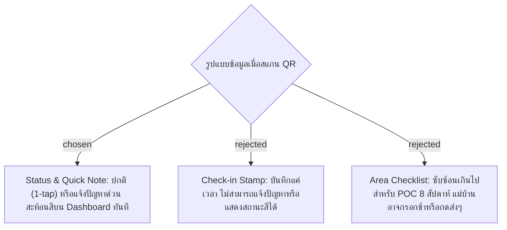

# Scan Record Payload & Status Structure

## Context & Decision
สำหรับการสแกน QR จุดบริการนำร่อง (แคนทีนและงานแม่บ้าน) ผ่านมือถือส่วนตัว เราตัดสินใจเลือก **แนวทาง B (Status & Note)**:
เมื่อแม่บ้านสแกน QR ระบบจะแสดงชื่อจุดบริการ โดยมีค่าเริ่มต้นเป็นสถานะ **"ปกติ / เรียบร้อย (NORMAL)"** ซึ่งสามารถกดส่งข้อมูลได้ทันทีใน 1 คลิก (1-tap) หรือสามารถสลับเป็น **"พบปัญหา (ISSUE)"** เพื่อเลือกประเภทปัญหาด่วน (เช่น ขยะล้น, โต๊ะชำรุด, พื้นเปียก/ลื่น) และพิมพ์หมายเหตุเพิ่มเติมได้

โครงสร้างข้อมูลของ Scan Record:
- `id`: Unique identifier (UUID/Auto-inc)
- `service_point_id`: รหัสจุดบริการ (เช่น LOC-CT-01)
- `scanner_id`: รหัสผู้สแกน/แม่บ้าน
- `scanned_at`: วันเวลาที่สแกน (ISO 8601 UTC)
- `status`: ค่าสถานะ `NORMAL` หรือ `ISSUE`
- `issue_tags`: รายการแท็กปัญหาด่วน (JSON array หรือ comma-separated)
- `notes`: ข้อความหมายเหตุเพิ่มเติม (nullable text)

หน้าจอต้นแบบที่ยืนยันร่วมกัน: [`docs/decision-map/facility-poc/mockups/scan-record-mockup.html`](../decision-map/facility-poc/mockups/scan-record-mockup.html)
