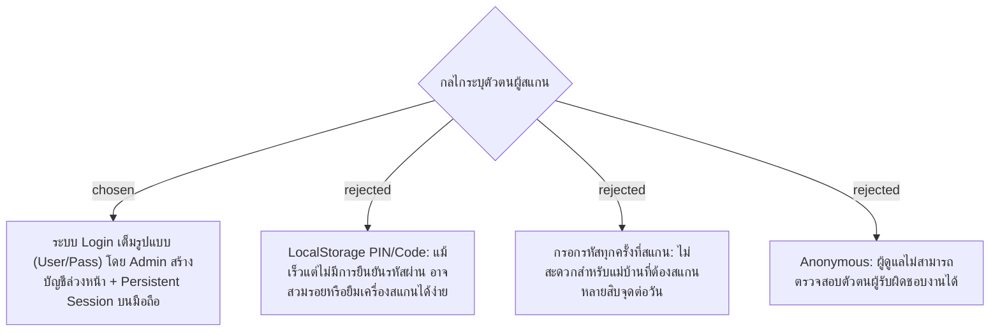

# Scanner Authentication & Account Management

## Context & Decision
สำหรับการระบุตัวตนแม่บ้าน/เจ้าหน้าที่ที่สแกนบันทึกงานผ่านมือถือส่วนตัว เราตัดสินใจเลือก **แนวทาง C (ระบบ Login เต็มรูปแบบ Username + Password)**:
1. **Account Provisioning**: ผู้ดูแลระบบ (Admin) หรือพี่เลี้ยงจะเป็นผู้สร้างบัญชีล่วงหน้าในระบบ เช่น `cleaner01`, `cleaner02` พร้อมกำหนดรหัสผ่านเริ่มต้นและส่งมอบให้แม่บ้าน เพื่อป้องกันบุคคลภายนอกสมัครบัญชีเข้าใช้งานระบบภายใน
2. **Persistent Session**: เมื่อแม่บ้านล็อกอินบนเบราว์เซอร์ของมือถือส่วนตัวสำเร็จ ระบบจะจัดเก็บ Token สถานะการเข้าสู่ระบบไว้ (Persistent Session) เพื่อให้แม่บ้านเดินสแกน QR ตามจุดต่างๆ ได้อย่างราบรื่นตลอดวันโดยไม่ต้องล็อกอินซ้ำทุกจุด จนกว่าจะกดปุ่ม "ออกจากระบบ (Logout)"
3. **PDPA & ความเป็นส่วนตัว**:
   - บัญชีผู้ใช้จัดเก็บ: `id`, `username`, `password_hash`, `display_name` (ชื่อเรียก เช่น "แม่บ้าน สมศรี"), `role` (`CLEANER`, `ADMIN`)
   - ไม่จัดเก็บข้อมูลส่วนบุคคลที่มีความเสี่ยง เช่น เลขบัตรประชาชน, เบอร์โทรศัพท์ส่วนตัว, หรือบัญชีโซเชียลมีเดีย
   - รหัสผ่านได้รับการแฮชอย่างปลอดภัย (Password Hashing) ก่อนบันทึกลง MySQL
