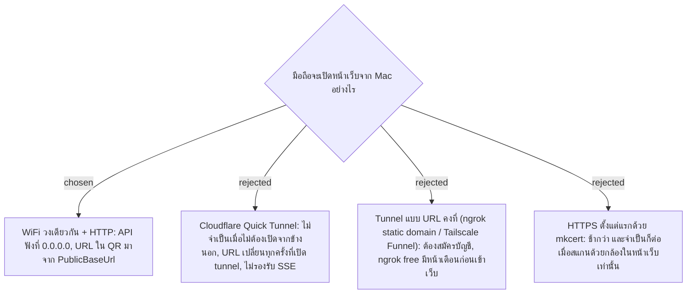

# Local Access — มือถือเข้าถึงระบบซ้อมมือบน Mac ผ่าน WiFi วงเดียวกันด้วย HTTP

- Decision map: [#8 การเข้าถึง local](https://github.com/ThodsaphonSonthiphin/Facility-Real-time-dashboard/issues/8)
- วันที่: 2026-09-11

## Context & Decision

ระบบซ้อมมือก่อนฝึกงานรันทั้งหมดบน Mac M1 8GB ได้แก่ ASP.NET Core API, React, MySQL และ SignalR (#6, #7) มือถือที่สแกน QR ของ Service Point ต้องเปิดหน้าเว็บจาก Mac ได้ และ URL ที่ฝังใน QR ขึ้นอยู่กับวิธีเชื่อมต่อ

เจ้าของโปรเจกต์ยืนยันว่าตอนทดสอบ มือถือจะ "อยู่กับ Mac ไม่ต้องเปิดจากข้างนอก" จึงเลือก **แนวทาง A (WiFi วงเดียวกัน + HTTP)**:

1. **Network**: มือถือกับ Mac ต่อ WiFi วงเดียวกัน และเข้าผ่าน HTTP เช่น `http://192.168.x.x:5000`
2. **Kestrel binding**: ตั้งให้ API ฟังที่ `0.0.0.0` (ไม่ใช่ localhost อย่างเดียว) และอนุญาต incoming connection ใน macOS firewall
3. **QR URL**: URL ใน QR ของ Service Point สร้างจากค่า config `PublicBaseUrl` ถ้า IP ของ Mac เปลี่ยน ให้แก้ค่านี้แล้วออก QR ใหม่จากหน้าจัดการจุด
4. **Real-time**: SignalR ใช้ WebSockets ผ่าน WiFi ตรง ๆ

## Consequences

- **ข้อจำกัดส่งต่อให้ #9:** ถ้าเลือกสแกนด้วยกล้องในหน้าเว็บ ต้องเพิ่ม HTTPS (mkcert + ติดตั้งใบรับรองบนมือถือ) เพราะ browser อนุญาตกล้องเฉพาะ secure context ถ้าสแกนด้วยแอปกล้องของมือถือแล้วเปิดลิงก์ HTTP ใช้ได้
- ใช้ได้เฉพาะในวง WiFi เดียวกัน (การเปิดจากข้างนอกอยู่นอกขอบเขตของ map) ถ้าวันหลังต้องเดโมนอกบ้าน ทางสำรองคือ Cloudflare Quick Tunnel ซึ่งได้ HTTPS แต่ต้องออก QR ใหม่ทุกครั้งที่ URL เปลี่ยน
- ระบบจริงตอนฝึกงานจะใช้โครงสร้างของบริษัท ADR นี้ใช้กับงานซ้อมมือเท่านั้น
