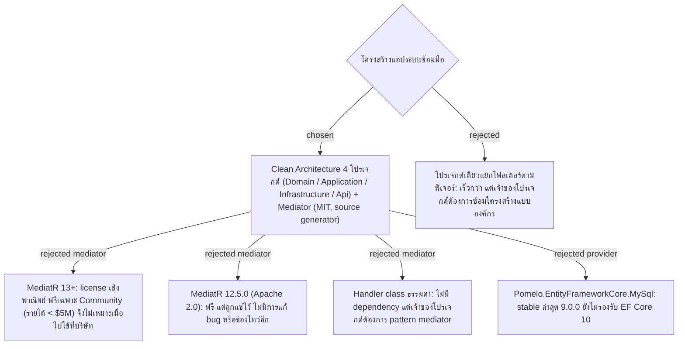

# App Architecture — Clean Architecture 4 โปรเจกต์ + Mediator (MIT) + React ตาม react-structure

- Decision map: [#12 โครงสร้างแอป](https://github.com/ThodsaphonSonthiphin/Facility-Real-time-dashboard/issues/12)
- วันที่: 2026-09-11
- เกี่ยวข้อง: facility-0003 (local WiFi + HTTP), #7 (SignalR)

## Context & Decision

ระบบซ้อมมือต้องสร้างให้เสร็จเร็ว และต้องได้ฝึก pattern ที่นำไปใช้ต่อตอนฝึกงาน (React + .NET C#, MySQL, ห้ามมีค่าใช้จ่าย, Mac M1 8GB) เจ้าของโปรเจกต์เลือก **Clean Architecture** และระบุว่าต้องการ mediator "ตัวที่มันฟรี" จึงตัดสินใจดังนี้:

1. **Repo layout**: repo เดียว มี `backend/` (solution .NET) และ `frontend/` (React)
2. **Backend projects** (.NET 10 LTS):
   - `Domain`: entity และกติกาทางธุรกิจ เช่น Scan Record, Service Point, Cleaner Account ไม่มี dependency ภายนอก
   - `Application`: use case เป็น request + handler ของ **Mediator** (`martinothamar/Mediator`, MIT) รวมถึง interface ที่ชั้นนอกต้อง implement เช่น `IDashboardNotifier`
   - `Infrastructure`: EF Core + **MySql.EntityFrameworkCore 10.x** (provider ของ Oracle), password hashing และ implementation ของ interface
   - `Api`: **Minimal API** (`MapPost` + `TypedResults`) เรียก `ISender.Send(...)`, SignalR Hub และ implementation ของ `IDashboardNotifier` ที่ใช้ `IHubContext` เพื่อให้ Application ไม่ผูกกับ SignalR
3. **Frontend**: Vite + React + TypeScript ตาม skill `react-structure` (แยกไฟล์ UI กับ hook, MUI, Redux เมื่อ component มี state ร่วม)
4. **Runtime บน Mac**: ติดตั้ง .NET 10 SDK และ MySQL ผ่าน Homebrew แบบ native **ไม่ใช้ Docker** เพราะ RAM 8GB
5. **Dev serving**: Kestrel ฟังที่ `0.0.0.0` ส่วน Vite รันด้วย `--host` และ proxy `/api` กับ `/hubs` (WebSockets) ไป Kestrel มือถือจึงเปิด origin เดียว, `PublicBaseUrl` = URL ของ Vite และ cookie ของ Persistent Session ทำงานได้โดยไม่ต้องตั้ง CORS

## Consequences

- Mediator ใช้ `ValueTask` และ source generator ต่างจากตัวอย่าง MediatR เล็กน้อย (delegate ของ pipeline และ lifetime เริ่มต้นเป็น singleton) ถ้าอ่าน tutorial MediatR ต้องแปลงตาม เอกสาร "Differences from MediatR" ใน repo ของ Mediator
- ห้ามอัปเกรดหรือเปลี่ยนไปใช้ MediatR 13+ โดยไม่ทบทวน ADR นี้ เพราะจะติด license เชิงพาณิชย์
- EF Core migrations อยู่ใน `Infrastructure` และรันกับ MySQL ที่ติดตั้งผ่าน Homebrew
- Clean Architecture ทำให้แต่ละฟีเจอร์มีหลายไฟล์ข้ามโปรเจกต์ เป็นต้นทุนที่ยอมรับเพื่อซ้อมโครงสร้างแบบองค์กร
- Repo เป็น public จึงห้าม commit connection string หรือ secret ให้ใช้ `dotnet user-secrets`
