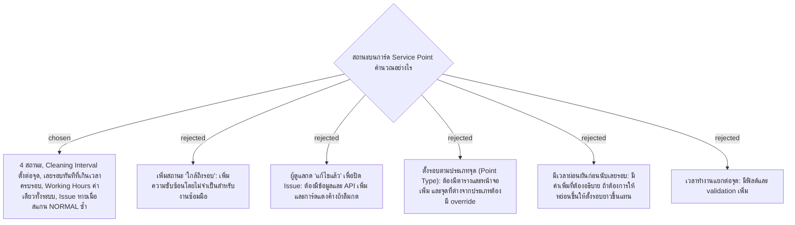

# Point Status Rules — สถานะของ Service Point บน Dashboard

- Decision map: [#4 กติกาสถานะ](https://github.com/ThodsaphonSonthiphin/Facility-Real-time-dashboard/issues/4)
- UI mockup ที่ใช้ตัดสินเรื่องรอบ: https://claude.ai/code/artifact/28c3a564-39ee-451f-b812-d6dbe988b21b
- วันที่: 2026-09-11
- เกี่ยวข้อง: facility-0001 (Scan Record), #7 (คำนวณเลยรอบจากเวลาสแกนล่าสุด)

## Context & Decision

Dashboard ต้องบอกผู้ดูแลได้ทันทีว่า Service Point ไหนต้องไปดู โดยใช้ข้อมูลจาก Scan Record (facility-0001) เท่าที่มีอยู่ ระบบซ้อมมือต้องสร้างให้เสร็จเร็ว จึงตัดสินใจดังนี้:

1. **Point Status มี 4 ค่า** ตรวจตามลำดับนี้ เจอเงื่อนไขแรกที่ตรงให้หยุด:
   1. **Issue (แดง, มีปัญหา)**: Scan Record ล่าสุดของจุดมี Cleaning Status เป็น `ISSUE` แสดงเป็นแดงทุกเวลา รวมถึงนอกเวลาทำงาน
   2. **Off Hours (เทา, นอกเวลาทำงาน)**: เวลาปัจจุบันอยู่นอก Working Hours
   3. **Overdue (ส้ม, เลยรอบ)**: เวลาปัจจุบัน > `due_at`
   4. **Normal (เขียว, ปกติ)**: กรณีอื่นทั้งหมด
2. **การคำนวณ `due_at`**:
   - `cycle_start` = ค่าที่มากกว่าระหว่าง `scanned_at` ล่าสุด กับเวลาเปิดของวันนี้ (ถ้ายังไม่เคยสแกนเลย ใช้เวลาเปิดของวันนี้)
   - `due_at` = `cycle_start` + `cleaning_interval_minutes`
   - ตัวอย่าง: เปิด 08:00 รอบ 60 นาที ถ้ายังไม่มีการสแกนวันนี้ ครบรอบแรก 09:00 ถ้าสแกน 10:05 ครบรอบถัดไป 11:05 และจะเป็น Overdue ตั้งแต่เลย 11:05
3. **Cleaning Interval ตั้งที่ Service Point แต่ละจุด**: ฟิลด์ `cleaning_interval_minutes` (จำนวนเต็ม > 0) กรอกในฟอร์มเพิ่ม/แก้ Service Point ไม่มีตาราง Point Type
4. **ไม่มีเวลาผ่อนผัน**: เลยเวลาครบรอบเมื่อไหร่ นับเป็น Overdue ทันที
5. **Working Hours ค่าเดียวทั้งระบบ** อยู่ใน config ค่าเริ่มต้น `08:00–17:00` time zone `Asia/Bangkok` ส่วน `scanned_at` เก็บเป็น UTC ตาม facility-0001 และแปลงเป็นเวลาไทยตอนคำนวณ
6. **Issue หายเมื่อสแกน NORMAL ซ้ำ**: ไม่มีปุ่มปิดปัญหาสำหรับผู้ดูแล สถานะมาจาก Scan Record ล่าสุดเสมอ

## Consequences

- Point Status เป็นค่าที่**คำนวณ ไม่เก็บลงฐานข้อมูล**: server คำนวณตอนส่ง snapshot และ client คำนวณซ้ำตามเวลา (#7) จึงไม่ต้องมี background job
- Data model (#11) ต้องมี `cleaning_interval_minutes` ใน Service Point และต้อง query Scan Record ล่าสุดต่อจุดได้เร็ว เช่น มี index (`service_point_id`, `scanned_at`)
- ผู้ดูแลยืนยันเองไม่ได้ว่าปัญหาจบแล้ว ต้องพึ่งการสแกน NORMAL ซ้ำ
- ถ้าจุดจำนวนมากใช้รอบเดียวกัน ต้องแก้ทีละจุด ยอมรับได้เพราะงานซ้อมมือใช้จุดจำลองไม่กี่จุด
- เวลาทำงานข้ามเที่ยงคืนหรือหลายกะยังไม่รองรับ
