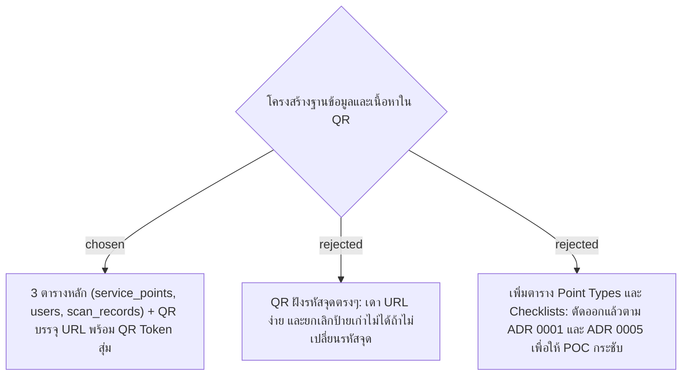
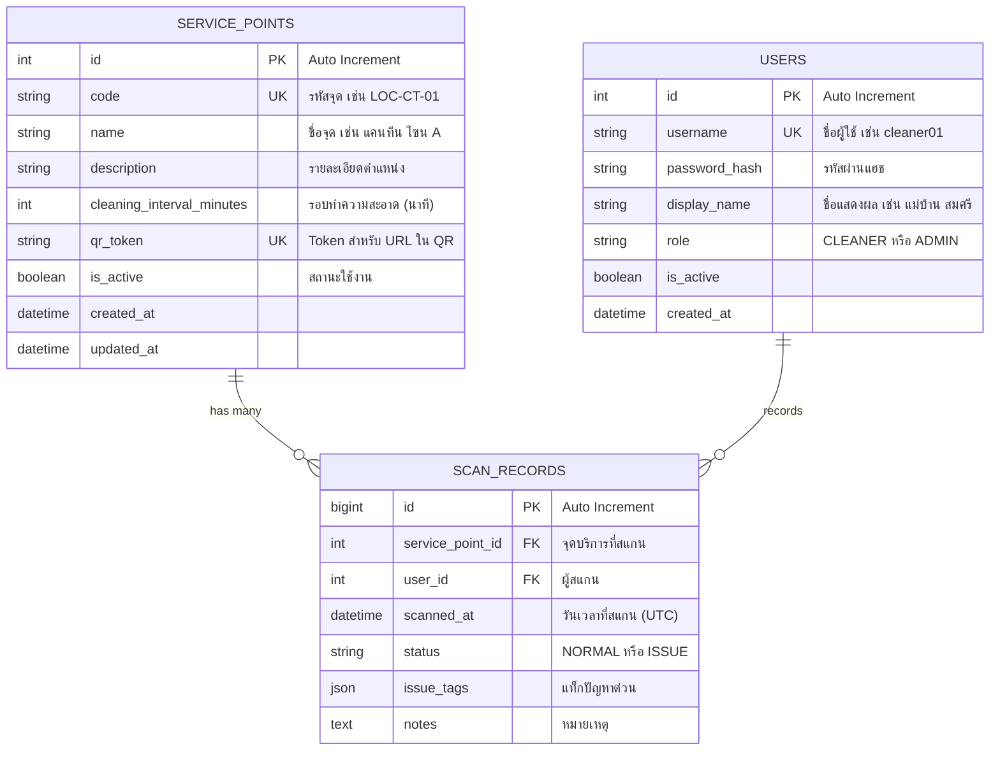

# MySQL Schema & QR Token Content

- Decision map: [#11 Data model](https://github.com/ThodsaphonSonthiphin/Facility-Real-time-dashboard/issues/11)
- วันที่: 2026-09-13
- เกี่ยวข้อง: facility-0001 (Scan Record), facility-0002 (Scanner Auth), facility-0004 (App Architecture), facility-0005 (Point Status Rules)

## Context & Decision

เพื่อรองรับฟังก์ชันทั้งหมดของ POC โดยไม่ซับซ้อนเกินความจำเป็น ตัดสินใจกำหนดโครงสร้าง Data Model และรูปแบบเนื้อหาใน QR ดังนี้:

### 1. เนื้อหาของ QR Code (QR Content)
- ป้าย QR Code จะบรรจุ URL: `http://<PublicBaseUrl>/scan?token={qr_token}`
- `qr_token` เป็นสตริงสุ่ม (UUID v4) ผูกกับ Service Point แต่ละจุด
- ในหน้าจัดการ Service Point (Admin) สามารถกด **"ออก QR ใหม่ (Regenerate QR)"** เพื่อสุ่มค่า `qr_token` ใหม่ ป้ายเก่าจะถูกยกเลิกทันทีโดยไม่ต้องแก้รหัสจุดหรือสูญเสียประวัติการสแกนเดิม

### 2. ตารางในฐานข้อมูล MySQL (3 ตาราง)

### 3. ดัชนีประสิทธิภาพ (Performance Index)
- ตาราง `scan_records` กำหนด Composite Index:
  `CREATE INDEX idx_service_point_scanned_at ON scan_records (service_point_id, scanned_at DESC);`
  เพื่อให้ Server และ Dashboard สามารถค้นหา Scan Record ล่าสุดของแต่ละจุดมาประมวลผล Point Status ได้ทันที

## Consequences
- ไม่มีตาราง Checklists หรือ Point Types (สอดคล้องกับ ADR 0001 และ ADR 0005)
- ป้าย QR Code ปลอดภัยจากการคาดเดารหัสจุด และสามารถออกป้ายทดแทนป้ายเดิมที่ชำรุดได้ง่าย

## Amendment 2026-09-13 — ตาราง refresh_tokens (#15 admin-access)

3 ตารางหลักข้างบนยังใช้ทั้งหมด facility-0014 เพิ่มตารางที่ 4 `refresh_tokens` เก็บ hash ของ refresh token เพื่อหมุนใบใหม่และยกเลิกตอน Logout หรือปิดบัญชี และบน master 000167d entity `User` ยังไม่มี `is_active` ตามที่ตารางข้างบนระบุ
