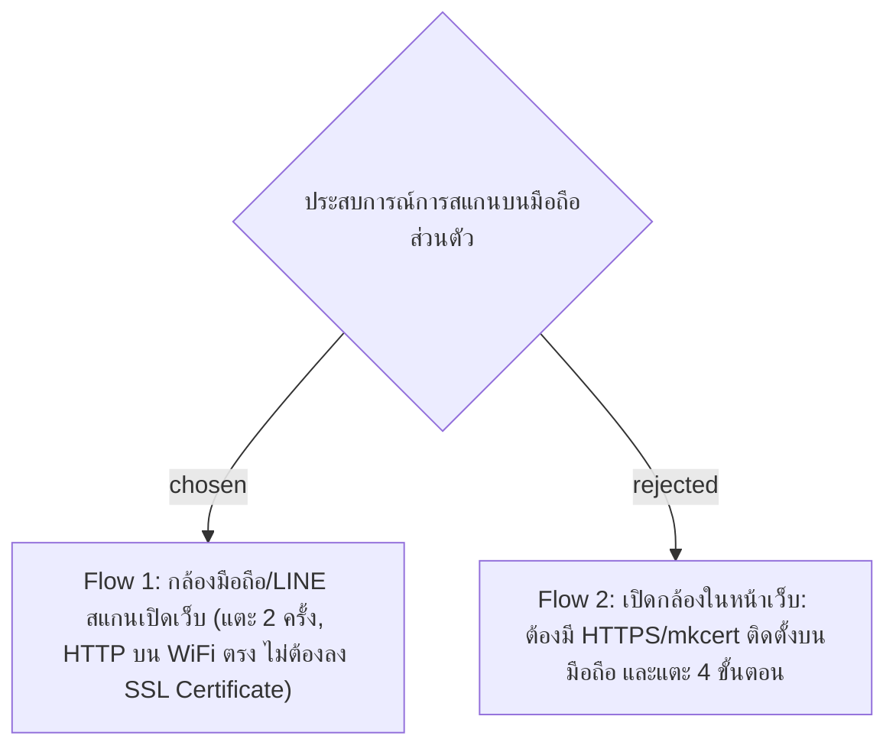

# Scan Flow — Native Mobile Camera & 2-Tap Submission

- Decision map: [#9 Flow การสแกน](https://github.com/ThodsaphonSonthiphin/Facility-Real-time-dashboard/issues/9)
- Prototype: [`docs/decision-map/facility-poc/mockups/scan-flow-prototype.html`](../decision-map/facility-poc/mockups/scan-flow-prototype.html)
- วันที่: 2026-09-13
- เกี่ยวข้อง: facility-0001 (Scan Record), facility-0002 (Scanner Auth), facility-0003 (WiFi HTTP Connection), facility-0006 (QR Token)

## Context & Decision

แม่บ้านและเจ้าหน้าที่ใช้อุปกรณ์มือถือส่วนตัวเชื่อมต่อเครือข่าย WiFi เดียวกับ Mac M1 เพื่อสแกนป้ายจุดบริการ เพื่อให้การปฏิบัติงานสะดวกรวดเร็วที่สุดและไม่สร้างภาระการตั้งค่าเครื่องส่วนตัว จึงตัดสินใจเลือก **Flow 1 (Native Camera)**:

1. **ขั้นตอนการสแกน (2 Taps)**:
   - **แตะที่ 1**: แม่บ้านเปิดแอปกล้องมือถือทั่วไปหรือ LINE ส่องไปที่ป้าย QR จุดบริการ กล้องจะตรวจพบ URL `http://<IP>:5173/scan?token={qr_token}` แล้วแตะที่แบนเนอร์เพื่อเปิดเบราว์เซอร์
   - **แสดงผลทันที**: เบราว์เซอร์ดึง Persistent Session (facility-0002) ระบุตัวตนแม่บ้านและชื่อจุดบริการ พร้อมตั้งค่าเริ่มต้นเป็น `NORMAL` (facility-0001)
   - **แตะที่ 2**: กดปุ่ม "ยืนยันทำความสะอาดเรียบร้อย" ข้อมูลจะถูกบันทึกและส่งผ่าน SignalR ไปยัง Dashboard ทันที
2. **ข้อยกเว้นกรณีพบปัญหา**:
   - หากมีสิ่งผิดปกติ แม่บ้านแตะสลับเป็น "พบปัญหา" -> แตะเลือกแท็กปัญหาด่วน (เช่น ขยะล้น, ชำรุด) -> กดยืนยัน (แตะ 3 ครั้ง)
3. **การเข้ากันได้ของเครือข่าย (ADR 0003)**:
   - การเปิด URL ผ่านเบราว์เซอร์รองรับการเชื่อมต่อผ่าน **HTTP ธรรมดา** บนเครือข่าย WiFi เดียวกันได้สมบูรณ์ โดยไม่ต้องจัดทำ HTTPS หรือนำ Root Certificate (`mkcert`) ไปติดตั้งบนมือถือส่วนตัวของแม่บ้าน

## Consequences
- แม่บ้านไม่ต้องติดตั้งแอปพลิเคชันพิเศษใดๆ เพิ่มเติมบนมือถือ
- ไม่ต้องขอสิทธิ์กล้อง (Camera Permission) ภายในหน้าเว็บ
- ประหยัดเวลาการทำความสะอาดต่อจุดเหลือเพียงประมาณ 2–3 วินาที
