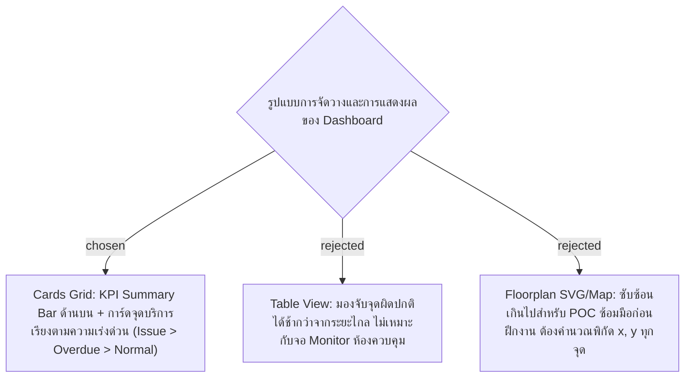

# Dashboard Cards Grid Layout & Real-time Priority View

- Decision map: [#10 หน้า Dashboard](https://github.com/ThodsaphonSonthiphin/Facility-Real-time-dashboard/issues/10)
- Prototype: [`docs/decision-map/facility-poc/mockups/dashboard-prototype.html`](../decision-map/facility-poc/mockups/dashboard-prototype.html)
- วันที่: 2026-09-13
- เกี่ยวข้อง: facility-0001 (Scan Record), facility-0005 (Point Status Rules), facility-0006 (MySQL Schema), #7 (SignalR Real-time)

## Context & Decision

ผู้ดูแลระบบและพี่เลี้ยงต้องการหน้าจอ Real-time Monitoring ที่สามารถสังเกตเห็นจุดบริการที่มีปัญหาหรือเลยรอบได้ทันทีจากระยะไกลบนจอมอนิเตอร์ จึงตัดสินใจเลือก **การจัดวางแบบ Cards Grid**:

1. **แถบสรุปภาพรวม (KPI Summary Bar)**:
   - แสดงตัวเลขสรุป 4 กล่อง: จำนวนจุดทั้งหมด, 🔴 พบปัญหา (Issue), 🟠 เลยรอบ (Overdue), 🟢 ปกติ (Normal)
   - กล่องตัวเลขสามารถคลิกเพื่อทำหน้าที่เป็น Filter กรองดูเฉพาะสถานะนั้นๆ ได้ทันที
2. **แผงการ์ดจุดบริการ (Service Point Cards Grid)**:
   - จัดวางแบบ Responsive Grid (3–4 คอลัมน์) แต่ละการ์ดมีขอบสีและแสงเรืองตามสถานะชัดเจน
   - **การเรียงลำดับความสำคัญ (Priority Order)** ตามข้อกำหนด facility-0005:
     `🔴 Issue (มีปัญหา) > 🟠 Overdue (เลยรอบ) > 🟢 Normal (ปกติ) > ⚪ Off Hours (นอกเวลาทำงาน)`
   - แสดงข้อมูลสำคัญ: ชื่อจุดบริการ, รหัสจุด, รอบทำความสะอาด (นาที), เวลาสแกนล่าสุดพร้อมชื่อผู้สแกน, และเวลากำหนดรอบถัดไป
   - หากจุดมีสถานะเป็น Issue จะแสดงกล่องแจ้งเตือนสีแดงพร้อมแท็กปัญหาด่วน (เช่น `[ขยะล้น]`, `[ชำรุด]`) และข้อความหมายเหตุ
3. **การอัปเดตแบบ Real-time**:
   - เชื่อมต่อผ่าน SignalR (`facility-0004`) เมื่อมีการสแกนใหม่ การ์ดจุดนั้นจะอัปเดตสถานะและสลับตำแหน่งขึ้นมาด้านบนทันทีโดยไม่ต้อง Refresh หน้าจอ

## Consequences
- อ่านง่ายจากระยะไกล เหมาะกับการเปิดมอนิเตอร์ในห้องควบคุมงานแม่บ้าน
- สร้างได้รวดเร็วบน React + Vanilla CSS / Tailwind โดยไม่ต้องวาดผัง Floorplan
- มีกลไกค้นหา (Search input) ชื่อและรหัสจุดเพื่อความสะดวกในการจัดการ
