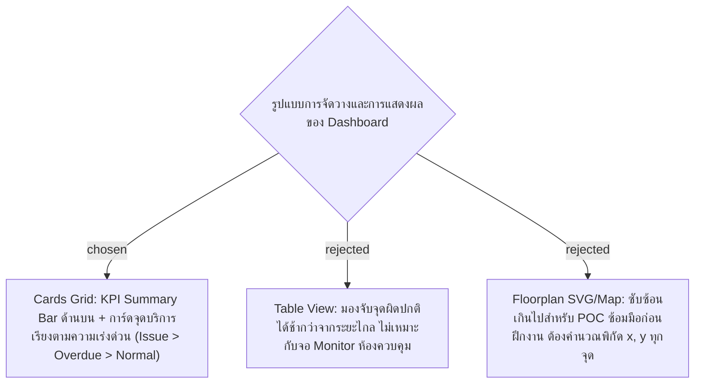
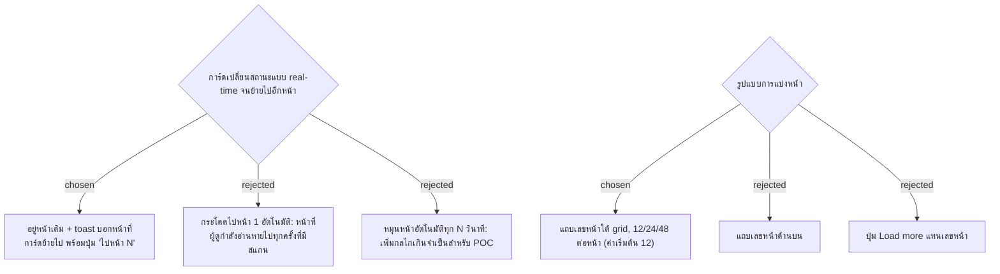

# Dashboard Cards Grid Layout & Real-time Priority View

- Decision map: [#10 หน้า Dashboard](https://github.com/ThodsaphonSonthiphin/Facility-Real-time-dashboard/issues/10)
- Prototype: [`docs/decision-map/facility-poc/mockups/dashboard-prototype.html`](../decision-map/facility-poc/mockups/dashboard-prototype.html)
- วันที่: 2026-09-13
- เกี่ยวข้อง: facility-0001 (Scan Record), facility-0005 (Point Status Rules), facility-0006 (MySQL Schema), #7 (SignalR Real-time)

## Context & Decision

ผู้ดูแลระบบและพี่เลี้ยงต้องการหน้าจอ Real-time Monitoring ที่สามารถสังเกตเห็นจุดบริการที่มีปัญหาหรือเลยรอบได้ทันทีจากระยะไกลบนจอมอนิเตอร์ จึงตัดสินใจเลือก **การจัดวางแบบ Cards Grid**:

1. **แถบสรุปภาพรวม (KPI Summary Bar)**:
   - แสดงตัวเลขสรุป 4 กล่อง: จำนวนจุดทั้งหมด, 🔴 พบปัญหา (Issue), 🟠 เลยรอบ (Overdue), 🟢 ปกติ (Normal)
   - กล่องตัวเลขสามารถคลิกเพื่อทำหน้าที่เป็น Filter กรองดูเฉพาะสถานะนั้นๆ ได้ทันที
2. **แผงการ์ดจุดบริการ (Service Point Cards Grid)**:
   - จัดวางแบบ Responsive Grid (3–4 คอลัมน์) แต่ละการ์ดมีขอบสีและแสงเรืองตามสถานะชัดเจน
   - **การเรียงลำดับความสำคัญ (Priority Order)** ตามข้อกำหนด facility-0005:
     `🔴 Issue (มีปัญหา) > 🟠 Overdue (เลยรอบ) > 🟢 Normal (ปกติ) > ⚪ Off Hours (นอกเวลาทำงาน)`
   - แสดงข้อมูลสำคัญ: ชื่อจุดบริการ, รหัสจุด, รอบทำความสะอาด (นาที), เวลาสแกนล่าสุดพร้อมชื่อผู้สแกน, และเวลากำหนดรอบถัดไป
   - หากจุดมีสถานะเป็น Issue จะแสดงกล่องแจ้งเตือนสีแดงพร้อมแท็กปัญหาด่วน (เช่น `[ขยะล้น]`, `[ชำรุด]`) และข้อความหมายเหตุ
3. **การอัปเดตแบบ Real-time**:
   - เชื่อมต่อผ่าน SignalR (`facility-0004`) เมื่อมีการสแกนใหม่ การ์ดจุดนั้นจะอัปเดตสถานะและสลับตำแหน่งขึ้นมาด้านบนทันทีโดยไม่ต้อง Refresh หน้าจอ

## Consequences
- อ่านง่ายจากระยะไกล เหมาะกับการเปิดมอนิเตอร์ในห้องควบคุมงานแม่บ้าน
- สร้างได้รวดเร็วบน React + Vanilla CSS / Tailwind โดยไม่ต้องวาดผัง Floorplan
- มีกลไกค้นหา (Search input) ชื่อและรหัสจุดเพื่อความสะดวกในการจัดการ

## Amendment 2026-09-13 — Pagination (#14 dashboard-pagination)

การตัดสินใจเดิมข้างบนยังใช้ทั้งหมด ส่วนนี้เพิ่มเรื่องการแบ่งหน้าเมื่อจุดบริการมีมากเกินหนึ่งจอ

- Decision map: [#14 Pagination หน้า Dashboard](https://github.com/ThodsaphonSonthiphin/Facility-Real-time-dashboard/issues/14)
- Prototype: [`docs/decision-map/facility-poc/mockups/dashboard-prototype.html`](../decision-map/facility-poc/mockups/dashboard-prototype.html) (จุดจำลอง 26 จุด)

1. **แถบเลขหน้า** อยู่ใต้ grid ใช้ชุดเดียวกันทั้ง Cards Grid และ Table View: ข้อความ "แสดง 1–12 จาก 26 จุด", ปุ่มก่อนหน้า/ถัดไป, เลขหน้าแบบย่อ (1 … 4 5 6 … 10) และตัวเลือก 12/24/48 ต่อหน้า
2. **กรองและเรียงทั้งรายการก่อน แล้วค่อยตัดเป็นหน้า**: ลำดับ Issue > Overdue > Normal > Off Hours ใช้กับทุกจุด จุดที่เร่งด่วนที่สุดจึงอยู่หน้า 1 เสมอ
3. **จุดสีบนเลขหน้า**: หน้าที่ไม่ได้เปิดอยู่และมีจุด Issue จะมีจุดแดง ถ้ามีแค่ Overdue จะมีจุดส้ม
4. **กลับหน้า 1** เมื่อเปลี่ยน KPI filter, พิมพ์ค้นหา หรือเปลี่ยนจำนวนต่อหน้า ถ้าหน้าปัจจุบันเกินจำนวนหน้าที่มี ให้ลดลงมาหน้าสุดท้าย
5. **KPI Summary Bar นับจากทุกจุด** ไม่ใช่เฉพาะหน้าที่เปิดอยู่
6. **Real-time**: เมื่อ SignalR ส่ง ScanRecorded มา ให้อยู่หน้าเดิม ถ้าการ์ดย้ายไปหน้าอื่นให้ขึ้น toast "ย้ายไปอยู่หน้า N" พร้อมปุ่มไปดู (กดแล้วการ์ดกระพริบ) ถ้าการ์ดหลุดจากตัวกรองปัจจุบัน toast จะบอกว่า "ไม่อยู่ในตัวกรองปัจจุบัน"

### Consequences
- แอป React ยังไม่ทำ pagination ตอนนี้ (seed มี 3 จุด) ให้ทำเมื่อจุดบริการเกิน 12 จุด โดยตัดหน้าฝั่ง client ใน `useDashboard` จากรายการที่ `GET /api/service-points` ส่งมาทั้งหมด ไม่ต้องแก้ API
- บนมือถือ toast บังแถบเลขหน้าประมาณ 6 วินาทีก่อนหายไป ยอมรับได้สำหรับ POC
