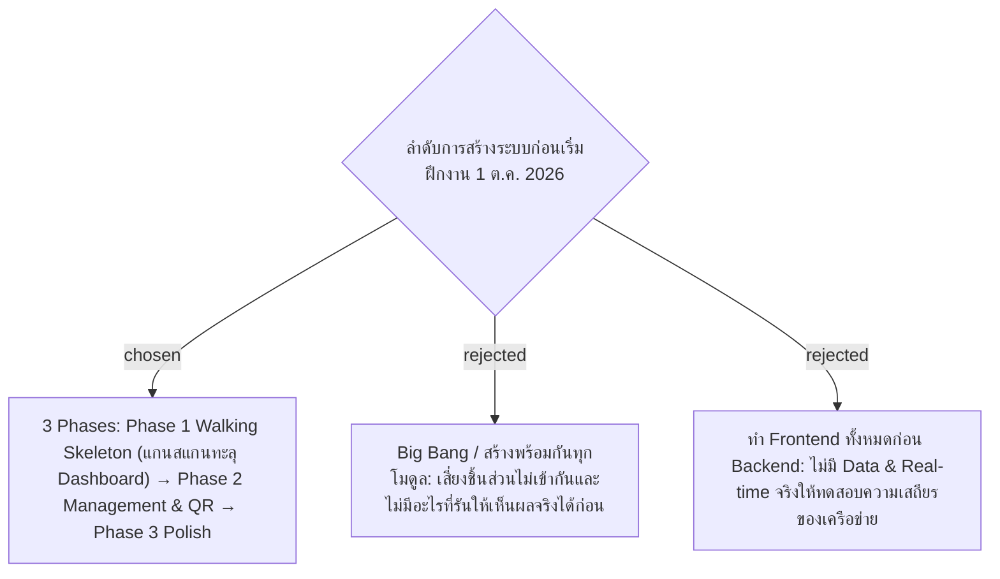

# Delivery Plan — 3-Phase Walking Skeleton Implementation

- Decision map: [#13 แผนลงมือ](https://github.com/ThodsaphonSonthiphin/Facility-Real-time-dashboard/issues/13)
- วันที่: 2026-09-13
- เกี่ยวข้อง: facility-0001 ถึง facility-0008 ทุกฉบับ

## Context & Decision

เพื่อส่งมอบระบบ POC ซ้อมมือก่อนกำหนดเริ่มฝึกงานจริง (1 ต.ค. 2026) โดยมีระบบที่ทำงานได้จริงครบวงจร (End-to-End) ให้เร็วที่สุด จึงตัดสินใจแบ่งลำดับการสร้างเป็น **3 เฟสแบบ Walking Skeleton**:

### 1. ลำดับ 3 เฟส (13 ก.ย. – 30 ก.ย. 2026)
1. **Phase 1: Walking Skeleton (เป้าหมาย: แกนหลักทำงานได้จริงใน 3–4 วัน)**:
   - รัน MySQL บน Docker + สร้าง 3 ตารางผ่าน EF Core Migrations (facility-0006)
   - Seed ข้อมูลจุดบริการและบัญชีแม่บ้านทดสอบ
   - พัฒนา Backend Minimal APIs (`POST /api/scan-records`) ร่วมกับ SignalR Hub (facility-0004, #7)
   - พัฒนา Frontend หน้าสแกนบนมือถือ (facility-0007) และหน้า Dashboard รับ SignalR อัปเดตสีการ์ดแบบ Real-time (facility-0008)
   - **Gate วัดผล**: สแกนป้ายบนมือถือจริงผ่าน WiFi วงเดียวกัน แล้วการ์ดบนจอ Mac เด้งเปลี่ยนสีทันที
2. **Phase 2: Management & QR Generation (3–4 วัน)**:
   - หน้าจัดการ Service Point (เพิ่ม/แก้ไขจุด, กำหนดรอบ `cleaning_interval_minutes`)
   - ปุ่มออก QR Code ใหม่ (Regenerate QR Token) พร้อมหน้าแสดงผลสำหรับสั่งพิมพ์
   - หน้าจัดการบัญชี Cleaner Accounts
3. **Phase 3: Polish & Edge Cases (2–3 วัน)**:
   - ตัวจับเวลาคำนวณ Overdue และ Off Hours อัตโนมัติ (facility-0005)
   - ระบบค้นหาและตัวกรองบน Dashboard
   - บันทึกบทเรียนและเตรียมเอกสารส่งมอบ

### 2. แนวทางการตัดลดขอบเขตกรณีเวลาจำกัด (Scope Defense)
- **ห้ามตัด**: สแกนบันทึกสถานะ -> บันทึกลง MySQL -> SignalR Push สู่ Dashboard (หัวใจหลักของ POC)
- **ตัด/แทนที่ได้ก่อน**:
  1. หากหน้า UI จัดการบัญชีไม่ทัน ให้ใช้ Database Seeding ผ่านโค้ดแทน
  2. หากหน้าพิมพ์ป้าย QR ไม่ทัน ให้ใช้บริการภายนอกสร้างรูป QR ชั่วคราว

### 3. บทเรียนที่ต้องบันทึกเพื่อใช้ต่อช่วงฝึกงาน
- ความเสถียรของสัญญาณ WiFi และการ Reconnect ของ SignalR
- ระยะเวลาเฉลี่ยที่แม่บ้านใช้ในการสแกนแต่ละจุด
- ข้อจำกัดของเบราว์เซอร์บนมือถือรุ่นต่างๆ ของพนักงาน

## Consequences
- มีระบบที่ทำงานได้จริงแบบ End-to-End ตั้งแต่สัปดาห์แรก
- ลดความเสี่ยงในการส่งมอบงานไม่ทันกำหนด 1 ต.ค.
- สามารถต่อยอดสู่แผน Implementation Plan และเริ่มเขียนโค้ดได้ทันที
