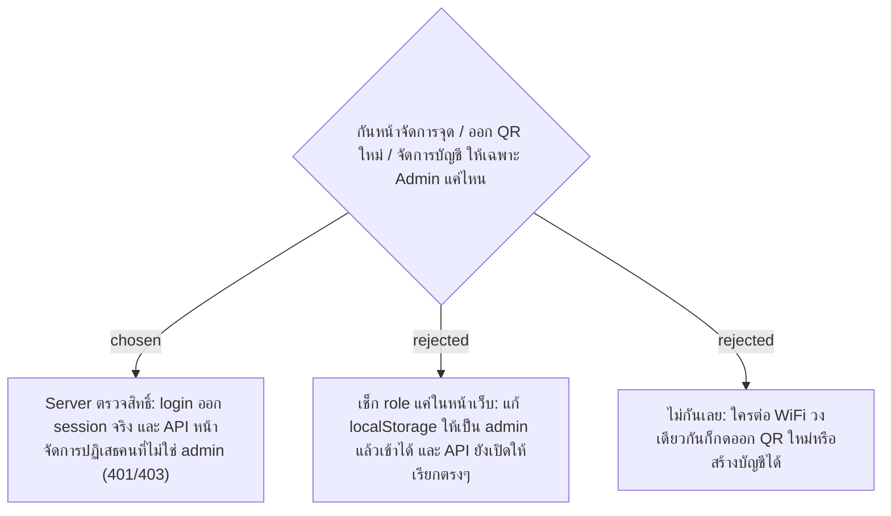

# Admin-only Management Guarded at the Server

- Decision map: [#15 สิทธิ์ Admin](https://github.com/ThodsaphonSonthiphin/Facility-Real-time-dashboard/issues/15)
- วันที่: 2026-09-13
- เกี่ยวข้อง: facility-0002 (Scanner Authentication), facility-0006 (QR Token), facility-0009 (Phase 2)

## Context & Decision

บน master (000167d) login คืน token สุ่มที่ไม่มีใครเก็บหรือตรวจ, API ทุกตัวไม่ตรวจสิทธิ์ และหน้าสแกนเชื่อข้อมูล login ใน `localStorage` ของเบราว์เซอร์ ส่วนเฟส 2 เพิ่มปุ่มที่มีผลกับของจริง: ออก QR Token ใหม่ทำให้ป้ายที่ติดอยู่สแกนไม่ได้ทันที และหน้าจัดการบัญชีสร้างบัญชี Admin ได้

จึงตัดสินใจให้ **server เป็นผู้ตรวจสิทธิ์**: API ของหน้าจัดการ Service Point, ออก QR Token ใหม่ และจัดการบัญชี ต้องมี session ที่ login จริงและมี role `admin` มิฉะนั้นตอบ 401 (ยังไม่ login) หรือ 403 (login แล้วแต่ไม่ใช่ admin) หน้าเว็บจะซ่อนเมนูหรือพาไปหน้า login ด้วยก็ได้ แต่นั่นเป็นความสะดวก ไม่ใช่ตัวกัน

เหตุผล: ปุ่มเหล่านี้ทำให้ป้ายจริงใช้ไม่ได้หรือเพิ่ม Admin ได้ และ POC นี้เป็นการซ้อมมือก่อนสร้างระบบคล้ายกันตอนฝึกงาน ซึ่งต้องกันที่ server อยู่แล้ว ถ้าเลือกเช็กแค่หน้าเว็บ ตอนฝึกงานก็ต้องรื้อทำใหม่

## Consequences

- login ต้องออก session ที่ server ตรวจได้จริง แทน token สุ่มที่ไม่มีใครตรวจ (รูปแบบ session ตัดสินแยกใน ADR ถัดไป)
