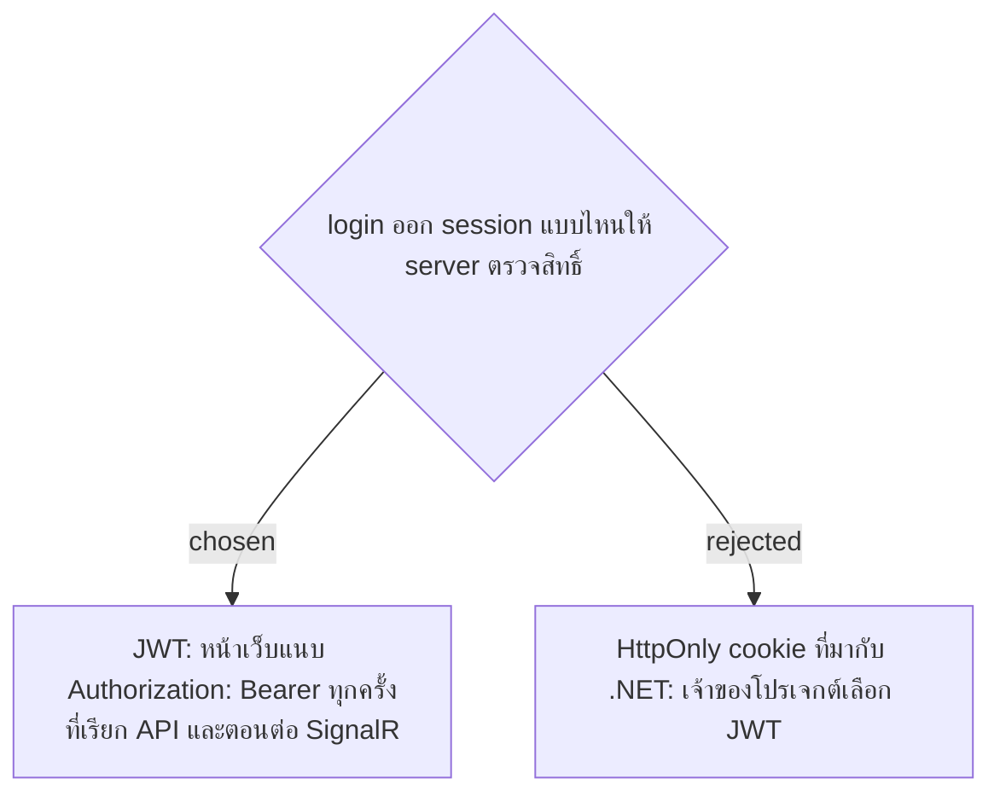

# JWT for API Authentication

- Decision map: [#15 สิทธิ์ Admin](https://github.com/ThodsaphonSonthiphin/Facility-Real-time-dashboard/issues/15)
- วันที่: 2026-09-13
- เกี่ยวข้อง: facility-0002 (Persistent Session), facility-0004 (App Architecture: Vite proxy /api /hubs), facility-0010 (Server-side Admin Gate)

## Context & Decision

facility-0010 กำหนดให้ server ตรวจสิทธิ์ จึงต้องมี session ที่ server ตรวจได้จริง ทางเลือกที่เสนอคือ HttpOnly cookie (แนะนำ เพราะหน้าเว็บกับ API อยู่ origin เดียวกันผ่าน Vite proxy และไม่ต้องลง package) กับ JWT เจ้าของโปรเจกต์เลือก **JWT**: server ออก JWT ตอน login และตรวจลายเซ็นกับ role ใน token ทุกครั้งที่เรียก API ของหน้าจัดการ

## Consequences

- ต้องลง `Microsoft.AspNetCore.Authentication.JwtBearer` และหน้าเว็บต้องแนบ header ในทุก `fetch` รวมถึง `accessTokenFactory` ของ SignalR
- signing key มาจาก config หรือ user-secrets ห้ามอยู่ในโค้ด เพราะ repo เป็น public (ข้อกำหนดใน Decision map) บน master 000167d โปรเจกต์ Api ยังไม่มี `UserSecretsId`
- SignalR ที่ต่อผ่าน WebSocket แนบ header ไม่ได้ token จึงมาทาง query `access_token` server ต้องอ่านค่านี้เฉพาะ path `/hubs`
