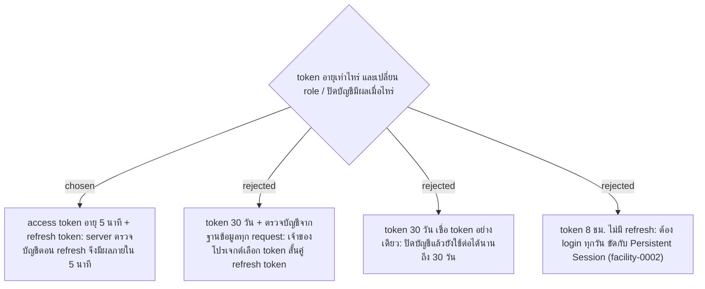

# Access Token 5 Minutes with Refresh Token

- Decision map: [#15 สิทธิ์ Admin](https://github.com/ThodsaphonSonthiphin/Facility-Real-time-dashboard/issues/15)
- วันที่: 2026-09-13
- เกี่ยวข้อง: facility-0002 (Persistent Session), facility-0006 (users.is_active), facility-0011 (JWT)

## Context & Decision

JWT (facility-0011) ถอนคืนไม่ได้ก่อนหมดอายุ จึงต้องตัดสินว่าเมื่อ Admin เปลี่ยน role หรือปิดบัญชีของคนที่ยัง login ค้างอยู่ ผลจะเกิดเมื่อไหร่ เจ้าของโปรเจกต์เลือก **access token อายุ 5 นาที และให้ใช้ refresh token ขอ access token ใหม่**

- ตอน refresh server อ่าน role และสถานะบัญชีจากฐานข้อมูลใหม่ทุกครั้ง การเปลี่ยน role หรือปิดบัญชีจึงมีผลภายใน 5 นาที โดยไม่ต้องอ่านฐานข้อมูลทุก request
- Persistent Session (facility-0002) ถูกรักษาไว้ด้วย refresh token ไม่ใช่ access token ผู้สแกนยัง login ค้างได้จนกด Logout
- ที่เก็บ refresh token, อายุ และวิธีถอนคืนตอน Logout ตัดสินแยก

## Consequences

- ขัดกับโค้ด: facility-0006 ระบุว่ามี `users.is_active` แต่ entity `User` บน master 000167d ไม่มี field นี้ ต้องเพิ่มก่อน refresh จะเช็กว่าบัญชีถูกปิดได้
- หน้าเว็บต้องขอ access token ใหม่เมื่อหมดอายุ ส่วน SignalR ใช้ token เฉพาะตอนเริ่มต่อ connection
- ต้องตั้ง `ClockSkew` ของการตรวจ JWT ให้สั้น (เช่น 30 วินาที) ค่าเริ่มต้นของ .NET คือ 5 นาที ถ้าไม่ปรับ token ที่ตั้งไว้ 5 นาทีจะใช้ได้จริงถึง 10 นาที
