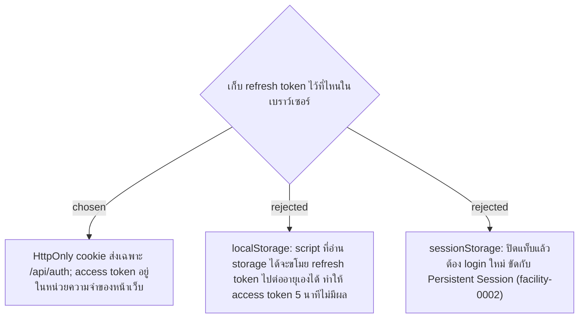

# Refresh Token in an HttpOnly Cookie

- Decision map: [#15 สิทธิ์ Admin](https://github.com/ThodsaphonSonthiphin/Facility-Real-time-dashboard/issues/15)
- วันที่: 2026-09-13
- เกี่ยวข้อง: facility-0002 (Persistent Session), facility-0003 (HTTP บน WiFi วงเดียว), facility-0011 (JWT), facility-0012 (access token 5 นาที + refresh token)

## Context & Decision

access token อายุ 5 นาที (facility-0012) จะลดความเสียหายได้จริงก็ต่อเมื่อ refresh token ซึ่งอายุยาวกว่าไม่ถูกขโมยง่ายเท่ากัน จึงตัดสินใจเก็บ **refresh token ใน HttpOnly cookie** ซึ่ง JavaScript อ่านไม่ได้ และเก็บ **access token ไว้ในหน่วยความจำของหน้าเว็บ** (ไม่ใช่ `localStorage`) เมื่อ reload หน้าให้เรียก refresh ขอ access token ใหม่ การเรียก API และ SignalR ยังใช้ JWT ใน header ตาม facility-0011 cookie ใช้เฉพาะตอน refresh และ logout

## Consequences

- POC นี้ตั้ง cookie แบบ `Secure` ไม่ได้ เพราะมือถือเข้าผ่าน HTTP (facility-0003) ถ้าเป็นระบบจริงต้องใช้ HTTPS และตั้ง `Secure`
