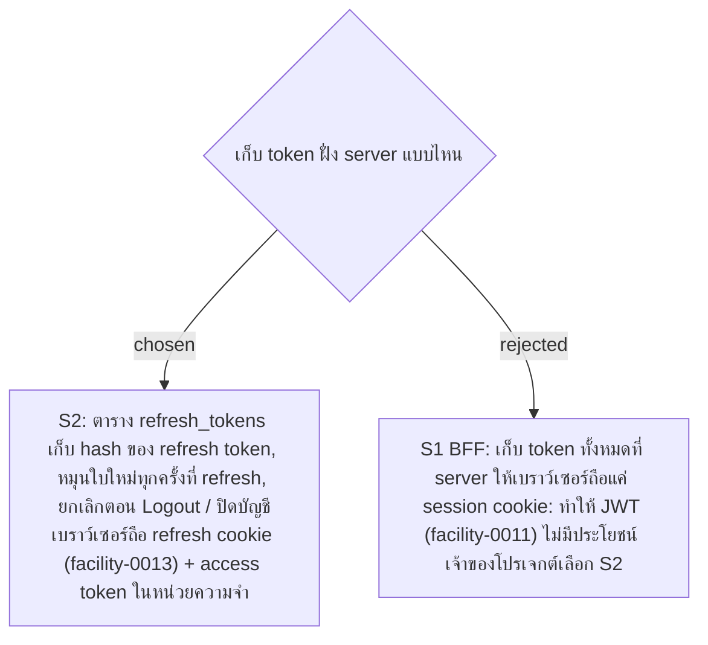

# Refresh Tokens Stored on the Server with Rotation

- Decision map: [#15 สิทธิ์ Admin](https://github.com/ThodsaphonSonthiphin/Facility-Real-time-dashboard/issues/15)
- วันที่: 2026-09-13
- เกี่ยวข้อง: facility-0006 (MySQL Schema), facility-0011 (JWT), facility-0012 (access token 5 นาที + refresh token), facility-0013 (refresh token ใน HttpOnly cookie)

## Context & Decision

ถ้า server ไม่เก็บบันทึก refresh token ไว้ การกด Logout หรือปิดบัญชีจะยกเลิก refresh token ที่อยู่ในมือถือไม่ได้ จึงตัดสินใจให้ **server เก็บบันทึก refresh token** (S2) และยังใช้ JWT ใน header ตาม facility-0011

- refresh token เป็นค่าสุ่มยาวอย่างน้อย 256 bit server เก็บเฉพาะ hash ไม่เก็บค่าจริง ถ้าข้อมูลในฐานข้อมูลรั่ว ก็เอาไปใช้ต่อไม่ได้
- **Rotation**: refresh ทุกครั้งออก refresh token ใบใหม่ และใบเก่าใช้ไม่ได้อีก
- **ยกเลิก**: Logout ยกเลิก refresh token ของการ login ครั้งนั้นแล้วลบ cookie ส่วนปิดบัญชีหรือเปลี่ยนรหัสผ่าน ยกเลิก refresh token ทุกใบของผู้ใช้คนนั้น
- ตอน refresh server อ่าน role และสถานะบัญชีใหม่จากฐานข้อมูล (facility-0012)

## Consequences

- เพิ่มตารางที่ 4 `refresh_tokens` นอกเหนือจาก 3 ตารางใน facility-0006
