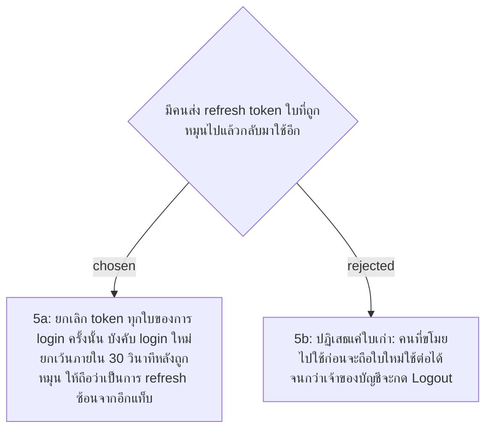

# Refresh Token Reuse Detection with a 30-second Grace Window

- Decision map: [#15 สิทธิ์ Admin](https://github.com/ThodsaphonSonthiphin/Facility-Real-time-dashboard/issues/15)
- วันที่: 2026-09-13
- เกี่ยวข้อง: facility-0014 (Refresh Tokens Stored on the Server with Rotation)

## Context & Decision

rotation (facility-0014) ทำให้ refresh token แต่ละใบใช้ได้ครั้งเดียว ถ้ามีใบที่ใช้ไปแล้วถูกส่งมาอีก แปลว่ามีสองคนถือใบเดียวกัน คือเจ้าของกับคนที่ขโมยไป server รู้ไม่ได้ว่าใครเป็นใคร จึงตัดสินใจ **ยกเลิก refresh token ทุกใบที่มาจากการ login ครั้งนั้น** แล้วให้ทั้งสองฝ่าย login ใหม่ ตามแนวทาง rotation คู่กับการตรวจจับการใช้ซ้ำใน RFC 9700 (OAuth 2.0 Security BCP)

ข้อยกเว้น: ใบที่เพิ่งถูกหมุนยังรับได้อีก **30 วินาที** เพื่อไม่ให้ผู้ใช้ที่เปิด Dashboard กับหน้าสแกนสองแท็บ แล้ว refresh พร้อมกัน หลุดออกจากระบบ

## Consequences

- ตาราง `refresh_tokens` ต้องรู้ว่าแต่ละใบมาจากการ login ครั้งไหน และถูกหมุนไปเมื่อไหร่
- หน้าเว็บควร refresh ทีละครั้ง ถ้ามีหลาย request ได้ 401 พร้อมกัน ให้รอผลของการ refresh ครั้งเดียวกัน
