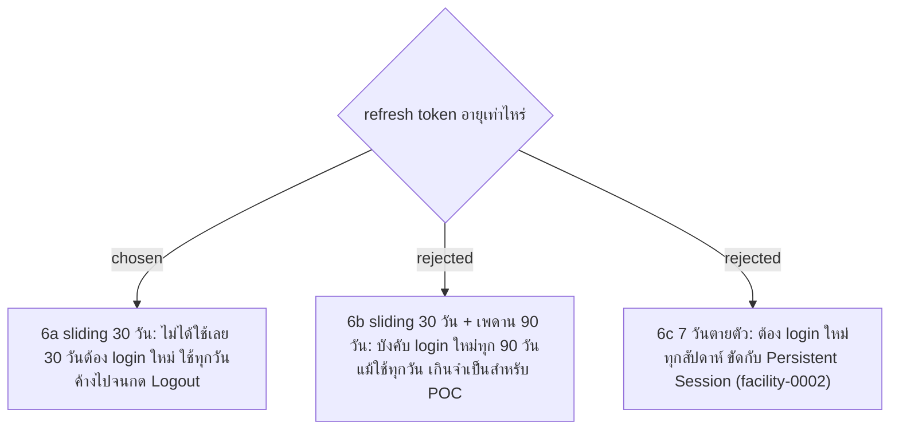

# Refresh Token Lifetime: Sliding 30 Days

- Decision map: [#15 สิทธิ์ Admin](https://github.com/ThodsaphonSonthiphin/Facility-Real-time-dashboard/issues/15)
- วันที่: 2026-09-13
- เกี่ยวข้อง: facility-0002 (Persistent Session), facility-0014 (Rotation), facility-0015 (Reuse Detection)

## Context & Decision

Persistent Session (facility-0002) ให้ผู้สแกน login ค้างได้จนกด Logout จึงตัดสินใจให้ refresh token มีอายุ **30 วันนับจากครั้งล่าสุดที่ใช้** refresh แต่ละครั้งออกใบใหม่ (facility-0014) ที่นับอายุใหม่อีก 30 วัน ถ้าใช้ทุกวันจะค้างไปเรื่อยๆ ถ้าไม่ได้เปิดเลย 30 วันต้อง login ใหม่ ไม่มีเพดานอายุรวม
