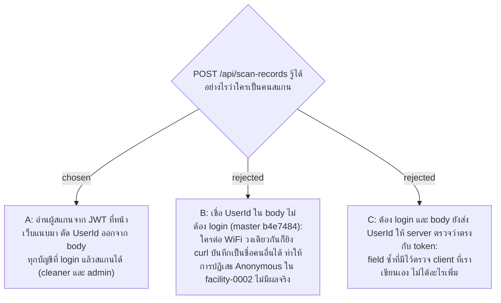

# Scanner Identity Comes from the JWT, not the Request Body

- Decision map: [#18 ตัวตนตอนสแกนและ Dashboard](https://github.com/ThodsaphonSonthiphin/Facility-Real-time-dashboard/issues/18)
- วันที่: 2026-09-13
- เกี่ยวข้อง: facility-0002 (Scanner Authentication), facility-0007 (แตะ 2 ครั้ง), facility-0010 (Server-side Gate), facility-0011 (JWT), facility-0013 (access token ในหน่วยความจำ, refresh เมื่อโหลดหน้า), facility-0014 (Rotation)

## Context & Decision

บน master (b4e7484) `POST /api/scan-records` รับ `UserId` จาก body แล้วค้นหาผู้ใช้ตามนั้น (`Program.cs`) โดยไม่ตรวจ token เลย ใครที่ต่อ WiFi วงเดียวกันส่ง `userId: 1` มาก็บันทึกเป็นสมชายได้ facility-0002 ปฏิเสธ "Anonymous" เพราะผู้ดูแลต้องตรวจสอบตัวตนผู้รับผิดชอบงานได้ แต่การเชื่อ body ทำให้ชื่อ "ทำความสะอาดล่าสุดโดย" บนการ์ด Dashboard เป็นสิ่งที่มือถือบอกมา ไม่ใช่สิ่งที่ server รู้

จึงตัดสินใจให้ **server อ่านผู้สแกนจาก JWT** (facility-0011) ที่หน้าเว็บแนบมาใน header: endpoint สแกนต้อง login (ไม่มี token ตอบ 401) และ `UserId` ถูกตัดออกจาก request body ทุกบัญชีที่ login แล้วสแกนได้ ทั้ง role cleaner และ admin (admin สแกนเพื่อทดสอบได้) เมื่อ middleware JWT มีอยู่แล้วสำหรับหน้าจัดการ (facility-0010) ทางเลือก A เหลือแค่ `RequireAuthorization()` หนึ่งบรรทัดกับอ่าน claim หนึ่งค่า

## Consequences

- `CreateScanRecordRequest` ไม่มี `UserId` อีกต่อไป และ `useScanRecord` เลิกส่ง `userId` — client เดียวคือหน้าเว็บของเราเอง จึงเปลี่ยน contract ได้เลย
- flow แตะ 2 ครั้ง (facility-0007) เปิดหน้าเว็บใหม่ทุกครั้งที่สแกน QR หน้าเว็บจึงเรียก refresh (facility-0013) ขอ access token ใหม่ก่อนกดยืนยันทุกครั้ง หนึ่งสแกน = หนึ่ง refresh + หมุน refresh token หนึ่งใบ (facility-0014) ซึ่งยอมรับได้สำหรับจำนวนสแกนต่อวันของแม่บ้าน
- ถ้า refresh ไม่ผ่าน (cookie หาย, ไม่ได้ใช้เกิน 30 วัน, บัญชีถูกปิด) หน้าสแกนพาไปหน้า login แล้วกลับมาที่ `/scan/{token}` เดิม — โค้ดบน master ทำอยู่แล้วเมื่อ `isAuthenticated` เป็น false
