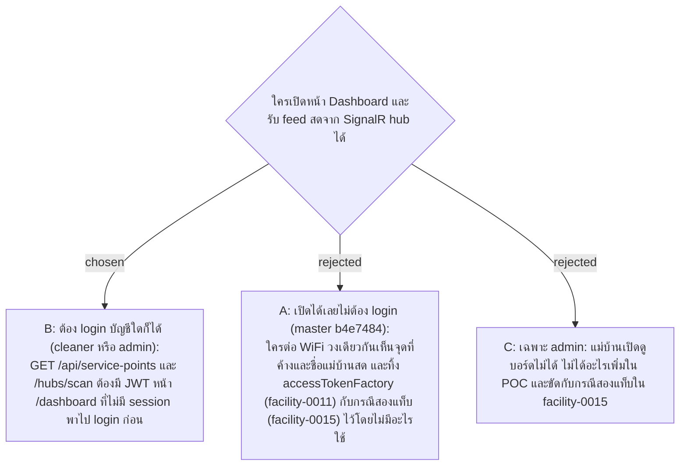

# Dashboard and SignalR Hub Require a Logged-in Account

- Decision map: [#18 ตัวตนตอนสแกนและ Dashboard](https://github.com/ThodsaphonSonthiphin/Facility-Real-time-dashboard/issues/18)
- วันที่: 2026-09-13
- เกี่ยวข้อง: facility-0008 (Dashboard), facility-0010 (Server-side Gate), facility-0011 (accessTokenFactory, `access_token` ใน query เฉพาะ `/hubs`), facility-0012 (SignalR ใช้ token ตอนเริ่มต่อ), facility-0015 (ผ่อนผันสองแท็บ), facility-0016 (sliding 30 วัน), facility-0017 (ผู้สแกนจาก JWT)

## Context & Decision

บน master (b4e7484) `GET /api/service-points` และ `/hubs/scan` เปิดโดยไม่ตรวจอะไร และหน้าเว็บไม่แนบ token ตอนต่อ hub (`signalr.ts`) facility-0011 และ facility-0015 เขียนโดยถือว่าแท็บ Dashboard มี session อยู่แล้ว (accessTokenFactory ของ SignalR, ผ่อนผัน 30 วินาทีให้คนที่เปิด Dashboard กับหน้าสแกนสองแท็บ) แต่ #15 ทิ้งคำถามนี้ไว้ให้ #18 ตัดสิน

จึงตัดสินใจให้ **Dashboard และ SignalR hub ต้อง login ด้วยบัญชีใดก็ได้** ทั้ง cleaner และ admin: `GET /api/service-points` และ `/hubs/scan` ปฏิเสธ connection ที่ไม่มี JWT (401) หน้า `/dashboard` ที่ไม่มี session พาไปหน้า login ที่มีอยู่แล้วใน `App.tsx` (route `/login` และปุ่ม "เข้าสู่ระบบ") ทีวีหรือคอมพิวเตอร์สำนักงาน login ครั้งเดียว แล้วค้างได้ด้วย refresh token sliding 30 วัน (facility-0016)

เหตุผลเดียวกับ facility-0010: ระบบที่จะสร้างตอนฝึกงานต้องกันบอร์ดที่แสดงจุดที่ค้างและชื่อพนักงานอยู่แล้ว การซ้อมมือจึงควรสร้างไว้ และเมื่อ middleware JWT มีอยู่แล้ว ทางเลือก B เพิ่มแค่ `RequireAuthorization()` บน endpoint, `[Authorize]` บน hub และ redirect หนึ่งจุด ส่วน C กันแม่บ้านออกโดยไม่ได้อะไรเพิ่มใน POC

## Consequences

- หน้า Dashboard ที่เปิดค้างต้องขอ access token ใหม่ก่อนหมดอายุ 5 นาที (facility-0012) ตลอดเวลาที่เปิด ทีวีที่เปิดทั้งวันจึง refresh ทุก 5 นาที และไม่หลุดตราบที่ใช้ภายใน 30 วัน
- `accessTokenFactory` ของ SignalR ถูกเรียกใหม่ทุกครั้งที่ reconnect ต้องคืน token ปัจจุบัน (ขอ refresh ก่อนถ้าหมดอายุ) ไม่ใช่ค่าที่ใช้ต่อครั้งแรก
- `Clients.All` ใน hub ยังใช้ได้ เพราะทุก connection ที่ต่อสำเร็จคือคนที่ login แล้ว ไม่ต้องแยก group
- `GET /api/service-points/by-token/{token}` ที่หน้าสแกนใช้ ต้อง login เช่นกัน เพราะหน้าสแกนเปิดได้เฉพาะเมื่อ login แล้วอยู่แล้ว (facility-0017) และคืนชื่อแม่บ้านคนล่าสุดเหมือน endpoint ของ Dashboard
- ปุ่ม "เปิดหน้าสแกนบนมือถือ" และ dev navbar ใน `App.tsx` เป็นความสะดวกตอนพัฒนา ไม่ใช่ตัวกัน (facility-0010)
