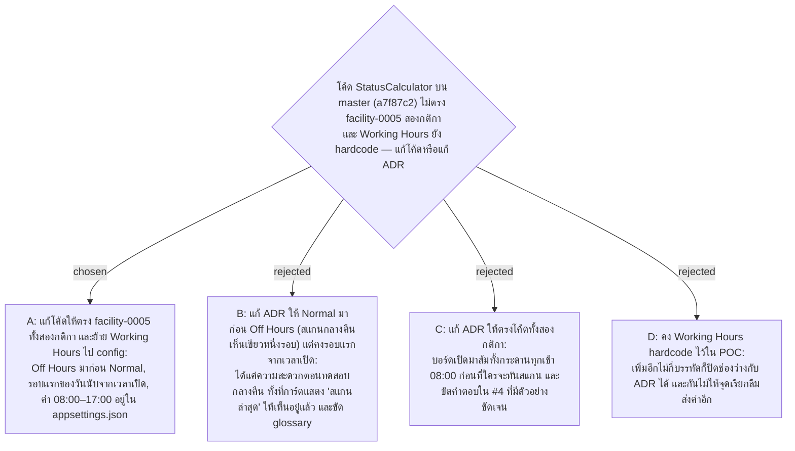

# Status Calculator Follows ADR 0005 — แก้โค้ดตาม ADR ไม่ใช่แก้ ADR ตามโค้ด

- Decision map: [#19 กติกาสถานะในโค้ดไม่ตรง ADR 0005](https://github.com/ThodsaphonSonthiphin/Facility-Real-time-dashboard/issues/19)
- วันที่: 2026-09-13
- เกี่ยวข้อง: facility-0005 (กติกาที่ยืนยันซ้ำใน ADR นี้), facility-0001 (`scanned_at` เก็บ UTC), #7 (Dashboard ดึง snapshot ใหม่ทุก 30 วินาที)

## Context & Decision

บน master (b4e7484) `StatusCalculator` เบี่ยงจาก facility-0005 สามจุด หลัง commit a7f87c2 ซึ่งแก้ bug เทียบเวลา UTC กับ Working Hours ไทย (โค้ดก่อนหน้า f045acf ทำตาม ADR แต่ไม่ได้แปลง time zone) แต่พร้อมกันนั้นก็เปลี่ยนกติกาโดยตั้งใจ มี unit test ยืนยันชื่อ `ReturnsNormal_EvenDuringOffHours`:

1. **ลำดับ**: จุดที่สแกน Normal ภายในรอบแสดงเขียวแม้อยู่นอกเวลาทำงาน แต่ ADR ให้ Off Hours มาก่อน Normal
2. **จุดเริ่มรอบ**: นับจากสแกนล่าสุดอย่างเดียว แต่ ADR นับจาก `max(สแกนล่าสุด, เวลาเปิดของวันนี้)`
3. **Working Hours**: เป็น parameter ที่มีค่า default 08:00–17:00 ในตัวคำนวณ และจุดเรียกทั้งสามใน `Program.cs` ไม่ส่งค่า ไม่มี section ใน `appsettings.json`

สิ่งที่เห็นบน Dashboard ต่างกันแบบนี้ (รอบ 60 นาที, เวลาทำงาน 08:00–17:00):

| เหตุการณ์ที่จุด | เวลาที่ดูบอร์ด | facility-0005 | โค้ดบน master ก่อนแก้ |
|---|---|---|---|
| สแกน Normal เมื่อวาน 16:00 วันนี้ยังไม่สแกน | 08:30 | 🟢 Normal รอบแรก 08:00–09:00 | 🟠 Overdue ตั้งแต่ 08:00 |
| จุดใหม่ ยังไม่เคยสแกน | 08:30 | 🟢 Normal จนถึง 09:00 | 🟠 Overdue |
| สแกน Normal 16:50 | 17:20 | ⚪ Off Hours | 🟢 Normal ถึง 17:50 แล้วค่อยเทา |
| สแกนทดสอบ 20:00 | 20:10 | ⚪ Off Hours | 🟢 Normal ถึง 21:00 |

จึงตัดสินใจ **แก้โค้ดให้ตรง facility-0005 ทั้งสองกติกา และย้าย Working Hours ไป config** เหตุผล: กติกาใน facility-0005 คือคำตอบของเจ้าของโปรเจกต์ใน #4 ที่มีตัวอย่างประกอบ (เปิด 08:00 รอบ 60 นาที ครบรอบแรก 09:00) และ glossary ใน CONTEXT.md ก็เขียนตามนั้น ผลของโค้ดเดิมคือทุกเช้า 08:00 บอร์ดส้มทั้งกระดานก่อนที่แม่บ้านจะทันเดินถึงจุดแรก ส่วนข้อดีเดียวของลำดับ Normal-ก่อน-Off-Hours คือสแกนทดสอบตอนกลางคืนเห็นการ์ดเขียว ซึ่งการ์ดแสดงเวลา "สแกนล่าสุด" อัปเดตให้เห็นอยู่แล้วโดยไม่ต้องเปลี่ยนสี

รูปแบบที่แก้: `StatusCalculator.CalculateStatus(latestScan, point, nowUtc, WorkingHours)` ไม่มีค่า default อีกต่อไป จุดเรียกต้องส่ง `WorkingHours` ที่ bind จาก section `WorkingHours` (`Start`/`End` เป็น `TimeOnly`) ตอน startup ตรวจว่า Start < End ไม่งั้นแอปไม่ขึ้น และลงทะเบียนเป็น singleton ให้ endpoint ทั้งสามรับผ่าน DI; unit test 15 กรณีครอบคลุมทั้งสี่กติกา, จุดเริ่มรอบ, ค่า config และ time zone

## Consequences

- Frontend ไม่ต้องแก้: หน้าเว็บแสดง `currentStatus` ที่ server คำนวณ และดึง snapshot ใหม่ทุก 30 วินาที การเปลี่ยนสถานะตามเวลา (เช่น เป็นส้มตอน 09:00) จึงเห็นภายใน 30 วินาที — ข้อ "client คำนวณซ้ำตามเวลา" ใน facility-0005 ทำสำเร็จด้วยการดึงซ้ำ ไม่ใช่ copy กติกาไปไว้ใน JavaScript กติกามีที่เดียว
- สแกนหลังเลิกงานได้การ์ดเทาทันที ผู้สแกนรู้ว่าสำเร็จจากหน้ายืนยันบนมือถือและเวลา "สแกนล่าสุด" บนการ์ด
- เปลี่ยนเวลาทำงาน = แก้ `appsettings.json` (หรือ `appsettings.Development.json`/env var `WorkingHours__Start`) แล้ว restart ค่าที่ parse ไม่ได้หรือ Start ≥ End ทำให้แอปไม่ขึ้นตั้งแต่ startup แทนที่จะเงียบไปใช้ค่า default
- ผู้เขียน a7f87c2 ควรรู้ว่า test `ReturnsNormal_EvenDuringOffHours` ถูกแทนด้วยกรณีตรงข้าม (`Normal_scan_minutes_before_closing_is_grey_after_closing`) ตามการตัดสินใจนี้
- เวลาทำงานข้ามเที่ยงคืนยังไม่รองรับเช่นเดิม (Start ต้องน้อยกว่า End)
