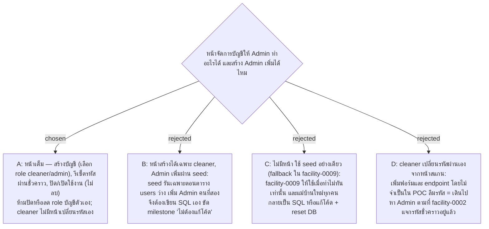

# Accounts Page — Admin สร้าง รีเซ็ตรหัสผ่าน และปิดใช้งานบัญชีได้จากหน้าเว็บ รวมถึงสร้าง Admin

- Decision map: [#17 จัดการบัญชีผู้ใช้](https://github.com/ThodsaphonSonthiphin/Facility-Real-time-dashboard/issues/17)
- วันที่: 2026-09-13
- เกี่ยวข้อง: facility-0002 (Admin สร้างบัญชีล่วงหน้า, ฟิลด์ของบัญชี), facility-0006 (`users.is_active`), facility-0009 (Scope Defense ข้อ 1), facility-0010 (API หน้าจัดการต้องเป็น admin), facility-0012 (ปิดบัญชี/เปลี่ยน role มีผลภายใน 5 นาที), facility-0014 (ปิดบัญชีหรือเปลี่ยนรหัสผ่านยกเลิก refresh token ทุกใบ)

## Context & Decision

บน master (f7b5855) มีแค่ endpoint login กับ seed สองบัญชี (`somchai` cleaner, `admin`) ที่รันเฉพาะตอนตาราง `users` ว่าง entity `User` ยังไม่มี `IsActive` ทั้งที่ facility-0006 กำหนดไว้และ facility-0012 ต้องใช้ตอน refresh การตัดสินใจก่อนหน้าปูไว้เกือบหมดแล้ว: ปิดบัญชีแทนลบ (ประวัติสแกนผูกกับผู้ใช้), ปิดบัญชีหรือรีเซ็ตรหัสผ่านทำให้ session ทุกเครื่องหลุดภายใน 5 นาที, และ API หน้าจัดการต้องเป็น admin สิ่งที่ยังไม่ได้ตัดสินคือชุดปุ่มบนหน้า และจะให้สร้าง Admin จากหน้าเว็บหรือไม่

จึงตัดสินใจให้ **หน้าจัดการบัญชีเป็นหน้าเต็ม** ตามตารางนี้ ทุกปุ่มเรียก API ที่ต้องเป็น admin (facility-0010):

| Admin กด | กรอกอะไร | ผลที่เกิด |
|---|---|---|
| เพิ่มบัญชี | username (ไม่ซ้ำ, แก้ทีหลังไม่ได้), display name, รหัสผ่านชั่วคราว, role `cleaner` หรือ `admin` | แถวใหม่ ผู้ใช้ login ด้วยรหัสชั่วคราวได้ทันที |
| แก้ไข | display name, role | มีผลกับ session ที่ค้างอยู่ภายใน 5 นาที (facility-0012) |
| รีเซ็ตรหัสผ่าน | รหัสผ่านชั่วคราวใหม่ | refresh token ทุกใบของคนนั้นถูกยกเลิก ต้อง login ใหม่ (facility-0014) |
| ปิดใช้งาน / เปิดใช้งาน | สวิตช์บนแถว | `is_active = false`: login ตอบ 401, refresh ถูกปฏิเสธ, ประวัติสแกนยังอยู่และยังแสดงชื่อบน Dashboard |

กติกากัน: Admin ปิดใช้งานหรือลด role บัญชีที่ตัวเอง login อยู่ไม่ได้ (server ตอบ 400) จึงมี Admin ที่ใช้งานได้อย่างน้อยหนึ่งคนเสมอ ไม่มีปุ่มลบ และ cleaner ไม่มีหน้าเปลี่ยนรหัสผ่านเอง ลืมรหัสคือให้ Admin รีเซ็ต

เหตุผล: milestone เฟส 2 ระบุว่า Admin จัดการบัญชีได้เอง "โดยไม่ต้องแก้โค้ด" และ seed บน master รันครั้งเดียวตอนตารางว่าง ทางเลือก B และ C จึงผลักงานประจำ (แม่บ้านใหม่, Admin คนที่สอง) กลับไปเป็น SQL หรือ reset ฐานข้อมูล ส่วน D เพิ่มหน้าจอโดยไม่มีใครขอ ระบบที่จะสร้างตอนฝึกงานต้องมีหน้าแบบนี้อยู่แล้ว การซ้อมมือจึงควรทำให้ครบ

## Consequences

- entity `User` ต้องเพิ่ม `IsActive` (default `true`) ก่อน และ login/refresh ต้องเช็กค่านี้ ซึ่ง facility-0012 ค้างไว้อยู่แล้ว
- API ชุดใหม่ใต้ `/api/users` (list, create, update, reset-password, activate/deactivate) ทั้งหมด `RequireAuthorization` role admin; ไม่มี DELETE
- หน้า Accounts อยู่ในเมนู Admin เดียวกับหน้าจัดการ Service Point (#16) และรูปแบบ prototype ของ #16 ควรเผื่อแท็บหรือเมนูสำหรับบัญชี
- รหัสผ่านชั่วคราวส่งให้แม่บ้านด้วยวาจาหรือกระดาษ ระบบไม่เก็บและไม่ส่ง; ไม่บังคับเปลี่ยนตอน login ครั้งแรกใน POC
- Scope Defense ข้อ 1 ใน facility-0009 ยังเป็น fallback ถ้าทำไม่ทันก่อน 1 ต.ค. แต่ต้องบันทึกใน map ว่าใช้ fallback
