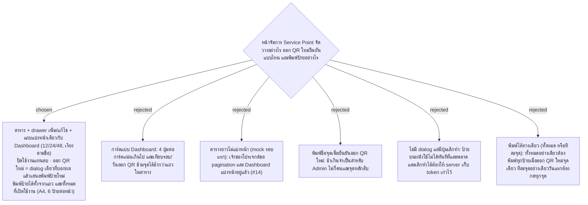

# Points Admin Page — ตารางแบ่งหน้า, ออก QR ใหม่ผ่าน dialog เดียว, พิมพ์ป้ายทีละจุดหรือทั้งหมด

- Decision map: [#16 หน้าจัดการจุดบริการ](https://github.com/ThodsaphonSonthiphin/Facility-Real-time-dashboard/issues/16)
- Prototype: [`docs/decision-map/facility-poc/mockups/points-admin-prototype.html`](../decision-map/facility-poc/mockups/points-admin-prototype.html) · Artifact https://claude.ai/code/artifact/7243e8f3-3cd7-4947-8767-88bf79a29a72 (Version 2)
- วันที่: 2026-09-13
- เกี่ยวข้อง: facility-0003 (URL ใน QR มาจาก PublicBaseUrl), facility-0005 (รอบเป็นนาที ไม่มีผ่อนผัน), facility-0006 (QR Token สุ่ม ออกใหม่แล้วป้ายเก่าใช้ไม่ได้), facility-0008 (แถบแบ่งหน้าของ Dashboard), facility-0009 (Scope Defense ข้อ 2), facility-0010 (API ต้องเป็น admin), facility-0020 (หน้าบัญชีผู้ใช้)

## Context & Decision

เฟส 2 ต้องให้ Admin เพิ่ม/แก้ไข/ปิดจุด ออก QR ใหม่ และพิมพ์ป้ายได้เองโดยไม่ต้องแก้โค้ด บน master (c359416) ยังไม่มีหน้า Admin เลย: จุดมาจาก seed, ปุ่ม "QR สำหรับมือถือ" บนการ์ด Dashboard เปิด modal ที่ดึงรูป QR จาก `api.qrserver.com` และสร้าง URL จาก IP ที่ฝังในโค้ด ทั้งนี้ entity `ServicePoint` มี `IsActive` แล้ว และทั้ง `GET /api/service-points` และ `GET /api/service-points/by-token/{token}` กรองเฉพาะจุดที่เปิดใช้งาน

เจ้าของโปรเจกต์ดู prototype แบบกดได้แล้วตัดสินใจดังนี้:

1. **Layout**: ตารางหนึ่งแถวต่อจุด (ชื่อ + ตำแหน่ง, รอบเป็นนาที, สแกนล่าสุด, QR Token แบบย่อพร้อมวันที่ออก, สถานะเปิด/ปิดใช้งาน, ปุ่ม แก้ไข · พิมพ์ป้าย · ออก QR ใหม่ · ปิด/เปิดใช้งาน) มีช่องค้นหาและ "ซ่อนจุดที่ปิดใช้งาน" หน้าบัญชีผู้ใช้ (facility-0020) เป็นอีกแท็บในเมนู Admin เดียวกัน
2. **เพิ่ม/แก้ไข**: drawer ด้านขวา (เต็มจอบนมือถือ) มี ชื่อจุด (บังคับ), ตำแหน่ง, รอบทำความสะอาดเป็นจำนวนเต็มนาที > 0 พร้อมปุ่มลัด 30/45/60/90/120 QR Token สุ่มให้ตอนสร้าง แก้ใน drawer ไม่ได้
3. **แบ่งหน้า**: ใช้แถบเดียวกับ Dashboard (facility-0008) ใต้ตาราง 12/24/48 แถวต่อหน้า เรียงตาม **ชื่อจุด** ไม่ใช่ความเร่งด่วน ค้นหา/ซ่อนจุดปิด/เปลี่ยนจำนวนต่อหน้า กลับไปหน้า 1; เพิ่มหรือเปลี่ยนชื่อจุดแล้วพาไปหน้าที่แถวนั้นอยู่และกระพริบ; ปิด/เปิดใช้งานและออก QR ใหม่ไม่ย้ายแถว
4. **ปิดใช้งานแทนลบ**: ไม่มีปุ่มลบ แถวที่ปิดจางลงแต่ยังอยู่ในตาราง หายจาก Dashboard ประวัติสแกนยังอยู่ มี toast พร้อมปุ่มเลิกทำ พิมพ์ป้ายและออก QR ใหม่ของจุดที่ปิดกดไม่ได้
5. **ออก QR ใหม่**: dialog เดียวที่มีชื่อจุด คำเตือน "ป้ายที่ติดอยู่ที่จุดนี้จะสแกนไม่ได้ทันที" และบอกว่าประวัติสแกนไม่เปลี่ยน ปุ่มยืนยันสีส้ม เมื่อยืนยันแล้ว toast เสนอ "พิมพ์ป้ายใหม่" ทันที
6. **พิมพ์ป้าย**: สองทาง — "พิมพ์ป้าย" บนแถว (ป้ายเดียว) และ "พิมพ์ป้ายทั้งหมด" ด้านบน (ทุกจุดที่เปิดใช้งาน ไม่ใช่แค่หน้าที่เห็น) เปิดหน้าตัวอย่างกระดาษ A4 แนวตั้ง 6 ป้ายต่อหน้า แต่ละป้ายมี ชื่อจุด, ตำแหน่ง, "สแกนด้วยกล้องมือถือ เพื่อบันทึกการทำความสะอาด", รอบ, วันที่ออก QR, token ย่อ, URL เต็มตัวเล็ก และรูป QR แล้วสั่งพิมพ์จากเบราว์เซอร์

เหตุผล: Admin ใช้หน้านี้หาและแก้จุดทีละแถว ไม่ได้เฝ้าดูสถานะ ตารางจึงเทียบข้อมูลข้ามจุดได้เร็วกว่าการ์ด และการเรียงตามชื่อทำให้แถวอยู่ที่เดิมระหว่างทำงาน การออก QR ใหม่ย้อนกลับไม่ได้ในทางปฏิบัติ (ป้ายบนผนังตายทันที) จึงควรมีจุดหยุดหนึ่งครั้ง แต่ไม่หนักถึงต้องพิมพ์ชื่อ ส่วนการพิมพ์สองทางตรงกับสองเหตุการณ์จริง: วันแรกติดป้ายทุกจุด และวันที่ป้ายจุดเดียวชำรุด

## Consequences

- API ชุดใหม่ใต้ `/api/admin/service-points` (list ที่รวมจุดปิด, create, update, activate/deactivate, regenerate-token) ทั้งหมดต้องเป็น admin (facility-0010); endpoint ของ Dashboard ยังกรองเฉพาะจุดที่เปิดใช้งาน
- ป้ายของจุดที่ปิดใช้งานสแกนไม่ได้ เพราะ `by-token` บน master ตอบ 404 เมื่อ `IsActive` เป็น false — หน้าสแกนควรบอกว่าจุดนี้ปิดใช้งาน ไม่ใช่ "ไม่พบ" เฉยๆ
- URL บนป้ายที่พิมพ์ต้องมาจาก PublicBaseUrl ใน config (facility-0003) แทน IP ที่ฝังใน `ServicePointCard.tsx` บน master มิฉะนั้นป้ายที่พิมพ์แล้วใช้ไม่ได้เมื่อ IP ของ Mac เปลี่ยน
- ต้องเก็บวันที่ออก QR Token ล่าสุด (เช่น `qr_token_issued_at`) เพื่อแสดงในตารางและบนป้าย ซึ่ง facility-0006 ยังไม่มี
- แถบแบ่งหน้าควรเป็น component เดียวกับของ Dashboard ใน React ไม่ใช่เขียนสองชุด
- Prototype วาดรูป QR ในเบราว์เซอร์; ถ้าทำไม่ทันใช้บริการภายนอกสร้างรูปชั่วคราวได้ตาม facility-0009 Scope Defense ข้อ 2 (อย่างที่ modal บน master ทำอยู่)
