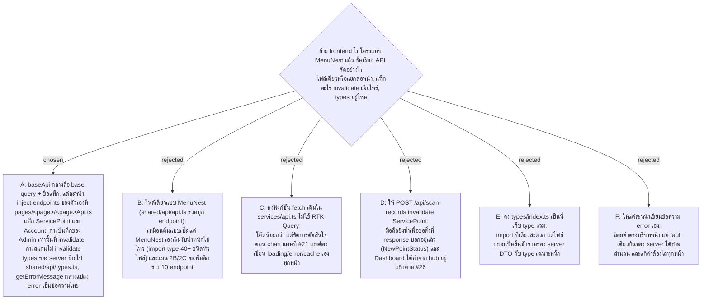

# Frontend API Layer — baseApi + injectEndpoints ต่อหน้า, สองแท็ก, types อยู่ข้าง API

- Decision map: [#24 api-layer-shape](https://github.com/ThodsaphonSonthiphin/Facility-Real-time-dashboard/issues/24) บนแผนที่ [#21](https://github.com/ThodsaphonSonthiphin/Facility-Real-time-dashboard/issues/21)
- วันที่: 2026-09-16
- เกี่ยวข้อง: facility-0004 (ส่วน frontend ของ ADR นั้นยังผิด — ระบุ MUI + react-structure), facility-0018 (ทุก endpoint ต้อง login), facility-0017 (ScanRecord ไม่มี UserId ใน body), #26 hub-cache-bridge (hub patch cache), #25 auth-in-base-query (token ใน base query — ยังไม่ตัดสิน)

## Context & Decision

แผนที่ #21 ตัดสินไปแล้วว่า frontend ย้ายไปโครงแบบ MenuNest และใช้ RTK Query + Redux Toolkit ตั๋วนี้ตอบว่าชั้น API จัดรูปอย่างไร

สภาพวันนี้: `services/api.ts` มีฟังก์ชันธรรมดา 3 ตัว (`getServicePointsApi`, `getServicePointByTokenApi`, `createScanRecordApi`) แต่ละตัวโยน `Error` เป็นข้อความไทย, DTO type อยู่ที่ `types/index.ts`, ฝั่ง server มี 6 endpoint และแผน 2B/2C จะเพิ่มอีกราว 10

**1. baseApi กลาง + injectEndpoints ต่อหน้า**

`shared/api/baseApi.ts` ถือ base query, `reducerPath` และรายชื่อ `tagTypes` เท่านั้น แต่ละหน้าเพิ่ม endpoint ของตัวเองด้วย `injectEndpoints` ที่ `pages/<page>/<page>Api.ts` — store เดียว cache เดียว base query เดียวเหมือน MenuNest ต่างกันแค่บรรทัดที่ประกาศ endpoint อยู่ในโฟลเดอร์ของหน้านั้น ซึ่งตรงกับเหตุผลที่เลือกโครง MenuNest ตั้งแต่ต้น

**2. สองแท็ก และการสแกนไม่ invalidate**

| การกระทำ | invalidate อะไร | ทำไม |
|---|---|---|
| Dashboard โหลดรายการ Service Point | provides `ServicePoint` (LIST + ราย id) | เป็นแหล่งข้อมูลของบอร์ด |
| หน้าสแกนเปิดด้วย QR Token | provides `ServicePoint` ราย id | จุดเดียว |
| Cleaner กดยืนยันการสแกน | **ไม่ invalidate** | response มี `NewPointStatus` อยู่แล้ว และ Dashboard ได้ค่าใหม่จาก hub ตาม #26 (มี poll 30 วินาทีเป็นตาข่าย) |
| Admin แก้ชื่อ/รอบ/ออก QR Token ใหม่/ปิดใช้งานจุด (2C) | invalidates `ServicePoint` | บอร์ดต้องเห็นของใหม่ |
| Admin สร้าง/แก้/รีเซ็ตรหัส/ปิดใช้งานบัญชี (2B) | invalidates `Account` | หน้าบัญชีต้องเห็นของใหม่ |

**3. types ของ server ย้ายไปข้าง API**

`shared/api/types.ts` ถือ shape ที่ server ส่งและรับ (`ServicePointStatus`, `CreateScanRequest`, `CreateScanResponse`, `AuthUser`, `AuthResponse`) ส่วน type ที่มีแต่หน้านั้นใช้ (ร่างฟอร์ม, ค่า filter) อยู่ในโฟลเดอร์ของหน้า — `types/index.ts` หายไป เพราะเป็นไฟล์ที่กลายเป็นลิ้นชักรวมได้ง่ายที่สุด

**4. ข้อความ error กลางหนึ่งที่ หน้าจอ override ได้**

`shared/utils/getErrorMessage.ts` แปลง error ของ RTK Query เป็นข้อความไทยสำหรับกรณีที่เหมือนกันทุกหน้า (ไม่มีเน็ต, 401 หลัง session ตาย, 500) หน้าจอส่งข้อความของตัวเองเฉพาะที่บริบทต่างจริง เช่น หน้าสแกนเจอ Deactivated Service Point ต้องบอกว่า QR Sign เลิกใช้แล้ว ไม่ใช่ "ขอข้อมูลไม่สำเร็จ"

## Consequences

- ทุก import ของ `AuthUser` / `AuthResponse` เปลี่ยนที่มา — `tsc -b` จะชี้ให้ครบ
- หน้าใหม่ 1 หน้า = ไฟล์ API เพิ่ม 1 ไฟล์ ต้องเขียนไว้ใน README/ADR ให้คนใหม่รู้ว่า endpoint ไม่ได้อยู่ที่เดียว
- การสแกนไม่ invalidate แปลว่า ถ้า hub ล่มและ poll ถูกตัดทิ้งภายหลัง บอร์ดจะค้าง — ตั๋ว #27 polling-vs-push ต้องรักษา poll ไว้เป็นตาข่าย
- `tagTypes` ประกาศรวมที่ baseApi ทำให้หน้าแต่ละหน้า invalidate ข้ามหน้าได้ (2C แก้จุด แล้วบอร์ดรีเฟรช) โดยไม่ต้อง import กันเอง ซึ่งยังเคารพกติกา shared -> pages
- ยังไม่ตัดสินในตั๋วนี้: token/refresh ใน base query (#25) และตำแหน่งของ `pollingInterval` (#27)
