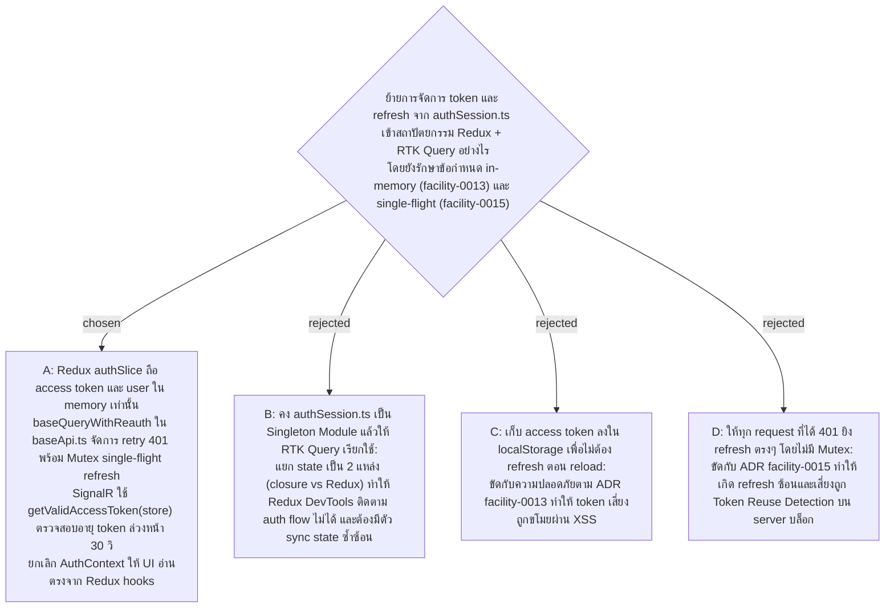

# Auth in Base Query and SignalR — Redux authSlice + baseQueryWithReauth + getValidAccessToken

- Decision map: [#25 auth-in-base-query](https://github.com/ThodsaphonSonthiphin/Facility-Real-time-dashboard/issues/25) บนแผนที่ [#21](https://github.com/ThodsaphonSonthiphin/Facility-Real-time-dashboard/issues/21)
- วันที่: 2026-09-24
- เกี่ยวข้อง: facility-0013 (refresh token ใน HttpOnly cookie, access token ในหน่วยความจำ), facility-0014 (server-side refresh rotation), facility-0015 (single-flight refresh, reuse detection), facility-0022 (baseApi + injectEndpoints)

## Context & Decision

ในโครงสร้างเดิม `services/authSession.ts` ทำหน้าที่เป็น Singleton Closure เก็บ Access Token (อายุ 5 นาที) ไว้ในหน่วยความจำ และจัดการ Single-flight Refresh เพื่อป้องกันการยิง Refresh Token ใน HttpOnly cookie ซ้ำซ้อนตาม ADR facility-0013 และ facility-0015

เมื่อย้ายโครงสร้าง Frontend สู่ **Redux Toolkit + RTK Query (`baseApi`)** ตาม ADR facility-0022 จึงตัดสินใจจัดวางความรับผิดชอบใหม่ดังนี้:

### 1. In-memory Auth State ใน Redux `authSlice`
- State เก็บอยู่ที่ `store/slices/authSlice.ts`:
  - `currentUser: AuthUser | null`
  - `accessToken: string | null`
  - `expiresAt: string | null`
  - `isBootstrapping: boolean` (เป็น `true` ตอนเริ่มแอปจนกว่าการตรวจ Session จะเสร็จ)
- **รักษาข้อกำหนด ADR facility-0013**: ข้อมูลทั้งหมดถูกเก็บไว้ใน Redux State ในหน่วยความจำของเบราว์เซอร์เท่านั้น **ไม่บันทึกลง `localStorage` หรือ `sessionStorage`**

### 2. RTK Query `baseQueryWithReauth`
- ใน `shared/api/baseApi.ts` ห่อหุ้ม `fetchBaseQuery` ด้วย `baseQueryWithReauth`:
  - ใน `prepareHeaders`: อ่าน `accessToken` จาก `(getState() as RootState).auth.accessToken` แนบใน `Authorization: Bearer <token>`
  - เมื่อได้รับผลลัพธ์เป็น HTTP 401:
    - ใช้กลไก **Mutex / Shared In-flight Promise** เพื่อรับประกันว่าเป็น **Single-flight Refresh** (ADR facility-0015): มีเพียง 1 Request เท่านั้นที่ยิง `POST /api/auth/refresh`
    - หาก Refresh สำเร็จ: dispatch `setCredentials` อัปเดต token ใหม่ลง Store แล้ว retry คำขอเดิมซ้ำอีก 1 ครั้ง
    - หาก Refresh ล้มเหลว (401/403 จาก server หรือ session หมดอายุ 30 วัน): dispatch `logout()` เคลียร์ state ใน Store และนำทางกลับสู่หน้า `/login`

### 3. SignalR `accessTokenFactory`
- เชื่อมต่อ SignalR ผ่าน Helper Function `getValidAccessToken(store)`:
  - ตรวจสอบว่ามี Token และอายุที่เหลือเกิน 30 วินาที (`REFRESH_MARGIN_MS`) หรือไม่
  - หากหมดอายุหรือใกล้หมดอายุ จะเรียก trigger refresh ผ่าน store ก่อนคืนค่า Token ใหม่ให้ SignalR นำไปใช้ต่อเชื่อมต่อ (Connect) หรือเชื่อมต่อใหม่ (Reconnect)

### 4. การจัดการวงจรชีวิต UI (Lifecycle & Context)
- ยกเลิก `AuthContext.tsx` และ `useAuth()` แบบ React Context
- เปลี่ยนไปใช้ Redux Custom Hooks (`useAppSelector`, `useAppDispatch`) และ RTK Query Auth Endpoints (`useLoginMutation`, `useLogoutMutation`)
- ตอนโหลดหน้าเว็บ (Page Reload): ให้ Component ราก (Root Component) เรียกตรวจ Session ผ่าน `refresh` เพียงครั้งเดียว หากผ่านจะเข้าใช้งานต่อได้โดยไม่มีจังหวะกะพริบหน้าจอ Login

## Consequences

- สอดคล้องกับ Redux Toolkit Architecture แบบ Single Source of Truth สามารถดูความเคลื่อนไหวของ Session ผ่าน Redux DevTools ได้ครบถ้วน
- ไม่มีไฟล์ `services/authSession.ts` และ `AuthContext.tsx` แบบเดิมในระบบ โค้ด Auth รวมเป็นอันหนึ่งอันเดียวกับ Store และ API Layer
- ปลอดภัยตามมาตรฐานความปลอดภัยเดิมของระบบ (In-memory Access Token + Single-flight HttpOnly Refresh Token)
