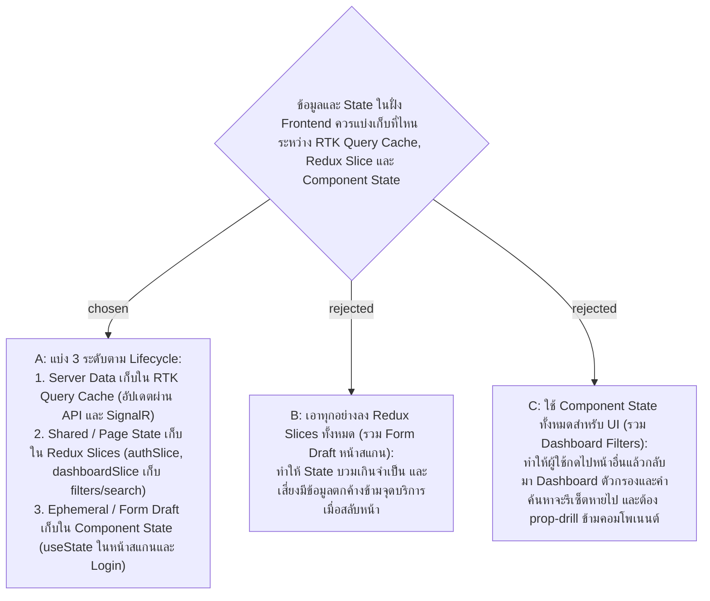

# Client State Split — RTK Query Cache vs Redux Slices vs Component State

- Decision map: [#29 client-state-split](https://github.com/ThodsaphonSonthiphin/Facility-Real-time-dashboard/issues/29) บนแผนที่ [#21](https://github.com/ThodsaphonSonthiphin/Facility-Real-time-dashboard/issues/21)
- วันที่: 2026-09-24
- เกี่ยวข้อง: facility-0022 (API layer & RTK Query), facility-0023 (auth in Redux authSlice & baseQueryWithReauth)

## Context & Decision

ในการปรับโครงสร้าง Frontend สู่ Redux Toolkit + RTK Query ต้องกำหนดขอบเขตความรับผิดชอบของ State บน Client ให้ชัดเจนเพื่อไม่ให้เกิดความซ้ำซ้อนและรองรับพฤติกรรมของผู้ใช้จริง:

### 1. RTK Query Cache (Server State)
- **ข้อมูลที่เก็บ**:
  - รายการจุดบริการ (`ServicePointStatus[]`)
  - รายละเอียดจุดบริการจาก QR Token
  - รายชื่อบัญชีผู้ใช้ (Accounts) สำหรับ Admin
  - สถานะ Request (`isLoading`, `isFetching`, `error`)
- **การจัดการ**:
  - จัดการอัตโนมัติผ่าน `shared/api/baseApi.ts` และ endpoint hooks
  - ข้อมูลใน Dashboard ได้รับการแพตช์แบบเรียลไทม์ผ่าน SignalR (`updateCachedData`) ตามการตัดสินใจใน #26

### 2. Redux Page Slices (Global / Multi-component State)
- **`authSlice`** (`store/slices/authSlice.ts`):
  - `currentUser`, `accessToken`, `expiresAt`, `isBootstrapping`
  - เก็บในหน่วยความจำเท่านั้นตาม ADR facility-0013 และ facility-0023
- **`dashboardSlice`** (`store/slices/dashboardSlice.ts`):
  - `selectedStatusFilter`: ค่าตัวกรองสถานะ (`All`, `Normal`, `Overdue`, `Issue`, `OffHours`)
  - `searchQuery`: ข้อความค้นหาจุดบริการ
  - `lastUpdatedPointId`: ID จุดบริการที่เพิ่งมีการอัปเดตผ่าน SignalR เพื่อทำ Visual Highlight
  - **เหตุผล**: เมื่อผู้ใช้นำทางไปหน้าอื่น (เช่น สลับไปหน้า Admin หรือ Scan) แล้วกดกลับมาที่หน้า Dashboard ค่าตัวกรองและคำค้นหาเดิมยังคงอยู่ ไม่รีเซ็ตหายไป และคอมโพเนนต์ย่อย (FilterBar, SearchInput, CardGrid) สามารถอ่านค่าได้โดยตรงโดยไม่ต้อง prop-drill

### 3. Local Component State (`useState`) (Ephemeral UI State)
- **หน้า Scan Record (`ScanRecordPage`)**:
  - `status`: สถานะผลการตรวจ (`Normal` / `Issue`)
  - `selectedTags`: รายการปัญหาที่เลือก
  - `notes`: ข้อความหมายเหตุเพิ่มเติม
  - `showIssueForm`: สถานะการเปิด/ปิดส่วนกรอกปัญหา
  - **เหตุผล**: เป็นงานสแกนหน้างานที่ทำจบในรอบเดียว (1-tap หรือบันทึกเสร็จ) เมื่อเปิดหน้าใหม่หรือสแกนจุดใหม่ ฟอร์มจะเริ่มต้นด้วยความสะอาดว่างเปล่าเสมอ ป้องกันข้อมูลเก่าตกค้างหรือสับสนข้ามจุดบริการ
- **หน้า Login (`LoginPage`)**:
  - `username`, `password`: ข้อมูลในช่อง input กรอกชั่วคราว ไม่บันทึกลง Redux เพื่อความปลอดภัย
- **คอมโพเนนต์ทั่วไป**:
  - Modal / Dialog open state (`showQrModal`, confirmation dialogs)

## Consequences
- โครงสร้าง Store ชัดเจน มี 2 Slices หลักคือ `auth` และ `dashboard`
- ลดความซับซ้อนในหน้า Scan โดยคง `useState` ที่เรียบง่ายและไม่ทิ้งขยะลง Global Store
- ประสบการณ์ใช้งาน Dashboard ดีขึ้นจากการคงตัวกรองข้ามการนำทาง
