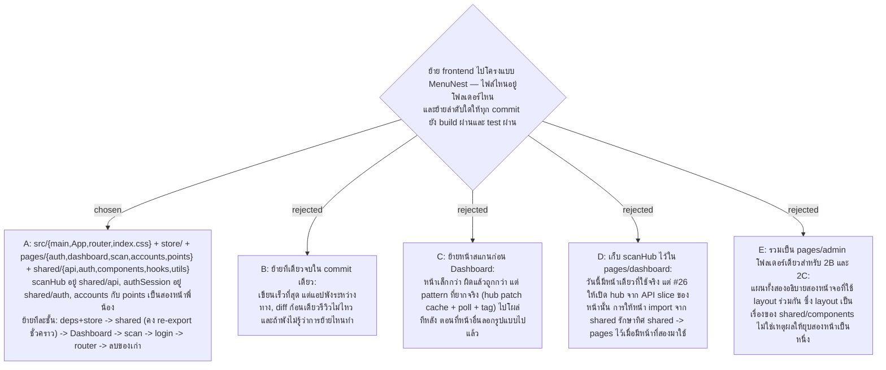

# Frontend Target Tree — pages/shared/store แบบ MenuNest และลำดับย้ายไฟล์ทีละชั้นแล้วทีละหน้า



- Decision map: [#22 target-tree](https://github.com/ThodsaphonSonthiphin/Facility-Real-time-dashboard/issues/22) บนแผนที่ [#21](https://github.com/ThodsaphonSonthiphin/Facility-Real-time-dashboard/issues/21)
- วันที่: 2026-09-16
- เกี่ยวข้อง: facility-0022 (API slice ต่อหน้า — ไฟล์ที่ tree นี้วางตำแหน่งให้), facility-0004 (ส่วน frontend ยังผิด), #26 hub-cache-bridge, #23 router-shape (เนื้อใน router.tsx), #31 css-organisation (การแตก index.css), #32 regression-net (ตาข่ายที่ต้องมีก่อนย้าย)

## Context & Decision

แผนที่ #21 ตัดสินแล้วว่าใช้โครงแบบ MenuNest (`pages/` + `shared/` + `store/` + barrel ต่อหน้า) ตั๋วนี้ระบุ tree จริงของแอปนี้ และลำดับการย้าย

**1. Tree**

```
src/
├── main.tsx · App.tsx · router.tsx · index.css
├── store/index.ts                  store เดียว, slice ของแต่ละหน้ามาลงทะเบียนที่นี่
├── pages/
│   ├── auth/                       LoginPage.tsx · index.ts
│   ├── dashboard/                  DashboardPage.tsx · ServicePointCard.tsx · KpiSummaryBar.tsx
│   │                               useDashboard.ts · dashboardApi.ts · dashboardSlice.ts · index.ts
│   ├── scan/                       ScanRecordPage.tsx · IssueTagSelector.tsx
│   │                               useScanRecord.ts · scanApi.ts · scanSlice.ts · index.ts
│   ├── accounts/                   แผน 2B
│   └── points/                     แผน 2C
└── shared/
    ├── api/                        baseApi.ts · types.ts · scanHub.ts
    ├── auth/                       authSession.ts (+ test)
    ├── components/                 AppLayout.tsx · ProtectedRoute.tsx · NavBar.tsx
    ├── hooks/                      useCurrentUser.ts
    └── utils/                      getErrorMessage.ts
```

`services/`, `types/index.ts` และ `features/` หายไปทั้งหมด

**2. ลำดับย้าย — ทีละชั้น แล้วทีละหน้า**

| ขั้น | ทำอะไร | สภาพหลังขั้นนี้ |
|---|---|---|
| 0 | `regression-net` (#32) เขียน component test ของ Dashboard และหน้าสแกนก่อน | มีตาข่าย |
| 1 | เพิ่ม Redux Toolkit และ `@base-ui/react`, สร้าง `store/index.ts` กับ `shared/api/baseApi.ts` | ยังไม่มีใครใช้ แอปเดิมทำงานปกติ |
| 2 | ย้าย `authSession.ts`, `signalr.ts`, type ของ server ไปที่ใหม่ โดยคง re-export ที่ path เดิมชั่วคราว | import เดิมยังใช้ได้ |
| 3 | ย้ายหน้า Dashboard | pattern ทั้งชุด (page folder, API slice, tag, hub patch) พิสูจน์บนหน้าที่ยากที่สุด |
| 4 | ย้ายหน้าสแกน แล้วหน้า login | ทำซ้ำ pattern เดิม |
| 5 | เปลี่ยน if-chain ใน `App.tsx` เป็น `router.tsx` | เส้นทางจริงตาม #23 |
| 6 | ลบ `services/`, `types/index.ts`, `features/` และ re-export ชั่วคราว | เหลือ tree เดียว |

## Consequences

- ขั้น 2 ทำให้มี import path สองทางอยู่ชั่วคราว จนกว่าขั้น 6 จะลบทิ้ง — เป็นราคาที่จ่ายเพื่อไม่ให้ build พังกลางทาง
- ทุก commit ต้อง build ผ่านและ test ผ่าน ไม่มี commit ที่ "ย้ายครึ่งทาง"
- Dashboard ย้ายก่อน แปลว่าถ้ารูปแบบผิด จะเจอตั้งแต่หน้าแรก ไม่ใช่หลังจากหน้าอื่นลอกไปแล้ว
- `router.tsx` และการแตก `index.css` ยังเป็นของตั๋ว #23 และ #31 — tree นี้แค่จองที่ให้
