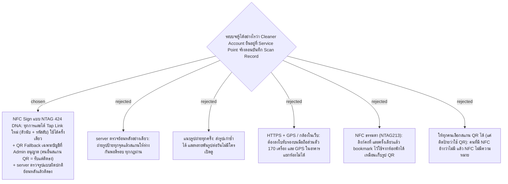

# Scan Presence Proof — NFC Sign (NTAG 424 DNA) with One-Time Tap Link

- Decision map: [#41 scan-presence-proof](https://github.com/ThodsaphonSonthiphin/Facility-Real-time-dashboard/issues/41) บนแผนที่ [#1](https://github.com/ThodsaphonSonthiphin/Facility-Real-time-dashboard/issues/1)
- วันที่: 2026-10-02
- เกี่ยวข้อง: facility-0003 (HTTP บน WiFi), facility-0006 (QR Token คงที่), facility-0007 (flow 2 แตะ), facility-0017 (ผู้สแกนจาก JWT)
- สรุปสำหรับคนอื่น: [ป้าย NFC กันสแกนปลอม](https://claude.ai/artifact/AsbyjJzzgwxqHNFqNDyZbK)

## Context & Decision

QR Sign บรรจุ QR Token คงที่ (facility-0006) และ scan request ไม่มีหลักฐานตำแหน่ง แม่บ้านจึงถ่ายรูปป้ายไว้แล้วสแกนจากห้องพักได้ การตัดสินใจนี้ใช้เกณฑ์ **งานจริงในโรงงาน** (แม่บ้าน ~170 คน มือถือส่วนตัว) ไม่ใช่แค่ POC

1. **NFC Sign เป็นทางหลัก** — ชิป NTAG 424 DNA (SUN) ต่อท้ายลิงก์ด้วยตัวนับที่เพิ่มขึ้นทุกการแตะและรหัสลับ (CMAC) จากกุญแจในชิป server ตรวจรหัสลับและจำตัวนับล่าสุดต่อ Service Point → **Tap Link ที่ใช้แล้วถูกปฏิเสธ** (ไม่บันทึก) ผู้ใช้ยังแตะ 2 ครั้งเหมือน facility-0007 (แตะป้าย → แตะยืนยัน) และทำงานบน HTTP ได้ ไม่ต้องใช้ secure context
2. **QR Fallback** — มือถือที่ไม่มี NFC ใช้ QR Sign ได้เฉพาะบัญชีที่ Admin เปิดสิทธิ์ให้ ถ้าบัญชีที่ไม่มีสิทธิ์สแกน QR → **รับไว้แต่เป็น Flagged Scan Record** (ไม่ปฏิเสธ เพื่อไม่ให้งานหยุดหน้างาน)
3. **ตรวจย้อนหลังที่ server** — ทุก Scan Record ผ่านกฎความผิดปกติ (เวลาเดินระหว่างจุดไม่พอ, สแกนซ้ำเร็วกว่า Cleaning Interval, ใช้ Tap Link หลายอันติดกัน/ใช้ช้าผิดปกติ) ผลคือ **ติดธง ไม่ปฏิเสธ**
4. **ป้ายในโรงงาน** — แบบกันน้ำ ฝังหลังแผ่นป้ายที่ยึดด้วยน็อต; ผิวโลหะต้องใช้รุ่น on-metal

| เหตุการณ์ | ผล |
|---|---|
| Tap Link ใหม่ รหัสลับถูก | บันทึก Scan Record ปกติ |
| Tap Link ซ้ำ / รหัสลับผิด | ปฏิเสธ |
| สแกน QR โดยบัญชีที่มี QR Fallback | บันทึก (กฎย้อนหลังยังตรวจ) |
| สแกน QR โดยบัญชีที่ไม่มี QR Fallback | บันทึกเป็น Flagged Scan Record |
| กฎย้อนหลังเจอรูปแบบผิดปกติ | ติดธงบน Scan Record นั้น |

## POC: จำลองก่อน (ผู้ใช้เลือก)

POC นี้**ไม่ซื้อชิป** เขียนส่วนตรวจ Tap Link (ตัวนับ + รหัสลับ) ให้ครบ แล้วทดสอบด้วยลิงก์ที่สร้างเองตามรูปแบบเดียวกับที่ชิปสร้าง เพราะฟรี เริ่มได้ทันที และตรงกับกติกา "เร็วที่สุด / ไม่มีค่าใช้จ่าย" ของ map

**NOTE — ต้องทำตอนฝึกงาน (ยังไม่ได้ทำ):**
- ซื้อ NTAG 424 DNA จริงมาลองแตะ (≈ ฿35/ชิ้น ส่วนใหญ่สั่งต่างประเทศ) ตรวจว่าลิงก์ที่ชิปจริงสร้างผ่านโค้ดตรวจที่จำลองไว้
- หาวิธีตั้งกุญแจและ SUN ในชิป (แอปบนมือถือ หรือต้องซื้อเครื่องเขียน) และวิธีเก็บกุญแจให้ปลอดภัย
- เช็กว่ามี 424 DNA รุ่น on-metal ขายและราคาเท่าไร
- สำรวจว่ามือถือแม่บ้านมี NFC กี่เครื่อง ถ้าไม่มีเยอะ พิจารณามือถือกลางทีมละเครื่อง

## Consequences

- scan request ต้องรับ Tap Link (ตัวนับ + รหัสลับ) เพิ่มจาก QR Token; Service Point ต้องเก็บกุญแจของชิปและตัวนับล่าสุด; Cleaner Account ได้ช่องสิทธิ์ QR Fallback; Scan Record ได้ธงและวิธีที่ใช้สแกน (NFC / QR)
- ช่องโหว่ที่เหลือ: คนตั้งใจใช้แอปอ่านชิปเก็บ Tap Link ไว้หลายอันโดยยังไม่เปิด แล้วใช้ทีหลัง (ต้องไปยืนที่ป้ายตอนเก็บ) และบัญชีที่มี QR Fallback ยังสแกนจากรูปได้ — ทั้งสองอาศัยกฎย้อนหลังจับ จึงควรให้มีบัญชี QR Fallback น้อยที่สุด
- Flagged Scan Record ไปขึ้นที่จอไหนและ Admin ทำอะไรต่อ ยังไม่ได้ตัดสิน
- ไม่ต้องย้ายไป HTTPS เพื่อเรื่องนี้ (#43 ยังตัดสินแยก)
