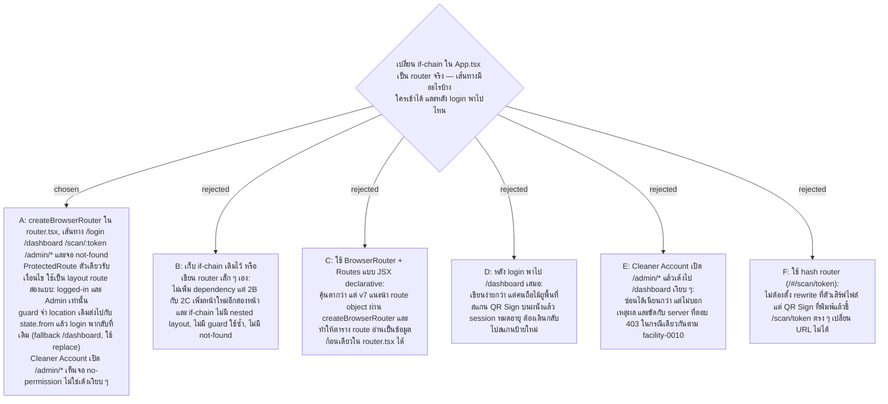

# Frontend Router Shape — react-router จริงใน router.tsx, ProtectedRoute ตัวเดียว และจำที่อยู่ก่อน login

- Decision map: [#23 router-shape](https://github.com/ThodsaphonSonthiphin/Facility-Real-time-dashboard/issues/23) บนแผนที่ [#21](https://github.com/ThodsaphonSonthiphin/Facility-Real-time-dashboard/issues/21)
- วันที่: 2026-09-23
- เกี่ยวข้อง: facility-0025 (tree ที่จองที่ให้ `router.tsx` และ `shared/components/ProtectedRoute.tsx`), facility-0022 (API layer), facility-0010 (server ตอบ 403 เมื่อ login แล้วแต่ไม่ใช่ Admin), facility-0018 (นโยบาย AdminOnly), #34 deploy-origin (ตัวเสิร์ฟไฟล์ต้องตอบ /scan/:token ด้วยแอป)

## Context

วันนี้ `App.tsx` เป็น if-chain: อ่าน `window.location.pathname` เข้า `useState`, เช็ค `startsWith('/scan')`, แล้วเลือก render หน้าไหน ถ้าไม่มี QR Token ใน URL จะตกไปที่ค่าคงที่ `token-restroom-m1` ที่ฝังในโค้ด แผน 2B และ 2C กำลังจะเพิ่มหน้าจัดการ Cleaner Account และหน้าจัดการ Service Point ซึ่งเข้าได้เฉพาะ Admin Account — if-chain นี้ไม่มีที่ให้วาง guard และไม่มีจอ not-found

## Decision

**1. ตาราง route**

| ที่อยู่ | วันนี้ | หลังเปลี่ยน |
|---|---|---|
| `/` | Dashboard | redirect ไป `/dashboard` ถ้า login แล้ว ไม่งั้นไป `/login` |
| `/login` | ไม่มี route | เป็น route จริง |
| `/dashboard` | Dashboard | เหมือนเดิม ต้อง login |
| `/scan/:token` | หน้าสแกน (QR Sign ที่พิมพ์แล้วชี้มาที่นี่) | เหมือนเดิม ห้ามพัง |
| `/scan` (ไม่มี token) | ตกไปที่ `token-restroom-m1` ที่ฝังในโค้ด | **ตัดทิ้ง** |
| `/admin/accounts`, `/admin/points` | ไม่มี | เพิ่มพร้อมแผน 2B และ 2C, Admin Account เท่านั้น |
| อื่น ๆ | Dashboard | จอ "ไม่พบหน้านี้" พร้อมลิงก์กลับหน้าแรก |

**2. API ของ router** — `createBrowserRouter` เขียนเป็น route object ทั้งตารางใน `router.tsx`, `App.tsx` เหลือแค่ provider และ layout ไม่ใช้ `loader` / `action` ของ react-router เพราะ RTK Query เป็นเจ้าของการโหลดข้อมูลตาม facility-0022 การมีสองทางโหลดข้อมูลในแอปเดียวคือความสับสน ไม่ใช่ทางเลือก

**3. Guard ตัวเดียว ใช้สองแบบ** — `shared/components/ProtectedRoute.tsx` รับเงื่อนไขเข้ามา ใช้เป็น layout route ที่ render `<Outlet />`

| ใช้ที่ | เงื่อนไข | ไม่ผ่านแล้วเห็นอะไร |
|---|---|---|
| `/dashboard`, `/scan/:token` | login แล้ว (บัญชีใดก็ได้) | ไปหน้า `/login` พร้อมจำที่อยู่เดิม |
| `/admin/*` | login แล้ว **และ** เป็น Admin Account | จอ no-permission |

**4. หลัง login กลับไปที่เดิม** — guard ส่ง `<Navigate to="/login" state={{ from: location }} replace />` หน้า login อ่าน `location.state?.from?.pathname` ถ้าไม่มีให้ไป `/dashboard` ใช้ `replace` เพื่อไม่ให้หน้า login ค้างใน history (กดย้อนกลับจากหน้าสแกนจะได้ไม่เด้งกลับมาที่ login)

**5. จอ no-permission** — บอกว่าหน้านี้ต้องใช้ Admin Account และมีลิงก์กลับ Dashboard ตรงกับที่ server ตอบ 403 ในกรณีเดียวกัน เมนูยังซ่อนลิงก์ admin จาก Cleaner Account อยู่ guard เป็นตาข่ายชั้นหลัง ไม่ใช่ชั้นเดียว

## Consequences

- **guard ฝั่ง client ไม่ใช่ความปลอดภัย** มันแค่ซ่อนหน้าจากคนที่ไม่ควรเห็น ประตูจริงคือนโยบาย `AdminOnly` บน server ตาม facility-0018 ไม่มีอะไรใน `/admin/*` ปลอดภัยขึ้นเพราะ route ถูกซ่อน
- router จริงแปลว่า **ตัวเสิร์ฟไฟล์ต้องตอบ `/scan/:token` ด้วยแอป** ไม่ใช่ 404 — dev server ของ Vite ทำให้แล้ว ของ production เป็นเรื่องของตั๋ว #34 deploy-origin
- `/scan` เปล่า ๆ ที่ตกไปที่ `token-restroom-m1` หายไป ถ้ามีใครจำที่อยู่นี้ไว้จะเจอจอ not-found แทน — ซึ่งถูกกว่าการพาไปสแกน Service Point ที่ไม่ได้ยืนอยู่ตรงนั้น
- `selectedScanToken` กับ `navigateTo` ใน `App.tsx` หายไปทั้งคู่ การเลือก Service Point ตอน dev ทำโดยพิมพ์ URL
