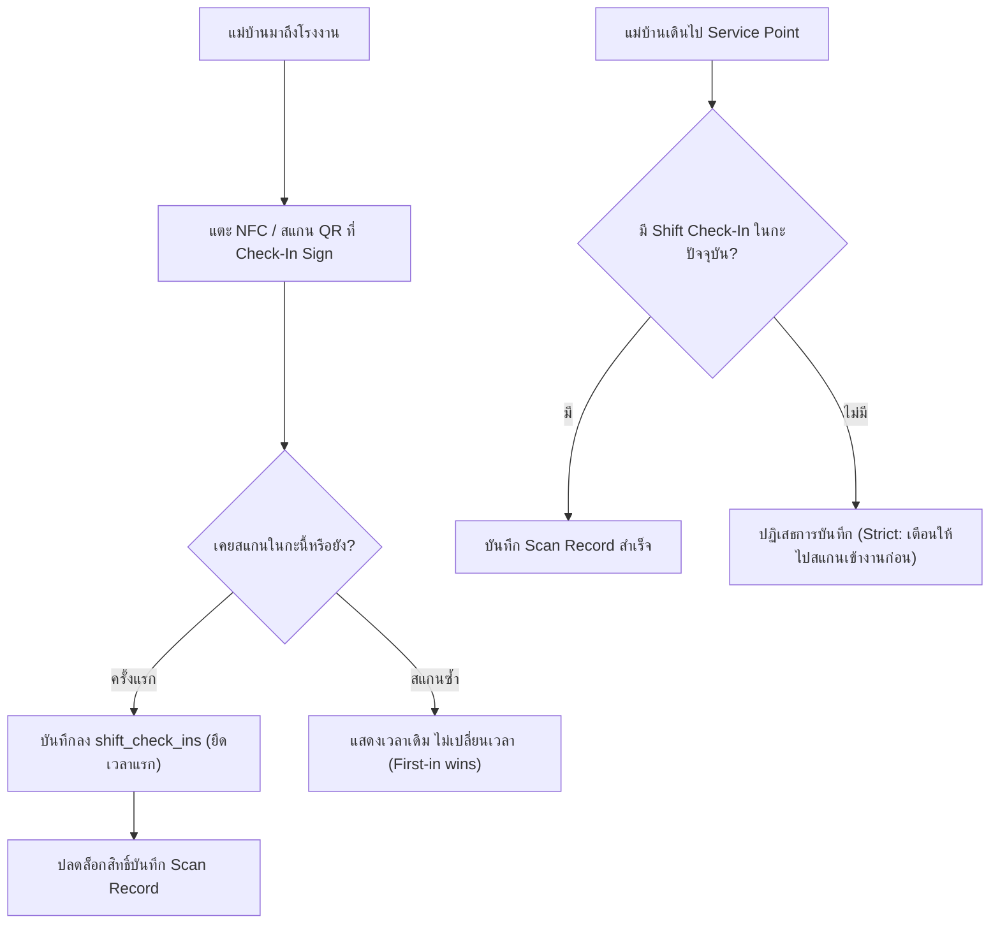

# Shift Check-In — Two Shifts (Day/Night) with Strict Prerequisite for Service Points

- Decision map: [#38 shift-check-in](https://github.com/ThodsaphonSonthiphin/Facility-Real-time-dashboard/issues/38) บนแผนที่ [#1](https://github.com/ThodsaphonSonthiphin/Facility-Real-time-dashboard/issues/1)
- วันที่: 2026-10-02
- เกี่ยวข้อง: facility-0001 (Scan Record), facility-0005 (Point Status & Working Hours), facility-0025 (Scan Presence Proof)
- Interactive Mockup: [`docs/decision-map/facility-poc/mockups/shift-check-in-prototype.html`](../decision-map/facility-poc/mockups/shift-check-in-prototype.html)

## Context & Decision

โรงงานมีแม่บ้านประมาณ 170 คน ทำงานหมุนเวียน 2 กะ การสแกนเข้างาน (Shift Check-In) ต้องแยกเป็นเอกเทศจาก Scan Record ของการทำความสะอาดตามจุดบริการ เพื่อให้หัวหน้าติดตามการเข้างานได้ และไม่ทำให้ระบบ Point Status สับสน

1. **กติกา 2 กะ (Day / Night Shifts)**:
   - **กะกลางวัน (Day Shift)**: 07:00 – 19:00
   - **กะกลางคืน (Night Shift)**: 19:00 – 07:00
   - ตัดรอบสถานะการเข้างานตามเวลากะ (07:00 น. และ 19:00 น.) ไม่ใช่เที่ยงคืน เพื่อไม่ให้รอบกะกลางคืนถูกล้างกลางคัน
2. **ป้ายเข้างาน (Check-In Sign)**:
   - ป้ายเฉพาะ (มี QR และ NFC) ติดตั้งที่จุดทางเข้า เช่น ป้อม รปภ. ประตูทางเข้าหลัก หรือห้องพักแม่บ้าน
   - แยกออกจาก QR Sign ประจำ Service Point
3. **การบังคับเข้างานก่อนเริ่มงาน (Strict Prerequisite — ทางเลือก A)**:
   - ถ้าแม่บ้านยังไม่ได้สแกนเข้างานกะปัจจุบัน แล้วเดินไปสแกนบันทึกทำความสะอาดที่ Service Point -> **ระบบปฏิเสธการบันทึก** และขึ้นแจ้งเตือนให้แม่บ้านไปสแกนป้ายเข้างานก่อน
4. **สแกนซ้ำยึดเวลาแรก (First-in Wins)**:
   - หากสแกนเข้างานซ้ำในกะเดียวกัน ระบบจะแสดงเวลาที่สแกนสำเร็จครั้งแรก และไม่เขียนทับเวลา เพื่อป้องกันไม่ให้แม่บ้านถูกบันทึกเป็นมาสาย
5. **โครงสร้างฐานข้อมูล (แยกตาราง `shift_check_ins`)**:
   - `id`: UUID / Primary Key
   - `user_id`: รหัสผู้ใช้งาน (Cleaner Account)
   - `shift_type`: `'DAY'` หรือ `'NIGHT'`
   - `shift_date`: วันที่ของกะ (Date)
   - `checked_in_at`: เวลาที่สแกนเข้างานครั้งแรก (UTC)
   - `sign_id`: รหัสป้ายเข้างานที่สแกน

## Consequences

- ฐานข้อมูลเพิ่มตาราง `shift_check_ins` เพื่อบันทึกการเข้างานโดยเฉพาะ
- API `/api/scan-records` เพิ่มการตรวจสอบว่า Caller มีประวัติใน `shift_check_ins` ของกะปัจจุบันหรือไม่ก่อนอนุญาตให้บันทึก
- เพิ่ม Endpoint สำหรับสแกนเข้างาน `POST /api/attendance/check-in`
- ปลดล็อก [#39 attendance-board](https://github.com/ThodsaphonSonthiphin/Facility-Real-time-dashboard/issues/39) สำหรับทำหน้าจอรายชื่อและสถานะเข้างานบน Dashboard

> **แก้ไข 2026-10-06:** ข้อ 2 (ป้ายติดที่ทางเข้า) ถูกแทนที่โดย facility-0040 ป้ายลงเวลาติดที่ Area, Area ละ 1 ป้าย กติกาข้ออื่นยังใช้อยู่

> **แก้ไข 2026-10-07:** การลงเวลาคือการยืนยันว่าเข้าพื้นที่ ไม่ใช่การลงเวลาทำงานของบริษัท (facility-0050) ถ้าลงเวลาไม่ได้ Admin เพิ่มเวลาให้ได้พร้อมเหตุผล (facility-0051)
