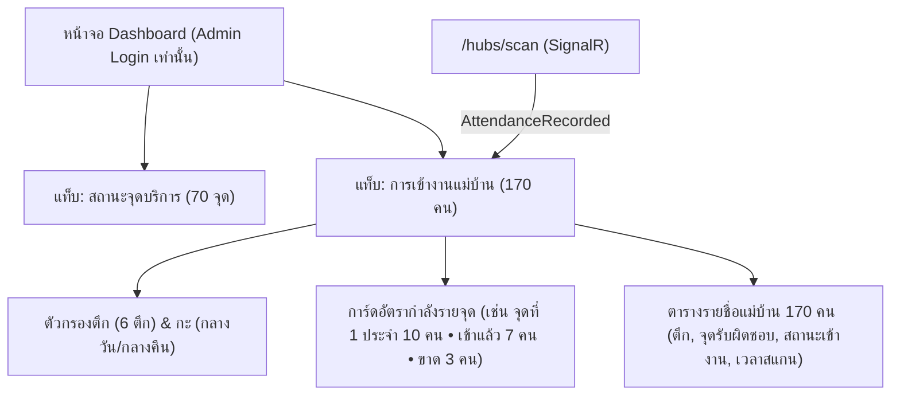

# Attendance Board — Dashboard Sub-Tab, Area Capacity & Cleaner Roster (Admin Only)

- Decision map: [#39 attendance-board](https://github.com/ThodsaphonSonthiphin/Facility-Real-time-dashboard/issues/39) บนแผนที่ [#1](https://github.com/ThodsaphonSonthiphin/Facility-Real-time-dashboard/issues/1)
- วันที่: 2026-10-02
- เกี่ยวข้อง: facility-0008 (Cards Grid), facility-0010 (Admin Gate), facility-0026 (Shift Check-In)
- Interactive Mockup: [`docs/decision-map/facility-poc/mockups/attendance-board-mockup.html`](../decision-map/facility-poc/mockups/attendance-board-mockup.html)

## Context & Decision

โรงงานขนาดใหญ่ (WD Factory) มี 6 ตึก 70 จุดบริการ และแม่บ้านประมาณ 170 คน โดยแม่บ้านแต่ละคนได้รับมอบหมายรับผิดชอบแต่ละจุด/ตึกแตกต่างกัน หัวหน้า Admin ต้องการหน้าจอที่เห็นทั้งภาพรวมอัตรากำลังต่อจุด และรายชื่อพนักงานที่เข้างานแล้ว/ยังไม่เข้างานในกะปัจจุบัน

1. **ตำแหน่งหน้าจอ (แบบที่ 1 — แท็บสลับบน Dashboard)**:
   - Dashboard มี Sub-tabs 2 แท็บ:
     - `[ สถานะจุดบริการ ]`: แสดงการ์ดสถานะความสะอาด 70 จุด (Normal/Overdue/Issue)
     - `[ การเข้างานแม่บ้าน ]`: แสดง Attendance Board และอัตรากำลังคน
2. **สิทธิ์การเข้าถึง (Admin Only)**:
   - เฉพาะ **Admin Account** เท่านั้นที่สามารถดูแท็บการเข้างานนี้ได้ เพื่อรักษาความเป็นส่วนตัวของข้อมูลพนักงาน 170 คน (Cleaner Account ที่เปิด Dashboard จะเห็นเฉพาะแท็บจุดบริการ)
3. **การแสดงอัตรากำลังคนต่อจุด (Area Capacity & Attendance)**:
   - มีการ์ดแสดงอัตรากำลังของจุดบริการ: แสดงจำนวนแม่บ้านที่รับผิดชอบจุดนั้น, จำนวนคนที่เข้างานแล้ว, และจำนวนคนที่ขาด (เช่น *จุดที่ 1: ประจำ 10 คน • เข้างานแล้ว 7 คน • ขาด 3 คน*) พร้อม Progress bar
   - มีตัวกรองเลือกดูตามตึก (ตึก 1 ถึง ตึก 6)
4. **ตารางรายชื่อแม่บ้าน 170 คน (Cleaners Roster)**:
   - คอลัมน์: รหัส/ชื่อแม่บ้าน, ตึกที่ประจำ, จุดบริการที่รับผิดชอบ, สถานะเข้างาน (`✓ เข้างานแล้ว` สีเขียว หรือ `✕ ยังไม่เข้างาน` สีแดง), เวลาสแกนเข้ากะ, และงานทำความสะอาดล่าสุด
   - มีช่อง Search ค้นหาตามชื่อแม่บ้าน หรือ ตึก
5. **การอัปเดต Real-time**:
   - เมื่อแม่บ้านสแกนเข้างานที่ Check-In Sign ระบบจะยิง event `AttendanceRecorded` ผ่าน SignalR Hub (`/hubs/scan`) เดิม ทำให้การ์ดอัตรากำลังและตารางบน Dashboard อัปเดตทันทีแบบเรียลไทม์

## Consequences

- Dashboard รองรับ Sub-tabs สลับหน้าจอได้สะดวกรวดเร็วโดยไม่ต้องเปลี่ยน URL
- Backend ขยาย SignalR Hub (`ScanHub`) ให้กระจาย event `AttendanceRecorded`
- ข้อมูล Cleaner Account รองรับการผูกข้อมูลจุดบริการ/ตึกที่รับผิดชอบ (`assigned_service_point_id` หรือ `assigned_building`)
- Milestone `attendance` สำเร็จแล้ว 2 ใน 3 tickets เหลือเพียง [#40 cleaner-accounts-at-scale](https://github.com/ThodsaphonSonthiphin/Facility-Real-time-dashboard/issues/40) (การสร้างและจัดการบัญชี 170 ใบ)

> **แก้ไข 2026-10-06:** ข้อ 3 (อัตรากำลังต่อจุด) ถูกแทนที่โดย facility-0040 แม่บ้าน 1 คนต่อ 1 Area ต่อ 1 กะ จึงนับมา-ขาดต่อ Area ในกะที่กำลังดู ข้อ 2 (Admin เท่านั้น) พี่เลี้ยงยืนยันแล้ว (R17)

> **แก้ไข 2026-10-07:** หน้านี้ไม่แสดงสาย/กลับก่อน (facility-0050) และมีปุ่มให้ Admin เพิ่ม/แก้เวลา (facility-0051)
