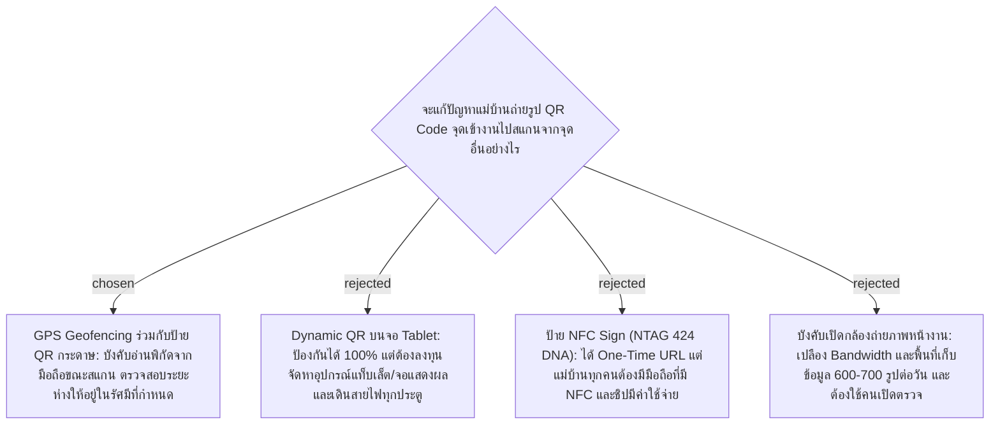

# Attendance GPS Geofencing Validation — Preventing Check-In QR Photo Cheating

- วันที่: 2026-10-02
- เกี่ยวข้อง: facility-0025 (Scan Presence Proof), facility-0026 (Shift Check-In)

## Context & Decision

จุดลงเวลาเข้างาน (Check-In) ใช้ป้ายกระดาษ QR Code ซึ่งมีช่องโหว่สำคัญคือพนักงานสามารถถ่ายรูปป้ายเก็บไว้ในมือถือ แล้วนำไปสแกนลงเวลาจากจุดอื่น (เช่น อยู่ตึก 3 หรืออยู่ที่บ้าน) เพื่อแก้ปัญหานี้โดยไม่ต้องลงทุนติดตั้งอุปกรณ์แท็บเล็ตราคาแพง:

1. **บังคับส่งพิกัด GPS ผ่าน Web Browser**:
   - เมื่อแม่บ้านสแกน QR Code หน้าเว็บเช็คอินบนมือถือจะเรียก `navigator.geolocation.getCurrentPosition` เพื่ออ่านพิกัด (Latitude, Longitude) และค่าความแม่นยำ (Accuracy) ณ เสี้ยววินาทีที่กดบันทึก
2. **Server-side Geofence Validation**:
   - แต่ละจุดเช็คอิน (หรืออาคาร) จะถูกกำหนดพิกัดอ้างอิง `(target_lat, target_lng)` และรัศมีที่ยอมรับได้ `radius_meters` (เช่น 50–100 เมตร)
   - Server คำนวณระยะห่างด้วย Haversine Formula หากระยะทางเกินกว่าที่กำหนด หรือผู้ใช้ปิดสิทธิ์การเข้าถึงพิกัด -> **ปฏิเสธการลงเวลาเข้างาน**
3. **การทำงานร่วมกับ HTTPS**:
   - Web Geolocation API กำหนดให้ต้องรันบน Secure Context (HTTPS) ระบบจะต้องติดตั้ง SSL Certificate สำหรับ Domain/IP ของระบบสแกน

## Consequences

- ฝั่ง Mobile Web ต้องขอ Browser Geolocation Permission จากผู้ใช้
- การตั้งค่า Service Point และ Check-In Sign ต้องเพิ่มฟิลด์ `latitude`, `longitude`, และ `allowed_radius_meters`
- สำหรับอาคารที่มีจุดอับสัญญาณ GPS สูง สามารถปรับค่า `allowed_radius_meters` ให้เหมาะสมตามหน้างานจริง

> **แก้ไข 2026-10-03:** ข้อ "ปฏิเสธการลงเวลา" ถูกแทนที่โดย facility-0035 ตอนนี้นอกรัศมีจะบันทึกไว้และติด Geofence Flag แทน
