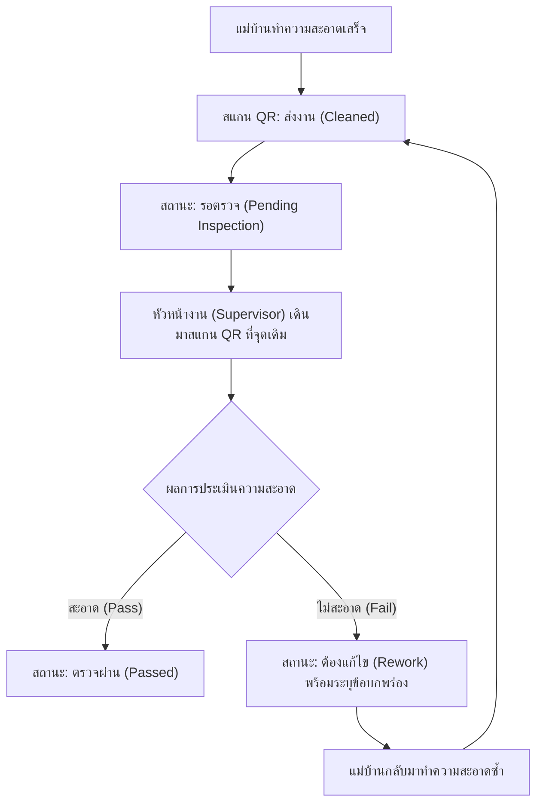

# Supervisor Inspection Workflow — Inspection Records, Rework State, and Re-evaluation

- วันที่: 2026-10-02
- เกี่ยวข้อง: facility-0001 (Scan Record), facility-0005 (Point Status Rules), facility-0017 (Scanner Identity)

## Context & Decision

เดิมระบบมีเพียงการสแกนส่งงานของแม่บ้าน (Cleaner Account) ในสถานะ Normal หรือ Issue ยังไม่มีกระบวนการตรวจสอบและรับรองคุณภาพงานโดยหัวหน้างาน (Supervisor Account) เพื่อตอบโจทย์ "ตรวจสอบการตรวจงานของหัวหน้า":

1. **การแยกบทบาทในการสแกน (Role-based Screen)**:
   - เมื่อสแกน QR Code ประจำจุดบริการ ระบบจะตรวจสอบบทบาทจาก Token:
     - **Cleaner Account**: เห็นปุ่มยืนยันส่งงานทำความสะอาด "ทำความสะอาดเรียบร้อย"
     - **Supervisor Account**: เห็นแบบฟอร์มตรวจรับงาน มีตัวเลือก `[ สะอาด / ผ่าน ]` และ `[ ไม่สะอาด / ต้องแก้ไข ]` พร้อมช่องระบุข้อบกพร่อง (Defect Notes)
2. **วัฏจักรสถานะการตรวจงาน (Inspection Lifecycle)**:
   - `Pending Cleaning` (ยังไม่ได้ทำความสะอาด) -> แม่บ้านสแกนส่งงาน -> `Pending Inspection` (ทำความสะอาดแล้ว รอตรวจ)
   - หัวหน้าสแกนตรวจ:
     - หากเลือก **สะอาด**: เปลี่ยนสถานะเป็น `Passed` (ตรวจผ่านแล้ว)
     - หากเลือก **ไม่สะอาด**: เปลี่ยนสถานะเป็น `Rework` (ต้องแก้ไข) และบันทึกข้อบกพร่องที่ต้องแก้ไข
3. **การแก้งาน (Rework Cycle)**:
   - แม่บ้านเห็นสถานะ `Rework` พร้อมข้อบกพร่องที่จุดนั้น ต้องเข้าไปแก้ไขงานจริง และสแกน QR ส่งงานใหม่อีกครั้ง สถานะจะกลับเป็น `Pending Inspection` เพื่อให้หัวหน้ามาตรวจรอบสอง

## Consequences

- ฐานข้อมูลเพิ่มตาราง `inspection_records` (id, service_point_id, supervisor_id, result [PASSED/REWORK], defect_notes, inspected_at)
- สถานะของ Service Point เพิ่มสถานะย่อยสำหรับการตรวจงานเพื่อให้ Dashboard แสดงผลได้ชัดเจน
- เพิ่มสิทธิ์และบทบาท `Supervisor` ในระบบยืนยันตัวตน
