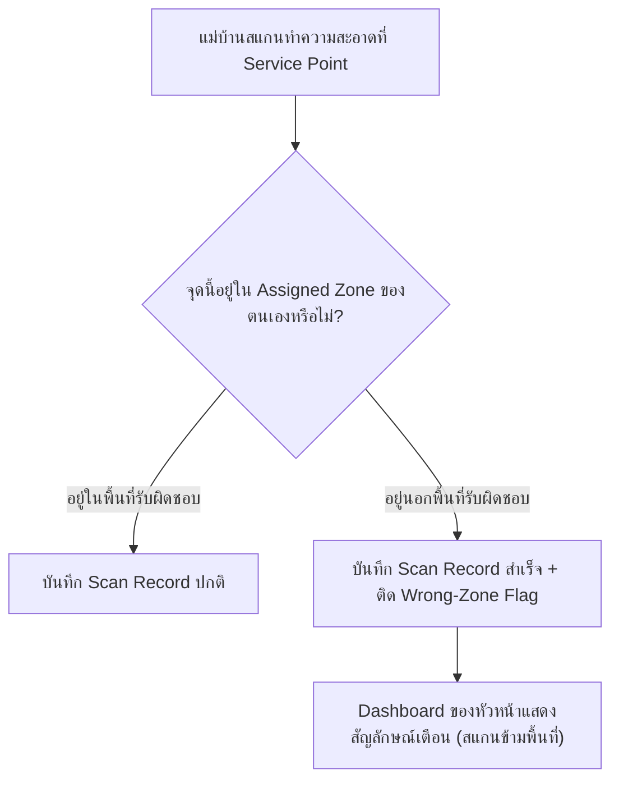

# Wrong-Zone Scan Policy — Non-blocking Scan with Dashboard Flagging

- วันที่: 2026-10-02
- เกี่ยวข้อง: facility-0001 (Scan Record), facility-0025 (Scan Presence Proof), facility-0027 (Attendance Board)

## Context & Decision

ในโรงงานจริงที่มี 6 อาคาร แต่ละอาคารมีหลายชั้น แม่บ้าน 170 คนได้รับการมอบหมายพื้นที่รับผิดชอบ (Assigned Zone) ประจำตัว หากแม่บ้านสแกน ณ จุดบริการที่อยู่นอกพื้นที่รับผิดชอบ (เช่น ประจำตึก A แต่ไปสแกนตึก B หรือสแกนผิดชั้น):

1. **บันทึกสำเร็จ ไม่บล็อกหน้างาน (Non-blocking Acceptance)**:
   - ระบบจะ **อนุญาตให้บันทึก Scan Record สำเร็จ** เพื่อไม่ให้กระทบการทำงานหน้างาน เช่น กรณีแม่บ้านเข้าช่วยงานเพื่อนที่ลาป่วย หรือมีการสลับกะ/สลับพื้นที่กระทันหัน
2. **ติดธงแจ้งเตือน (Wrong-Zone Flag)**:
   - บันทึกดังกล่าวจะถูกประทับค่า `is_wrong_zone = true`
3. **การแสดงผลบน Dashboard**:
   - บนหน้าจอ Dashboard และ Attendance Board ของ Admin/Supervisor จะมี Badge สีส้มแจ้งเตือนว่า "สแกนข้ามพื้นที่" พร้อมแสดงว่าแม่บ้านคนนี้สังกัดพื้นที่ใด แต่ไปสแกนที่จุดใด เพื่อให้หัวหน้าสอบถามหรือตรวจสอบได้

## Consequences

- ตาราง `cleaner_accounts` รองรับการผูกข้อมูล `assigned_zone_id` หรือ `assigned_building_id`
- ตาราง `scan_records` เพิ่มคอลัมน์ `is_wrong_zone` (boolean)
- หน้าจอ Dashboard ตารางประวัติและ Attendance Board รองรับการกรองและไฮไลต์รายการที่ติดธง Wrong-Zone
