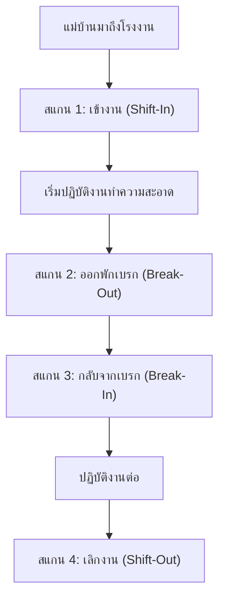

# Four-Stage Shift Attendance Lifecycle — 600-700 Records/Day Capacity

- วันที่: 2026-10-02
- เกี่ยวข้อง: facility-0026 (Shift Check-In), facility-0028 (GPS Geofencing)

## Context & Decision

โรงงานมีแม่บ้านประมาณ 170 คน ทำงาน 2 กะ (กะกลางวันและกะกลางคืน) มีการลงเวลาเข้า-ออกประมาณ 600–700 เรคคอร์ด/วัน เพื่อให้ระบบบริหารจัดการเวลาการทำงานและเวลาพักได้อย่างแม่นยำ:

1. **วงจรการลงเวลา 4 จังหวะ (Four Attendance Events)**:
   - **Shift-In**: สแกนเข้างานกะ ปลดล็อกสิทธิ์การสแกน Service Point
   - **Break-Out**: สแกนออกไปพักเบรก/รับประทานอาหาร
   - **Break-In**: สแกนกลับเข้ามาเริ่มงานหลังเบรก
   - **Shift-Out**: สแกนเลิกงาน สิ้นสุดการทำงานของกะ
2. **ปริมาณข้อมูลและสเกล (Scalability)**:
   - 170 คน x 4 เหตุการณ์/วัน = 680 เรคคอร์ด/วัน
   - 1 เดือน ≈ 20,400 เรคคอร์ด
   - 1 ปี ≈ 248,200 เรคคอร์ด
   - ตารางฐานข้อมูล `shift_attendances` ออกแบบ Index บน `(shift_date, user_id, event_type)` และ `(created_at)` เพื่อรองรับการสืบค้นและคำนวณ KPI ย้อนหลังได้รวดเร็ว
3. **การป้องกันข้อผิดพลาดหน้างาน**:
   - เมื่อแม่บ้านสแกนที่ Check-In Sign หน้าจอมือถือจะแสดงสถานะปัจจุบันและปุ่มการลงเวลาที่ถูกต้องตามลำดับโดยอัตโนมัติ (เช่น หากกด Shift-In แล้ว ครั้งต่อไปจะขึ้นตัวเลือกให้กด Break-Out หรือ Shift-Out)
   - ป้องกันการกดซ้ำซ้อนภายในระยะเวลาสั้น (Debounce 5 นาที)

## Consequences

- ขยายโครงสร้างจาก `shift_check_ins` (เดิมมีแค่ Check-In) เป็น `shift_attendances` ที่มี `event_type` (`SHIFT_IN`, `BREAK_OUT`, `BREAK_IN`, `SHIFT_OUT`)
- Attendance Board บน Dashboard สามารถแสดงสถานะปัจจุบันของพนักงานได้ 4 สถานะ: ปฏิบัติงาน, พักเบรก, เลิกงานแล้ว, หรือยังไม่เข้างาน
