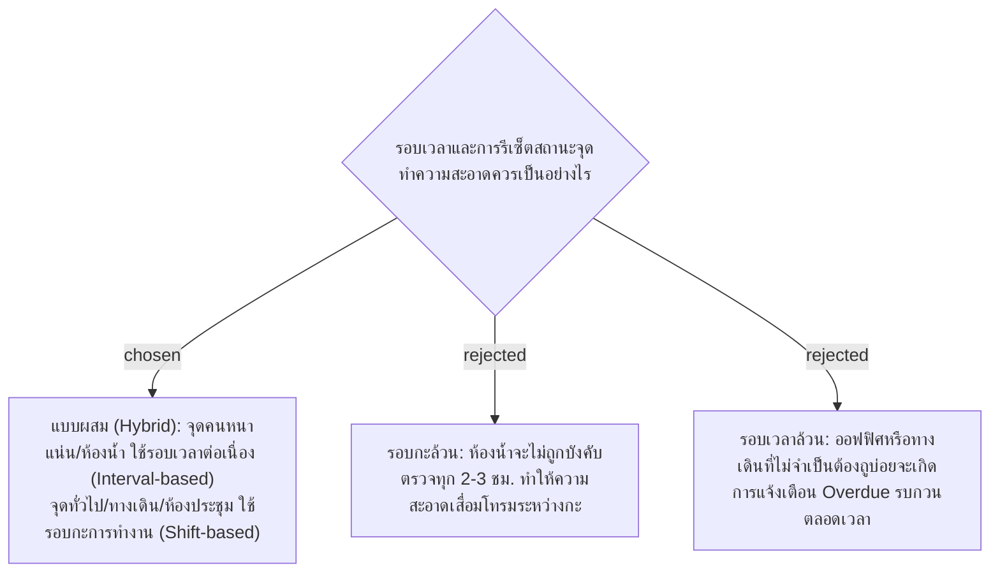

# Hybrid Cleaning Schedule — Interval-based (High-traffic) & Shift-based (General)

- วันที่: 2026-10-02
- เกี่ยวข้อง: facility-0005 (Point Status Rules), facility-0026 (Shift Check-In), facility-0029 (Supervisor Inspection)

## Context & Decision

ในโรงงานจริง แต่ละพื้นที่มีความหนาแน่นของการใช้งานและเกณฑ์มาตรฐานด้านสุขอนามัยที่แตกต่างกัน จากการสำรวจระบบบริหารจัดการสุขอนามัยระดับสากล (เช่น Swept, OrangeQC) การใช้เกณฑ์เดียวทั้งโรงงานสร้างปัญหาเรื่องแรงงาน (Over-cleaning ในจุดที่ไม่มีคนใช้ หรือ Under-cleaning ในห้องน้ำ):

1. **การจำแนกประเภทจุดบริการ (Point Schedule Type)**:
   - **Interval-based (ตามรอบเวลา)**:
     - เหมาะสำหรับ: ห้องน้ำ, โรงอาหาร/แคนทีน, จุดคัดกรองขยะ
     - กติกา: มีค่า `cleaning_interval_minutes` (เช่น 120 นาที) นับเวลาถอยหลังจากการตรวจผ่านล่าสุด หากเกินเวลา สถานะจะกลายเป็น `Overdue` เพื่อให้แม่บ้านเข้าไปดูแลต่อเนื่อง
   - **Shift-based (ตามรอบกะ)**:
     - เหมาะสำหรับ: โถงทางเดิน, ห้องประชุม, พื้นที่สำนักงาน, บันไดหนีไฟ
     - กติกา: กำหนดให้ทำความสะอาดและตรวจ 1 ครั้งต่อกะ ระบบจะรีเซ็ตสถานะกลับเป็น `Pending Cleaning` (ยังไม่ได้ทำความสะอาด) อัตโนมัติทุกครั้งที่มีการตัดกะ (07:00 น. เริ่มกะกลางวัน และ 19:00 น. เริ่มกะกลางคืน)
2. **การคำนวณสถานะจุด (Point Status Calculation)**:
   - การตัดรอบกะที่ 07:00 และ 19:00 จะทำการประมวลผลรีเซ็ตเฉพาะจุดที่เป็นประเภท `Shift-based`
   - จุดประเภท `Interval-based` จะยังคงนับเวลาตามจริงต่อเนื่องข้ามกะ เว้นแต่จะอยู่นอกเวลาทำงาน (Off Hours)

## Consequences

- ตาราง `service_points` เพิ่มคอลัมน์ `schedule_type` ENUM (`INTERVAL`, `SHIFT`) ค่าเริ่มต้นเป็น `INTERVAL`
- ฟังก์ชันคำนวณ Point Status ใน Backend และ Frontend รองรับเงื่อนไขการตัดรอบตาม `schedule_type`
- Dashboard เพิ่มตัวกรอง (Filter) ให้เลือกดูตามประเภทรอบเวลาได้

> **แก้ไข 2026-10-06:** ADR นี้ถูกแทนที่โดย facility-0042 ทุกจุดใช้รอบตามเวลาที่กำหนด (เช่น 07:00 10:00 13:00 16:00) แทน Interval-based / Shift-based
