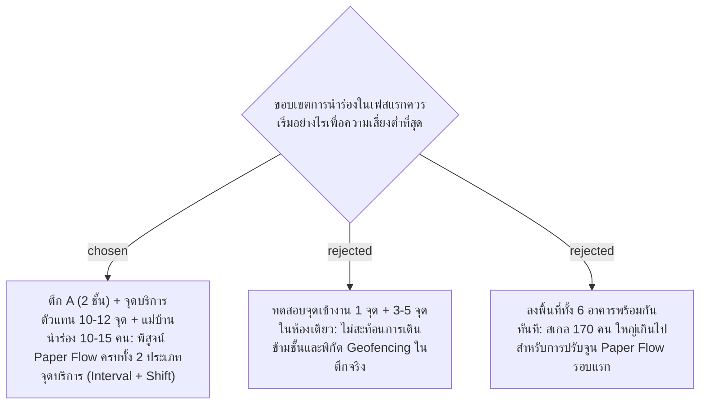

# Pilot Phase 1 Scope — Building A (2 Floors), 10-12 Service Points, 10-15 Cleaners

- วันที่: 2026-10-02
- เกี่ยวข้อง: facility-0028 (GPS Geofencing), facility-0029 (Supervisor Inspection), facility-0031 (Shift Attendance), facility-0032 (Hybrid Schedule)

## Context & Decision

โรงงานเป้าหมายมีอาคารทั้งหมด 6 อาคาร (แต่ละอาคารมีหลายชั้น เช่น ตึก A มี 2 ชั้น) และพนักงานแม่บ้าน 170 คน เพื่อให้กระบวนการตรวจสอบ Paper Flow และโครงสร้างฐานข้อมูลมีความรัดกุมก่อนลงสู่พื้นที่จริงทั้งหมด:

1. **ขอบเขตการทดสอบนำร่อง (Pilot Phase 1 Scope)**:
   - **พื้นที่นำร่อง**: อาคาร A (Building A) จำนวน 2 ชั้น
   - **จุดบริการตัวแทน**: 10–12 จุดบริการ แบ่งสัดส่วนเป็น:
     - ประเภท Interval-based (นับรอบเวลา 2–3 ชม.): ห้องน้ำชาย/หญิง ชั้น 1-2, โรงอาหาร/จุดพัก
     - ประเภท Shift-based (ตัดรอบกะ 07:00 / 19:00): โถงทางเดินชั้น 1-2, ล็อบบี้ต้อนรับ, บันได
   - **ผู้ใช้งานนำร่อง**:
     - แม่บ้าน 10–15 คน (ครอบคลุมทั้งกะกลางวันและกะกลางคืน)
     - หัวหน้างาน (Supervisor) 1–2 คน
   - **จุดลงเวลาเข้างาน (Check-In Sign)**: 1 จุดหลักบริเวณทางเข้าอาคาร A หรือป้อม รปภ.
2. **ตัวชี้วัดความสำเร็จของ Pilot Phase**:
   - การสแกนเข้างาน 4 จังหวะ (Shift-In, Break-Out, Break-In, Shift-Out) บันทึกพิกัด GPS Geofencing ได้ถูกต้อง ไม่เกิด False Block
   - วงจรการตรวจงานแม่บ้านและหัวหน้างาน (ทำความสะอาดแล้ว -> ตรวจผ่าน หรือ ต้องแก้ไข -> ส่งซ้ำ) ทำงานได้ราบรื่น
   - สรุปภาพรวมบน Dashboard แสดงผลการ์ดสถานะและ Attendance Board ได้ตรงตามจริง

## Consequences

- ฐานข้อมูลเริ่มต้นด้วยการ Seed ข้อมูลอาคาร A, ชั้น 1-2, จุดบริการ 12 จุด, และบัญชีผู้ใช้ 15 คน
- เอกสาร Paper Flow จะใช้ตัวอย่างของอาคาร A เป็นภาพอ้างอิงหลัก ก่อนขยายเป็น Template สู่ตึก B-F

> **แก้ไข 2026-10-06:** ADR นี้ถูกแทนที่โดย facility-0043 ทดลองที่ 1 Area มีจุดทำความสะอาดอย่างน้อย 1 จุด
