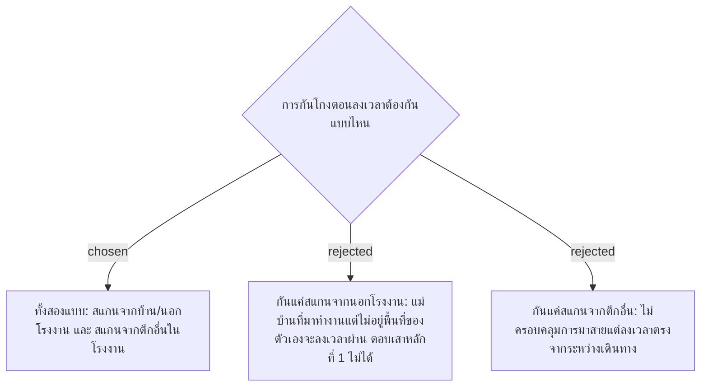

# Check-In Fraud Threat Scope — Off-Site and Wrong-Building Scans

- วันที่: 2026-10-03
- เกี่ยวข้อง: facility-0025 (NFC Tap Link), facility-0026 (Check-In Sign), facility-0028 (GPS Geofencing)

## Context & Decision

ADR 0025 และ 0028 เลือกกลไกกันโกงต่างกัน (NFC กับ GPS) โดยไม่ได้ระบุว่ากันการโกงแบบไหน จึงกำหนดขอบเขตภัยก่อน: การลงเวลาต้องกัน **ทั้ง** การสแกนจากนอกโรงงาน (มาสายแต่ลงเวลาตรง) **และ** การสแกนจากตึกอื่นภายในโรงงาน (มาทำงานแต่ไม่อยู่พื้นที่ที่ได้รับมอบหมาย) เพราะเสาหลักที่ 1 คือ "มาครบตามพื้นที่ที่ได้รับมอบหมาย" ไม่ใช่แค่ "มาทำงาน"

## Consequences

- กลไกที่เลือกต้องแยกตึกได้ GPS รัศมี 100 ม. ตาม ADR 0028 พอได้เฉพาะเมื่อตึกห่างกันเกินรัศมีบวกค่าคลาดเคลื่อนในอาคาร ต้องทบทวน 0028
- ป้ายเข้างานต้องผูกกับตึกหรือโซน ป้ายเดียวที่ประตูโรงงานพิสูจน์ "อยู่ถูกตึก" ไม่ได้
