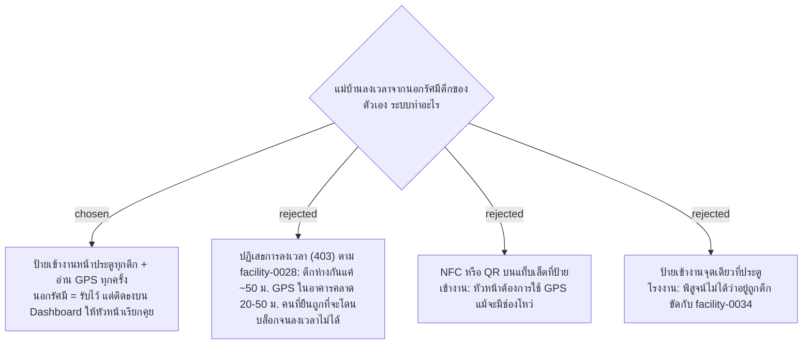

# Per-Building Check-In Sign with GPS — Flag on Dashboard, Never Block

- วันที่: 2026-10-03
- เกี่ยวข้อง: facility-0026 (Check-In Sign), facility-0028 (GPS Geofencing, ส่วน "ปฏิเสธ" ถูกแทนที่ด้วย ADR นี้), facility-0030 (Wrong-Zone Flag), facility-0034 (ขอบเขตภัย)

## Context & Decision

หัวหน้าต้องการให้ใช้ GPS แม้รู้ว่ามีช่องโหว่ ตึกที่ใกล้กันที่สุดห่างกันประมาณ 50 ม. ซึ่งพอ ๆ กับความคลาดเคลื่อนของ GPS ในอาคาร การปฏิเสธการลงเวลาจึงจะบล็อกคนที่ยืนถูกที่ไปด้วย ระบบจึงทำแบบนี้:

1. **ป้ายเข้างานติดหน้าประตูทุกตึก** แม่บ้านลงเวลาที่ป้ายของตึกที่ตัวเองรับผิดชอบ (เช่น สมศรีรับผิดชอบตึก A ต้องสแกนหน้าประตูตึก A)
2. **อ่าน GPS ทุกครั้งที่ลงเวลา** แล้วเทียบกับพิกัดของป้ายนั้น
3. **นอกรัศมีหรือสแกนป้ายของตึกอื่น จะบันทึกไว้แต่ติดธง** ให้แสดงบน Dashboard โดยไม่ปฏิเสธ หัวหน้าเรียกแม่บ้านมาคุยเองเพื่อให้รู้ว่าระบบตรวจได้ (ใช้ยับยั้ง ไม่ใช่บังคับ) แนวเดียวกับ facility-0030

## Consequences

- facility-0028 ข้อ "ปฏิเสธการลงเวลา (403)" ไม่ใช้แล้ว ส่วนการอ่าน GPS และการต้องใช้ HTTPS ยังใช้เหมือนเดิม
- ต้องมีพิกัดของป้ายเข้างานแต่ละตึกจากหน้างานจริง
- GPS ไม่ได้กันคนที่ตั้งใจโกงด้วยแอปปลอมพิกัด ระบบนี้ตั้งใจใช้ยับยั้งเท่านั้น
- ยังไม่ได้ตัดสิน: ค่ารัศมี และกรณีที่ GPS แม่นยำต่ำหรือผู้ใช้ปิด Location
