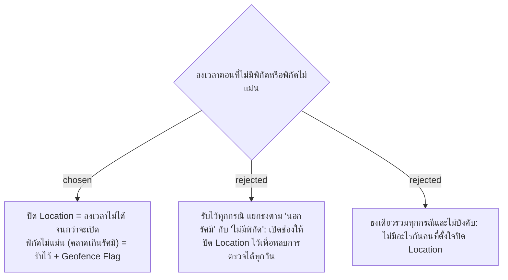

# Check-In Requires Location Permission; Inaccurate Fix Is Flagged, Not Blocked

- วันที่: 2026-10-03
- เกี่ยวข้อง: facility-0035 (ติดธง ไม่บล็อก), facility-0028 (GPS ต้องใช้ HTTPS)

## Context & Decision

ถ้าไม่บังคับ แม่บ้านจะปิด Location เพื่อหลบการตรวจได้ทุกวัน ส่วนพิกัดที่ไม่แม่นในอาคารเป็นเรื่องปกติและไม่ใช่ความผิดของแม่บ้าน การบล็อกจึงใช้เฉพาะกรณี **ไม่ได้รับสิทธิ์อ่านพิกัด** หน้าจอต้องบอกวิธีเปิด Location แล้วให้สแกนใหม่ได้ทันที ส่วนกรณี **อ่านพิกัดได้แต่คลาดเกินรัศมี** จะบันทึกไว้และติด Geofence Flag ตาม facility-0035

## Consequences

- นี่เป็นข้อยกเว้นเดียวของหลัก "ติดธง ไม่บล็อก" ใน facility-0035
- ต้องเก็บค่าความคลาดเคลื่อน (accuracy) ที่มือถือรายงานไว้กับการลงเวลา ให้หัวหน้าเห็นว่าธงเกิดจากพิกัดไม่แม่นหรือจากการอยู่ไกลจริง
- ต้องมีหน้าคำแนะนำการเปิด Location สำหรับ Android/iOS และต้องใช้ HTTPS ตาม facility-0028
