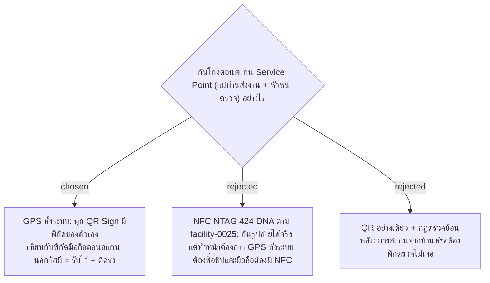

# GPS on Every Scan — Service Point Signs Get Their Own Coordinates (NFC Dropped)

- วันที่: 2026-10-03
- เกี่ยวข้อง: facility-0025 (ถูกแทนที่), facility-0035 (ติดธง ไม่บล็อก), facility-0036 (บังคับเปิด Location)

## Context & Decision

หัวหน้าต้องการให้ใช้ GPS แบบเดียวกันทั้งระบบ ทุก QR Sign ของ Service Point (เช่น แคนทีน) มีพิกัดและรัศมีของตัวเอง ทุกครั้งที่สแกน ทั้งแม่บ้านที่ส่งงานและหัวหน้าที่มาตรวจ ระบบจะอ่าน GPS แล้วเทียบกับพิกัดของป้ายนั้น ใช้กติกาเดียวกับการลงเวลา: ถ้าปิด Location จะสแกนไม่ได้ (facility-0036) ถ้าอยู่นอกรัศมีหรือพิกัดคลาดเคลื่อนเกินรัศมีจะบันทึกไว้แต่ติดธง (facility-0035)

## Consequences

- facility-0025 (NFC เป็นทางหลัก) **ถูกแทนที่** ถ้า pilot พบการโกงจริงค่อยกลับไปพิจารณา NFC เป็นเฟสหลังสำหรับจุดสำคัญ
- **ช่องโหว่ที่ยอมรับ:** GPS แยกห้องหรือชั้นในตึกเดียวกันไม่ได้ ถ้ายืนอยู่ในตึก A ก็สแกนรูปของทุกจุดในตึก A ได้โดยไม่ติดธง ทั้งการส่งงานของแม่บ้านและการตรวจของหัวหน้า (เสาหลักที่ 3) จึงพิสูจน์ได้แค่ "อยู่ในตึก" ต้องใช้กฎตรวจย้อนหลังช่วย เช่น สแกนหลายจุดเร็วเกินกว่าจะเดินถึง
- ต้องเก็บพิกัด, รัศมี และค่าความคลาดเคลื่อนของทุก Scan Record และ Inspection Record
- Admin ต้องเก็บพิกัดของป้ายครบ 70–80 จุด
