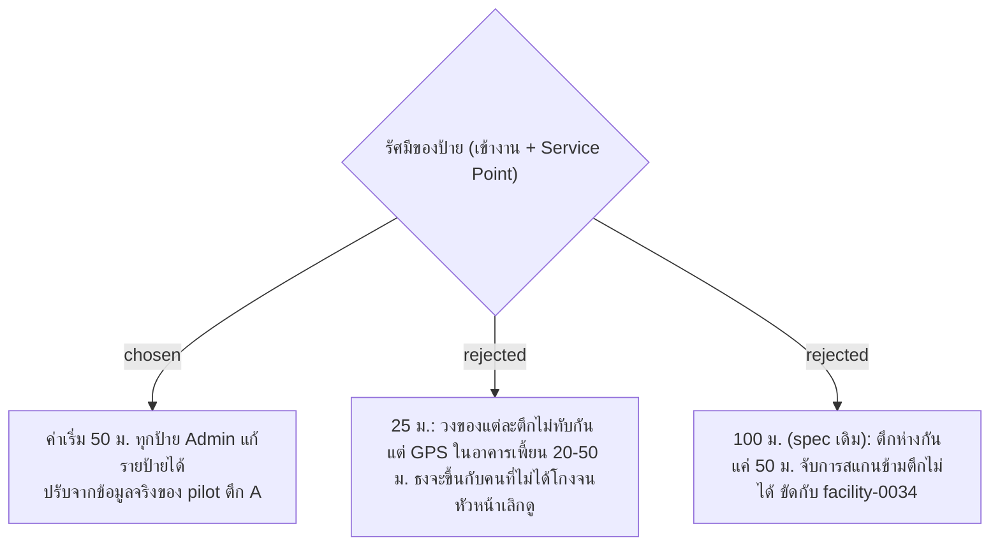

# Sign Radius — Default 50 m, Editable per Sign, Tuned in Pilot

- วันที่: 2026-10-03
- เกี่ยวข้อง: facility-0034, facility-0035, facility-0037

## Context & Decision

ตึกที่ใกล้กันที่สุดห่างกันประมาณ 50 ม. ส่วน GPS ในอาคารเพี้ยนประมาณ 20–50 ม. ไม่มีค่าเดียวที่จับการสแกนข้ามตึกได้ทุกครั้งโดยไม่ขึ้นธงกับคนที่ไม่ได้โกง จึงเริ่มที่ 50 ม. และให้แก้ได้ทีละป้าย แล้วใช้พิกัดจริงที่เก็บระหว่าง pilot ตึก A ปรับก่อนขยายไปครบ 6 ตึก

## Consequences

- QR Sign และ Check-In Sign ต้องมีช่องรัศมีที่ Admin แก้ได้
- ต้องมีรายงานของ pilot ที่แสดงระยะห่างและค่าความคลาดเคลื่อนจริงของแต่ละป้าย ไว้ใช้ปรับรัศมี
- ยอมรับว่าช่วงแรก การสแกนข้ามตึกบางครั้งจะไม่ติดธง
