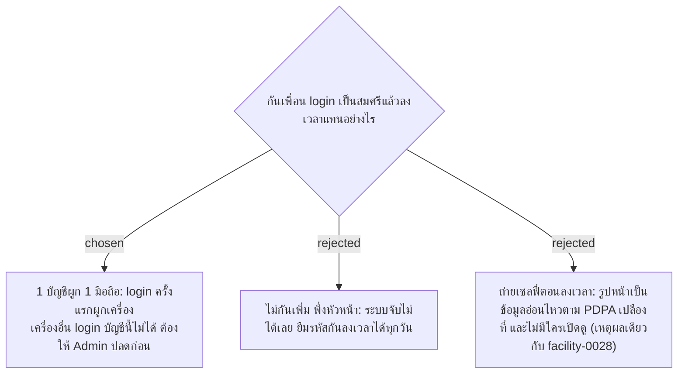

# One Account, One Bound Device — Stop Buddy Check-In

- วันที่: 2026-10-03
- เกี่ยวข้อง: facility-0002 (Login + Persistent Session), facility-0016 (จำ 30 วัน), facility-0017 (ตัวตนจาก JWT), facility-0035 (GPS ติดธง)

## Context & Decision

ตัวตนตอนสแกนมาจากการ login (facility-0002, 0017) ส่วน GPS พิสูจน์ได้แค่ว่ามีคนยืนอยู่ที่ป้าย ถ้าสมศรีให้รหัสผ่านกับมาลี มาลีก็ login เป็นสมศรีบนมือถือของมาลี แล้วลงเวลาแทนได้โดยไม่ติดธง จึงตัดสินใจให้ **1 บัญชีผูกกับ 1 มือถือ** สำหรับ Cleaner Account และ Supervisor Account:

1. login สำเร็จครั้งแรก ระบบผูกบัญชีกับเครื่องนั้น
2. เครื่องอื่นพยายาม login บัญชีเดียวกัน ระบบปฏิเสธ บอกให้ติดต่อหัวหน้า และบันทึกความพยายามนั้นให้ Admin เห็น
3. เปลี่ยนมือถือหรือล้างเบราว์เซอร์ Admin กด "ปลดเครื่อง" แล้ว login ใหม่บนเครื่องใหม่ได้

Admin Account ไม่ผูกเครื่อง เพราะใช้บนคอมพิวเตอร์หลายเครื่องได้

## Consequences

- ยังกันไม่ได้กรณียืมมือถือทั้งเครื่อง (มาลีถือมือถือของสมศรีมาสแกนแทน) ต้องพึ่งหัวหน้าเห็นหน้าคน
- เว็บแอปไม่มีรหัสเครื่องจริง "เครื่อง" คือเบราว์เซอร์นั้นบนมือถือนั้น เปิดด้วย LINE แล้วเปลี่ยนไป Chrome ก็นับเป็นเครื่องใหม่ จึงต้องสอนแม่บ้านให้เปิดด้วยเบราว์เซอร์เดียวกันตลอด ช่วงทดลองจะมีคำขอปลดเครื่องบ่อย
- ต้องเพิ่มปุ่ม "ปลดเครื่อง" ในหน้าจัดการบัญชี (facility-0020) และรายการความพยายาม login จากเครื่องอื่น

> **แก้ไข 2026-10-06:** ADR นี้ถูกแทนที่โดย facility-0044 พี่เลี้ยงให้ login ได้หลายเครื่อง ไม่ผูกเครื่อง
