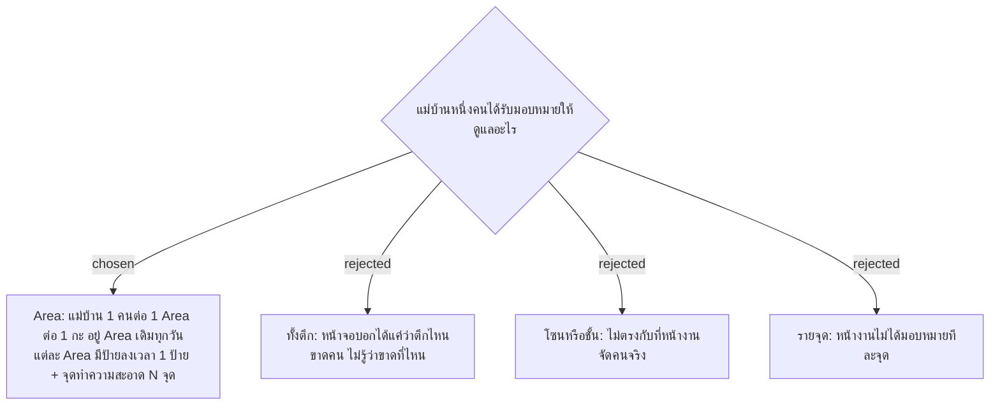

# Area Is the Unit of Assignment — One Cleaner per Area per Shift, One Check-In Sign per Area

- วันที่: 2026-10-06
- ที่มา: คำตอบของพี่เลี้ยงในใบทบทวน ข้อ 1, 2.1, 2.3, 7 และ R5 (`docs/requirements-gathering/2026-10-06-supervisor-answers.md`) และเจ้าของโปรเจกต์ยืนยันเรื่อง 1 คนต่อ Area ต่อกะ ในวันเดียวกัน
- เกี่ยวข้อง: facility-0026 (ป้ายเข้างาน), facility-0027 (อัตรากำลัง), facility-0035 (ป้ายต่อตึก), facility-0041 (สแกนได้เฉพาะ Area ตัวเอง)

## Context & Decision

พี่เลี้ยงตอบว่าโรงงานจัดคนเป็น **Area** มีทั้งหมด 70–72 Area อยู่ในตึกต่าง ๆ ระบบจึงใช้ Area เป็นหน่วยหลัก:

1. **Area อยู่ในตึก 1 ตึก** ตึกหนึ่งมีได้หลาย Area
2. **แม่บ้าน 1 คนต่อ 1 Area ต่อ 1 กะ** และอยู่ Area เดิม กะเดิมทุกวัน แม่บ้านรับผิดชอบ Area เดียวเท่านั้น
   - Area ที่ทำ 2 กะ มีแม่บ้านประจำ 2 คน: กะเช้า 1 คน และกะดึก 1 คน
   - Area ที่ทำเฉพาะกะเช้า มีแม่บ้านประจำ 1 คน
3. **แต่ละ Area มีป้าย 1 + N ป้าย:**
   - ป้ายลงเวลา (Check-In Sign) 1 ป้าย ติดที่ Area ไม่ใช่หน้าประตูตึก
   - จุดทำความสะอาด (Service Point) N จุด จุดละป้าย เช่น Area ที่มี 4 จุดใช้ QR รวม 5 ป้าย
4. **Area ตั้งรูปแบบกะได้ 2 แบบ:**
   - ทำ 2 กะ (เช้า 07:00–19:00 และดึก 19:00–07:00) กะดึกทำงานเหมือนกะเช้า
   - ทำเฉพาะกะเช้า เช่น Office ที่ไม่มีกะกลางคืน
5. **แม่บ้านลงเวลาที่ป้ายของ Area ตัวเอง** กติกาลงเวลาตาม facility-0026 และ 0031 ยังใช้เหมือนเดิม: 4 ครั้ง, ต้องลงเวลาก่อนสแกนส่งงาน, สแกนซ้ำยึดเวลาแรก

## Consequences

- facility-0026 ข้อ 2 (ป้ายติดที่ทางเข้า) และ facility-0035 ข้อ 1 (ป้ายติดหน้าประตูทุกตึก) ถูกแทนที่: ป้ายลงเวลาติดที่ Area
- facility-0027 ข้อ 3 (อัตรากำลังต่อจุด เช่น "ประจำ 10 คน") ถูกแทนที่: Attendance Board นับมา-ขาดต่อ Area ในกะที่กำลังดู ซึ่งมีคนประจำกะละ 1 คน
- ตารางใหม่ `areas` (ชื่อ, ตึก, รูปแบบกะ) และแม่บ้านประจำเก็บแยกตามกะ (Area + กะ → แม่บ้าน 1 คน, Area ที่ทำเฉพาะกะเช้ามีแค่แถวกะเช้า) ส่วน Service Point กับ Check-In Sign ต้องอ้างถึง Area
- ป้ายลงเวลาของ Area ที่อยู่ติดกันอาจห่างกันไม่ถึงรัศมี GPS แต่ไม่เป็นปัญหา เพราะระบบรู้จากตัว QR ว่าเป็นป้ายของ Area ไหน (facility-0041)
- ยังไม่ได้ตัดสินใจ: หัวหน้างานต้องลงเวลาด้วยไหม (คำถามข้อ 2.4)

> **แก้ไข 2026-10-07:** คำถามข้อ 2.4 ตอบแล้ว: หัวหน้าไม่ต้องลงเวลา และประจำตึก (facility-0048) แม่บ้านทุกคนมี Area ประจำ ไม่มีคนสำรอง (facility-0041)
