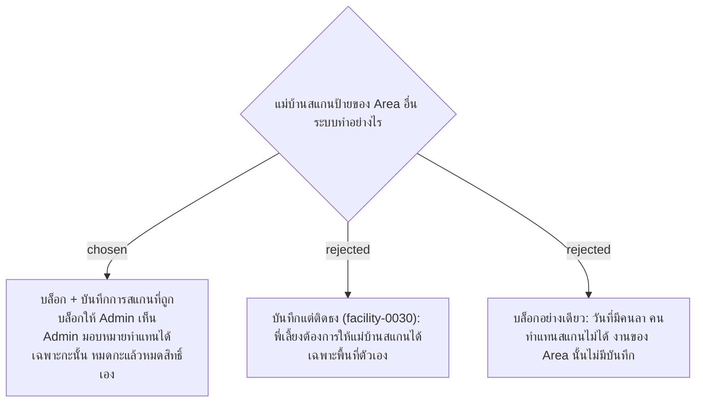

# Scan Only Your Own Area — Block Other Areas, Admin Grants Per-Shift Cover

- วันที่: 2026-10-06
- ที่มา: คำตอบของพี่เลี้ยง R12 ("แม่บ้าน 1 คนรับผิดชอบแค่พื้นที่ของตัวเอง ไม่สามารถไปสแกนพื้นที่อื่นได้") ส่วนการมอบหมายทำแทน เจ้าของโปรเจกต์ตกลงในวันเดียวกัน
- เกี่ยวข้อง: facility-0030 (ถูกแทนที่), facility-0035 (GPS ติดธง), facility-0040 (Area)

## Context & Decision

1. **บล็อกการสแกนป้ายของ Area อื่น** ทั้งป้ายจุดทำความสะอาดและป้ายลงเวลา ระบบไม่บันทึกงาน และแจ้งบนมือถือว่า "จุดนี้ไม่ใช่ Area ของคุณ" พร้อมบอกว่าป้ายนั้นเป็นของ Area ไหน
2. **ตัดสินจาก QR ไม่ใช่ GPS** QR Token ระบุได้แน่นอนว่าป้ายเป็นของ Area ไหน จึงไม่มีปัญหา GPS เพี้ยนทำให้คนยืนถูกที่โดนบล็อก ส่วนกติกานอกรัศมีแล้วติดธงไม่บล็อก (facility-0035, 0037) ยังใช้เหมือนเดิม
3. **บันทึกการสแกนที่ถูกบล็อก (Blocked Scan)** แสดงในหน้ารายการที่ขึ้นเตือนให้ Admin เห็น
4. **มอบหมายทำแทน (Cover Assignment)** วันที่มีคนลา Admin กดให้แม่บ้านอีกคนทำแทน Area นั้นได้:
   - มีผลเฉพาะกะนั้น หมดกะแล้วหมดสิทธิ์เอง ไม่ต้องให้ Admin ยกเลิก
   - คนทำแทนลงเวลาที่ป้ายของ Area ตัวเองตามปกติ แล้วไปสแกนจุดของ Area ที่ได้รับมอบหมาย
   - Admin กดมอบหมายจากรายการ Blocked Scan ได้ทันที ไม่ต้องรอให้แม่บ้านโทรมาบอก
   - Scan Record ที่สแกนระหว่างทำแทนบันทึกไว้ว่าเป็นการทำแทน

## Consequences

- facility-0030 (Wrong-Zone Flag) ถูกแทนที่ทั้งฉบับ และข้อ "สแกนป้ายของตึกอื่นแล้วติดธง" ใน facility-0035 ข้อ 3 ด้วย
- ต้องมีตาราง `cover_assignments` (แม่บ้าน, Area, กะ, ผู้มอบหมาย) และตาราง `blocked_scans`
- ถ้า Admin ไม่ได้อยู่หน้าจอ คนทำแทนจะสแกนไม่ได้จนกว่า Admin จะกดมอบหมาย ช่วงทดลองต้องดูว่าเกิดบ่อยแค่ไหน
- มีหน้าใหม่บนมือถือ (สแกนนอก Area) และปุ่มมอบหมายในหน้ารายการที่ขึ้นเตือน
