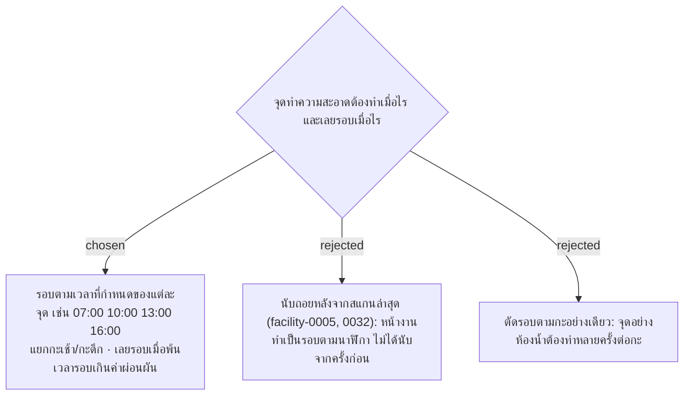

# Fixed-Time Cleaning Rounds per Point — Replaces Interval and Shift Reset

- วันที่: 2026-10-06
- ที่มา: คำตอบของพี่เลี้ยงข้อ 5 ("รอบทำความสะอาดจะเป็นรอบ ๆ เช่น 7:00 10:00 13:00 16:00"), R15 ("แต่ละจุดมีรอบเวลาไม่เหมือนกัน"), ข้อ 7 และหมายเหตุข้อ 1
- เกี่ยวข้อง: facility-0005 และ 0019 (Point Status), facility-0029 (การตรวจงาน), facility-0032 (ถูกแทนที่), facility-0040 (รูปแบบกะของ Area)

## Context & Decision

1. **แต่ละจุดมีรายการเวลารอบของตัวเอง** แยกกะเช้ากับกะดึก เช่น ห้องน้ำ 07:00 10:00 13:00 16:00 · 19:00 22:00 01:00 04:00 ส่วนจุดที่ทำกะละครั้งใส่เวลาเดียวต่อกะ
2. **รอบปัจจุบัน** คือเวลารอบล่าสุดที่ผ่านมาแล้ว การส่งงานหลังเวลารอบนั้นนับเป็นงานของรอบนั้น
3. **เลยรอบ (Overdue)** เมื่อเวลาปัจจุบันเกิน "เวลารอบ + ค่าผ่อนผัน" แล้วรอบนั้นยังไม่มีการส่งงาน ค่าผ่อนผันเป็นค่าเดียวทั้งระบบใน config **ค่าเริ่มต้น 30 นาที รอพี่เลี้ยงยืนยันตัวเลข**
4. **นอกเวลา (Off Hours)** ใช้กับ Area ที่ทำเฉพาะกะเช้า (facility-0040) ช่วงกะดึกการ์ดเป็นสีเทา ไม่นับเลยรอบ แทน Working Hours ค่าเดียวทั้งระบบ
5. **สถานะบนการ์ด** เรียงตามความสำคัญ:
   - ต้องแก้ไข: หัวหน้าตรวจแล้วไม่สะอาด (facility-0029)
   - เลยรอบ
   - รอตรวจ: ส่งงานรอบปัจจุบันแล้ว หัวหน้ายังไม่ตรวจ
   - ตรวจผ่าน
   - ยังไม่ทำ: ถึงรอบแล้ว ยังไม่ส่งงาน แต่ยังไม่เลยค่าผ่อนผัน
   - นอกเวลา

   กติกาแจ้งปัญหา (Issue) ตอนสแกนตาม facility-0005 ข้อ 1.1 และ 6 ยังใช้เหมือนเดิม

## Consequences

- facility-0032 (Interval-based / Shift-based) ถูกแทนที่ทั้งฉบับ
- facility-0005 ข้อ 2–5 (`due_at` จาก `cleaning_interval_minutes`, ไม่มีเวลาผ่อนผัน, Working Hours ค่าเดียว) และ config `WorkingHours` ใน facility-0019 ถูกแทนที่
- `StatusCalculator` ต้องเขียนใหม่: อ่านเวลารอบของจุด, รูปแบบกะของ Area และค่าผ่อนผัน แทน `cleaning_interval_minutes` กับ `WorkingHours`
- ตารางใหม่ `point_round_times` (จุด, กะ, เวลา) แทนคอลัมน์ `cleaning_interval_minutes`
- ยังไม่ได้ตัดสินใจ: หัวหน้าต้องตรวจทุกรอบไหม (คำถามข้อ 6) ข้อนี้มีผลว่าการ์ด "รอตรวจ" จะค้างจนกว่าหัวหน้าจะตรวจหรือไม่

> **แก้ไข 2026-10-07:** ข้อ 1–3 (เวลารอบจุดเดียว + ค่าผ่อนผัน) และข้อ 5 ถูกแทนที่โดย facility-0047 รอบเป็นช่วงเวลา เลยรอบเมื่อพ้นเวลาสิ้นสุด ไม่มีค่าผ่อนผัน และ Issue เป็นป้ายแยก (facility-0046) ข้อ 4 (นอกเวลา) ยังใช้ คำถามข้อ 6 ตอบแล้วใน facility-0047
