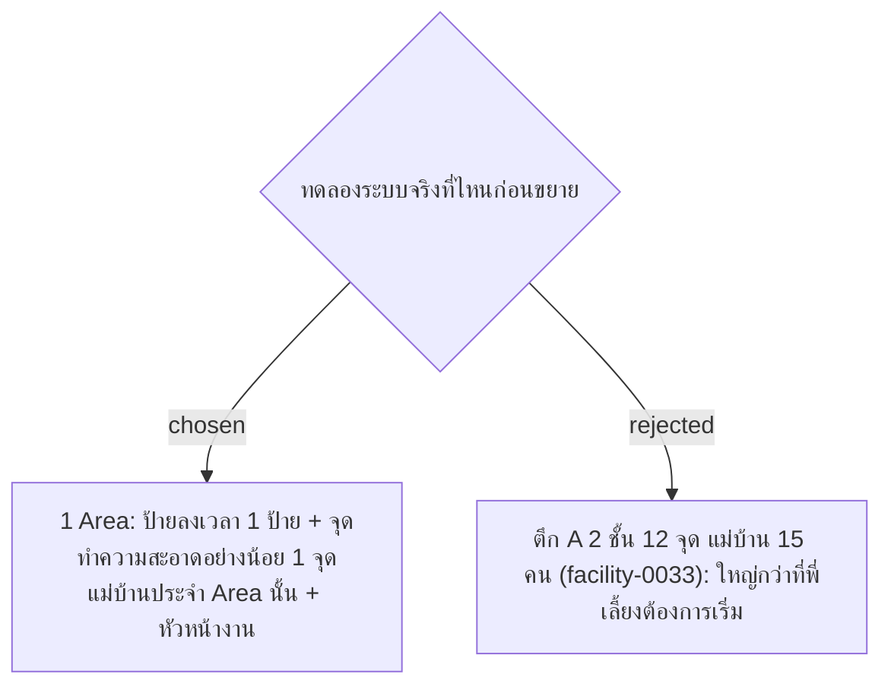

# Pilot Scope — One Area with At Least One Cleaning Point

- วันที่: 2026-10-06
- ที่มา: คำตอบของพี่เลี้ยง R20 ("จุดที่จะทดลอง Area ที่ 1 … มีจุดที่ต้องทำความสะอาด 1 จุดขั้นต่ำ")
- เกี่ยวข้อง: facility-0033 (ถูกแทนที่), facility-0040 (Area)

## Context & Decision

ทดลองที่ **1 Area** ก่อนขยายไปครบ 70–72 Area:

1. ป้ายลงเวลาของ Area 1 ป้าย กับจุดทำความสะอาดอย่างน้อย 1 จุด
2. ผู้ใช้คือแม่บ้านประจำ Area นั้น (ทั้ง 2 กะถ้า Area ทำ 2 กะ) กับหัวหน้างานที่ตรวจ Area นั้น
3. Admin เป็นคนสร้าง Area, จุด และเก็บพิกัดป้ายเองในระบบ (facility-0045) ชื่อ Area จึงไม่ต้องกำหนดไว้ใน ADR

สิ่งที่ต้องพิสูจน์ให้ได้ตามเดิมจาก facility-0033:
- GPS ไม่เตือนผิดกับคนที่ยืนถูกที่
- การลงเวลา 4 ครั้งเก็บครบ
- ขั้นตอนส่งงาน → ตรวจ → แก้งาน → ตรวจซ้ำ ทำงานได้จริง

เพิ่มจากเดิม:
- รอบตามเวลาที่กำหนดขึ้นเลยรอบถูกเวลา (facility-0042)
- ข้อมูลพิกัดจริงพอให้ปรับรัศมีก่อนขยาย (facility-0038)

## Consequences

- facility-0033 ถูกแทนที่ทั้งฉบับ
- ยังต้องรู้จากพี่เลี้ยงว่าจะทดลองที่ Area ไหน เพื่อไปเก็บพิกัดที่หน้างาน
- ทดลองกับคนน้อย ข้อมูลกรณีมีคนลาและต้องมอบหมายทำแทน (facility-0041) อาจไม่เกิดเลยในช่วงทดลอง

> **แก้ไข 2026-10-07:** การเลือก Area ทดลองไม่ใช่คำถามที่ต้องรอคำตอบ ชื่อ Area จุด และช่วงเวลารอบเป็นข้อมูลที่ Admin กรอกและแก้ได้ตลอด (facility-0045) ตอนติดตั้งให้ Admin กรอกข้อมูล พิมพ์ QR ไปติด แล้วยืนที่ป้ายแต่ละป้ายเพื่อเก็บพิกัด
