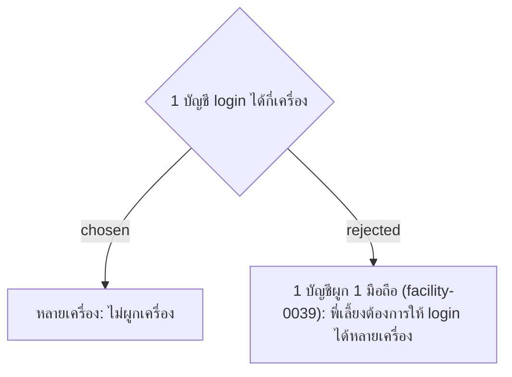

# Login on Multiple Devices — Bound Device Dropped

- วันที่: 2026-10-06
- ที่มา: คำตอบของพี่เลี้ยง R21 ("login ได้หลายเครื่อง")
- เกี่ยวข้อง: facility-0039 (ถูกแทนที่), facility-0002, 0016, 0017 (login และ Persistent Session)

## Context & Decision

Cleaner Account, Supervisor Account และ Admin Account login ได้หลายเครื่องพร้อมกัน ไม่มีการผูกเครื่อง กติกา login เดิมยังใช้ทั้งหมด: JWT อายุ 5 นาที, refresh token จำไว้ 30 วัน และตัวตนตอนสแกนมาจาก JWT

## Consequences

- facility-0039 ถูกแทนที่ทั้งฉบับ ไม่ต้องสร้างปุ่ม "ปลดเครื่อง" และรายการความพยายาม login จากเครื่องอื่น
- **ความเสี่ยงที่ยอมรับ:** ถ้าเพื่อนรู้รหัสผ่าน ก็ login บนมือถือของตัวเองแล้วลงเวลาแทนได้โดยไม่ติดธง
- ทางเลือกในอนาคตถ้าทดลองแล้วเจอการลงเวลาแทนกัน: ติดธง (ไม่บล็อก) เมื่อบัญชีเดียวลงเวลาหรือสแกนจาก 2 เครื่องในกะเดียวกัน
- แม่บ้านเปลี่ยนมือถือหรือสลับเบราว์เซอร์ได้เอง ไม่ต้องขอ Admin
