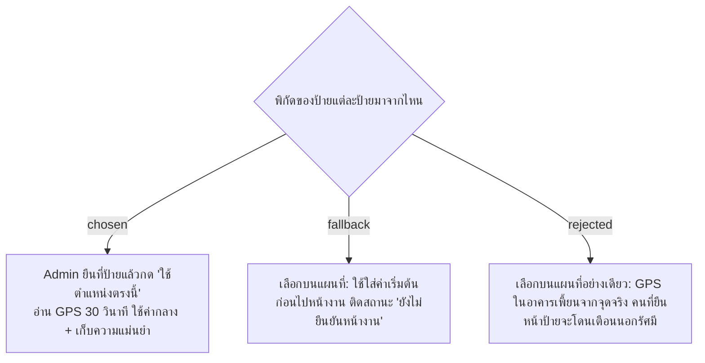

# Admin Manages Areas, Points, Round Times and Sign Locations — Capture GPS at the Sign

- วันที่: 2026-10-06
- ที่มา: เจ้าของโปรเจกต์ตกลง 2026-10-06 (ชื่อ Area และจุดเป็นข้อมูลที่ Admin กรอกเอง) และคำถามข้อ 2.2
- เกี่ยวข้อง: facility-0021 (หน้าจัดการจุด), facility-0038 (รัศมี 50 ม.), facility-0040 (Area), facility-0042 (เวลารอบ)

## Context & Decision

1. **Admin สร้างและแก้ข้อมูลเองทั้งหมดในหน้าจัดการ:**
   - Area: ชื่อ, ตึก, รูปแบบกะ, แม่บ้านประจำแต่ละกะ (กะละ 1 คน)
   - จุดทำความสะอาดใน Area: ชื่อ, เวลารอบแยกกะเช้า/กะดึก
   - ป้ายลงเวลาของ Area: ระบบสร้างให้เองเมื่อเพิ่ม Area
   - พิกัดและรัศมีของทุกป้าย
2. **เก็บพิกัดที่หน้างาน:** Admin เปิดหน้านี้บนมือถือ ยืนตรงที่ติดป้าย แล้วกด "ใช้ตำแหน่งตรงนี้"
   - ระบบอ่าน GPS ต่อเนื่อง 30 วินาที แล้วใช้ค่ากลาง (median) ของค่าที่อ่านได้
   - แสดงและเก็บความแม่นยำ เช่น ±18 ม.
   - ถ้าความแม่นยำแย่กว่ารัศมีของป้าย ให้เตือนว่าควรขยายรัศมีหรือเก็บใหม่
3. **ทางสำรอง:** เลือกตำแหน่งบนแผนที่ได้ แต่ป้ายนั้นจะติดสถานะ "ยังไม่ยืนยันหน้างาน" จนกว่า Admin จะมากดที่ป้ายจริง
4. **หลังทดลอง 1–2 สัปดาห์:** เทียบพิกัดจริงของการสแกนกับพิกัดของป้าย แล้วปรับรัศมีตาม facility-0038

เหตุผล: ค่าที่ควรเก็บคือ "ค่าที่มือถืออ่านได้เมื่อยืนตรงนั้น" ไม่ใช่พิกัดที่ถูกต้องตามแผนที่ เพราะ GPS ในอาคารเพี้ยนได้ 20–50 ม.

## Consequences

- facility-0021 ข้อ 2 (รอบเป็นจำนวนนาที พร้อมปุ่มลัด 30/45/60/90/120) ถูกแทนที่ด้วยรายการเวลารอบ (facility-0042) และหน้าจัดการต้องเพิ่มระดับ Area ส่วนกติกาปิดใช้งานแทนลบ, ออก QR ใหม่ และพิมพ์ป้าย ยังใช้ตามเดิม
- หน้า Admin ต้องเปิดผ่าน HTTPS จึงจะอ่าน GPS ได้ เก็บพิกัดได้หลังมีเซิร์ฟเวอร์ หรือใช้ Cloudflare Tunnel ไปก่อน
- ต้องเก็บ `location_accuracy_m` และ `location_source` (หน้างาน / แผนที่) คู่กับพิกัดของป้าย
