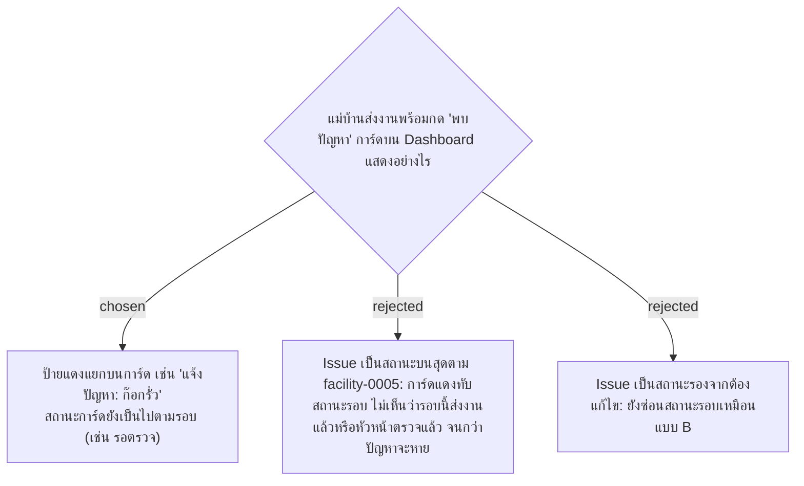

# Reported Issue Is a Tag on the Card, Not a Card Status

- วันที่: 2026-10-07
- ที่มา: คำตอบของหัวหน้า ผ่านเจ้าของโปรเจกต์ 2026-10-07
- เกี่ยวข้อง: facility-0005 (Issue), facility-0042 และ 0047 (สถานะการ์ดตามรอบ), facility-0029 (การตรวจงาน)

## Context & Decision

facility-0042 เรียงสถานะการ์ดไว้ 6 แบบโดยไม่มี Issue แต่บอกว่ากติกา Issue ของ facility-0005 (แดง อยู่บนสุด) ยังใช้อยู่ จึงไม่ชัดว่า Issue อยู่ตรงไหนในลำดับ

ตัดสินว่า **Issue ไม่ใช่สถานะของการ์ด** ปัญหาที่แม่บ้านแจ้ง (ก๊อกรั่ว, ของชำรุด, น้ำยาหมด) เป็นคนละเรื่องกับความสะอาดของรอบนั้น:

1. การ์ดแสดงสถานะตามรอบเหมือนเดิม (facility-0047) เช่น "รอตรวจ"
2. ถ้า Scan Record ล่าสุดของจุดมี Cleaning Status เป็น `ISSUE` การ์ดมีป้ายแดงเพิ่ม แสดงแท็กปัญหาและหมายเหตุ
3. ป้ายหายเมื่อการส่งงานครั้งถัดไปเป็น `NORMAL` (กติกาเดิมของ facility-0005 ข้อ 6)

## Consequences

- facility-0005 ข้อ 1.1 (Issue เป็นสถานะแดงบนสุด) ถูกแทนที่ ข้อ 6 ยังใช้
- ตัวกรองบน Dashboard ต้องมี "มีปัญหาที่แจ้ง" แยกจากตัวกรองสถานะ
- ยังไม่มีปุ่มให้ Admin ปิดปัญหาเอง (เหมือน facility-0005) ถ้าช่างซ่อมเสร็จแต่แม่บ้านยังไม่ส่งงานรอบถัดไป ป้ายจะค้างจนถึงตอนนั้น
