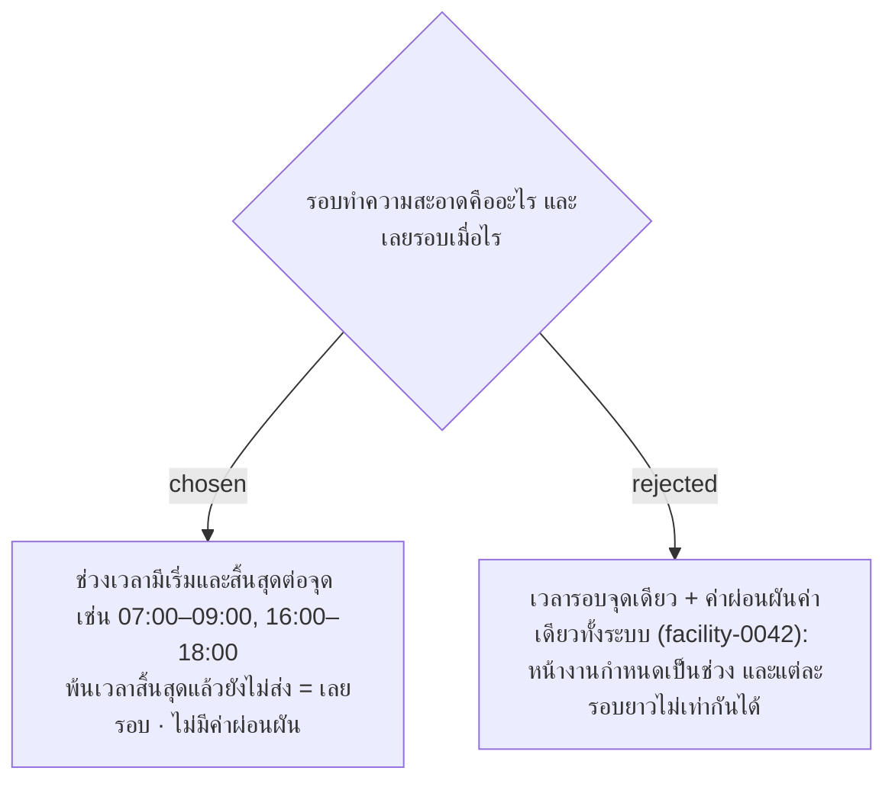

# Cleaning Rounds Are Time Windows — Late Counts for Its Round, Early Counts for None

- วันที่: 2026-10-07
- ที่มา: คำตอบของหัวหน้า ผ่านเจ้าของโปรเจกต์ 2026-10-07 ("ห้องน้ำทำ 2 รอบ รอบแรก 07:00–09:00 ถ้าเลย 9 โมงก็คือเลยรอบ อีกรอบ 16:00–18:00") และตอบคำถามข้อ 6 (หัวหน้าตรวจกี่ครั้งก็ได้)
- เกี่ยวข้อง: facility-0042 (ถูกแทนที่บางส่วน), facility-0029 (การตรวจงาน), facility-0046 (Issue เป็นป้าย), facility-0048 (ขอบเขตหัวหน้า)

## Context & Decision

facility-0042 ใช้เวลารอบจุดเดียวบวกค่าผ่อนผัน 30 นาที (รอยืนยัน) แต่หน้างานกำหนดรอบเป็นช่วงเวลา จึงเปลี่ยนเป็น:

1. **รอบ = ช่วงเวลา** แต่ละจุดมีรายการช่วงเวลาของตัวเอง แยกกะเช้า/กะดึก Admin กรอกเวลาเริ่มและเวลาสิ้นสุดของแต่ละช่วง ช่วงห้ามซ้อนกันและต้องอยู่ในกะ
2. **รอบปัจจุบัน** คือรอบล่าสุดของกะนี้ที่เวลาเริ่มผ่านมาแล้ว การ์ดแสดงเฉพาะรอบปัจจุบัน
3. **การส่งงานนับเป็นของรอบไหน** ดูจากเวลาที่ส่ง ตามลำดับนี้:

   | ส่งตอนไหน | นับเป็น | ตัวอย่าง (รอบ 07:00–09:00 และ 16:00–18:00) |
   |---|---|---|
   | อยู่ในช่วงของรอบ | รอบนั้น ตรงเวลา | 08:10 → รอบ 07:00 |
   | หลังช่วงจบ และรอบนั้นยังไม่มีการส่ง | รอบนั้น **ส่งช้า** (เก็บจำนวนนาทีที่ช้า) | 09:40 → รอบ 07:00 ช้า 40 นาที |
   | หลังช่วงจบ และหัวหน้าให้แก้ไขรอบนั้น | การแก้งานของรอบนั้น (facility-0029) | 11:00 → แก้งานรอบ 07:00 |
   | หลังช่วงจบ และรอบนั้นส่งแล้ว | **งานนอกรอบ** บันทึกไว้ แต่ไม่นับเป็นรอบใดและการ์ดไม่เปลี่ยน | 15:30 → นอกรอบ |

4. **สถานะการ์ด** ของรอบปัจจุบัน เรียงตามความสำคัญ (Issue เป็นป้ายแยกตาม facility-0046):
   - ต้องแก้ไข: หัวหน้าตรวจแล้วไม่สะอาด ยังไม่ส่งงานแก้
   - เลยรอบ: พ้นเวลาสิ้นสุดของช่วงแล้ว ยังไม่ส่งงาน
   - รอตรวจ: ส่งงานแล้ว หัวหน้ายังไม่ตรวจ
   - ตรวจผ่าน
   - ยังไม่ทำ: อยู่ในช่วงของรอบ ยังไม่ส่งงาน
   - ยังไม่ถึงรอบ: กะเริ่มแล้วแต่รอบแรกของกะยังไม่เริ่ม การ์ดแสดงเวลารอบถัดไป
   - นอกเวลา: Area ที่ทำเฉพาะกะเช้า ช่วงกะดึก (facility-0042 ข้อ 4)
5. **รอบใหม่เริ่มแล้ว การ์ดเริ่มใหม่เสมอ** ไม่ค้างรอหัวหน้าหรือรอแก้งาน รอบเก่าเก็บผลในประวัติ:
   - ส่งแล้วหัวหน้าไม่ได้ตรวจ → "ไม่ได้ตรวจ"
   - หัวหน้าให้แก้แล้วไม่ได้แก้ → "ไม่ได้แก้"
   - ไม่ได้ส่งเลย → "ไม่ได้ทำ"
6. **หัวหน้าตรวจกี่ครั้งก็ได้** ไม่มีขั้นต่ำ ไม่ตรวจเลยก็ได้ งานที่ส่งแล้วแสดง "รอตรวจ" จนรอบนั้นจบ Admin ประเมินหัวหน้าเองจากหน้าสรุปการตรวจ (facility-0048)
7. **หัวหน้าตรวจได้เฉพาะงานที่ส่งในรอบปัจจุบัน** ถ้ารอบปัจจุบันยังไม่มีการส่งงาน หน้าจอแสดงสถานะจุดและบอกว่า "รอบนี้แม่บ้านยังไม่ส่งงาน" ไม่มีปุ่มตรวจ

## Consequences

- facility-0042 ข้อ 1–3 (เวลารอบจุดเดียว, ค่าผ่อนผัน) ถูกแทนที่ ข้อ 4 (นอกเวลา) ยังใช้ ข้อ 5 ใช้ลำดับในข้อ 4 ของ ADR นี้แทน ไม่ต้องมีค่าผ่อนผันใน config
- ตาราง `point_round_times` (จุด, กะ, เวลา) เปลี่ยนเป็น `point_round_windows` (จุด, กะ, เวลาเริ่ม, เวลาสิ้นสุด)
- Scan Record ต้องเก็บว่าเป็นของรอบไหน (`round_window_id` + วันที่ของกะ), จำนวนนาทีที่ส่งช้า และเป็นงานนอกรอบหรือไม่ — คำนวณตอนบันทึก ไม่ต้องคำนวณใหม่ทีหลัง
- หน้าจัดการจุด (facility-0045) กรอกเวลารอบเป็นคู่ เริ่ม–สิ้นสุด แทนเวลาเดียว
- คำถามข้อ 6 ของพี่เลี้ยงปิดแล้ว
- ข้อ 4 "ยังไม่ถึงรอบ" และข้อ 7 ได้คำตอบเพิ่มในวันเดียวกัน

> **แก้ไข 2026-10-09:** ช่วงรอบห้ามจบตรงเวลาเปลี่ยนกะ (19:00 ของกะเช้า หรือ 07:00 ของกะดึก) เจ้าของโปรเจกต์ตัดสิน เพราะพ้นเวลานั้นระบบนับเป็นกะใหม่แล้ว งานที่ส่งช้าหรือส่งแก้ของรอบนั้นจึงเข้ารอบเดิมไม่ได้ หน้าตั้งค่ารอบของ Admin (facility-0045) ต้องปฏิเสธช่วงที่จบตรงเวลาเหล่านี้
